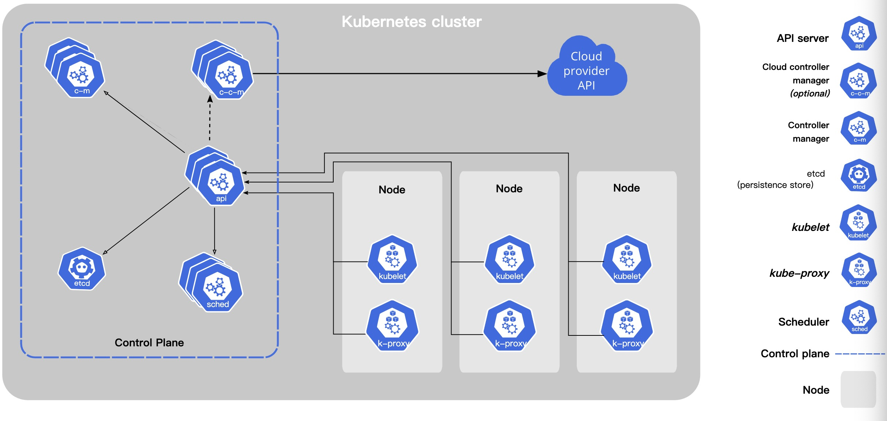
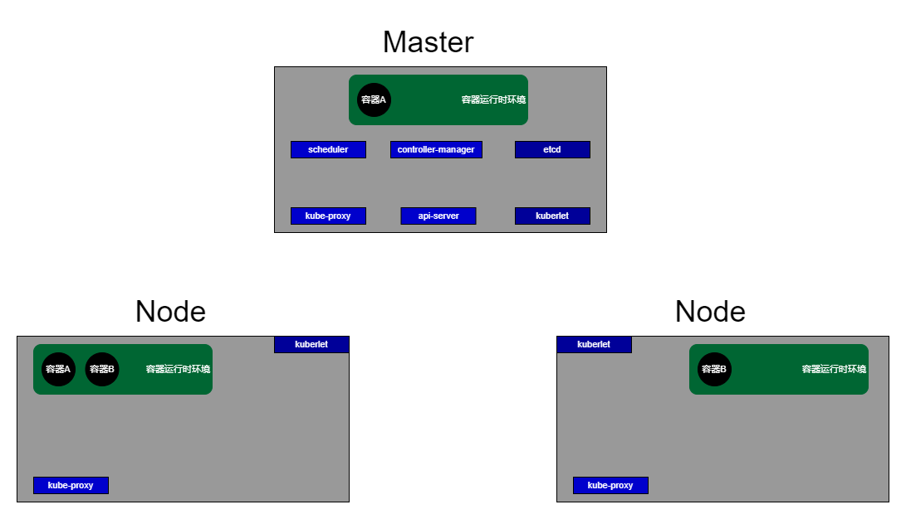
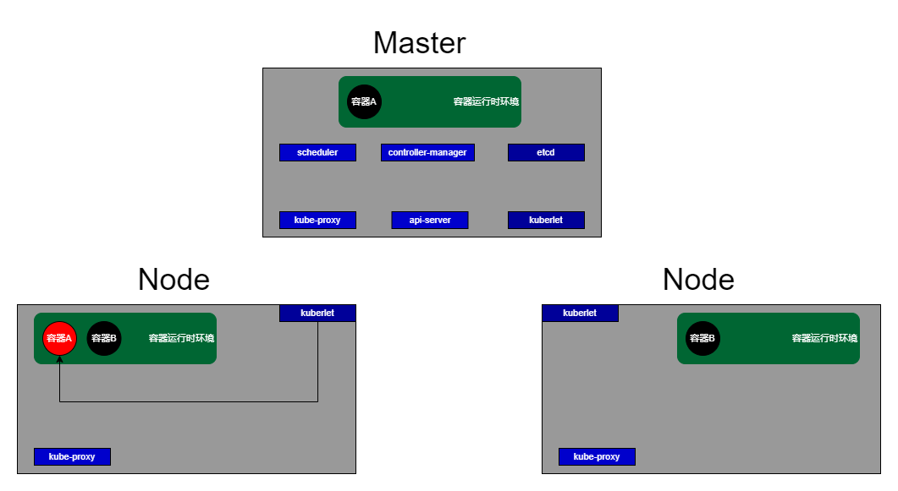
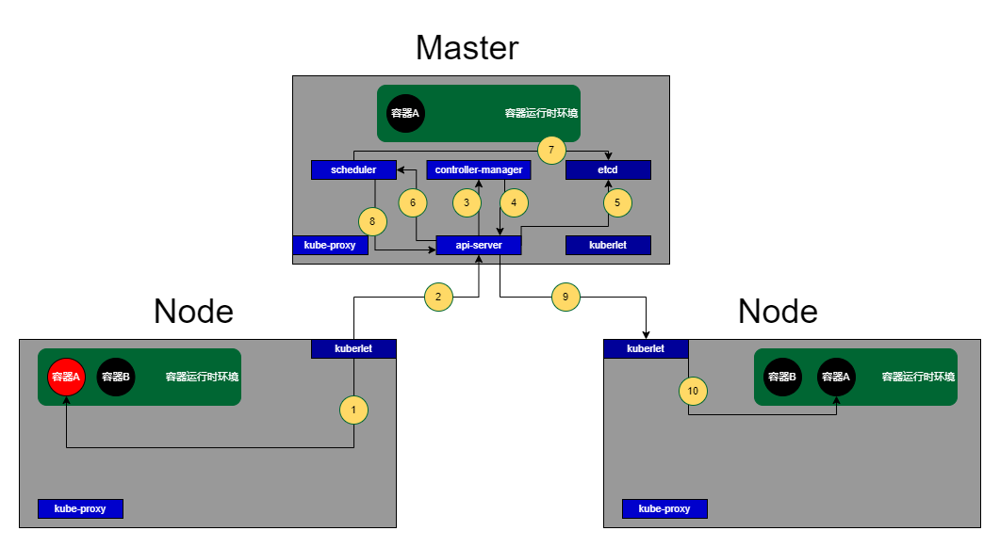
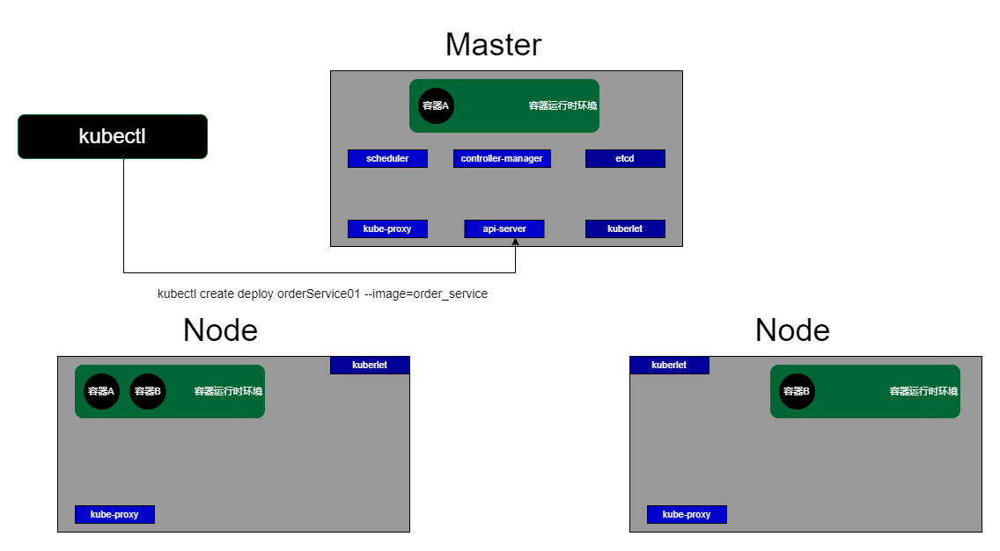

# Kubernetes作用

在多个物理机之间，管理多个容器，它本质是一个**容器编排**工具。

编排，哪来的编？哪来的排？Kubernetes的编排主要围绕以下几点：

1. 服务发现与负载均衡

   Kubernetes可以使用 **DNS名称** 或 **ip地址** 暴露容器，在容器承载流量很大的情况下，Kubernetes可以负载均衡分配容器的流量，使得整个集群稳定。

   这个 **DNS名称** 应该类似微服务里 注册中心 对服务实例 封装的一层 实例名称。

2. 存储编排

   多个物理机之间、多个容器使用的存储资源，原本是分散的在不同物理机上的。Kubernetes可以管理这些容器的存储资源，容器想要操作存储空间，需要向Kubernetes申请、释放。在容器被销毁后，容器申请的存储资源也会被Kubernetes释放掉。

3. 部署与回滚

   被Kubernetes管理的容器，有一个概念叫 版本。对于旧版本的容器，Kubernetes可以部署一个新版本容器覆盖它。对于新版本容器，Kubernetes可以进行回滚，重新用旧版本容器覆盖它。

   这个操作可以理解为：新上线的应用版本出现了BUG，于是即使回滚到旧版本，及时减少BUG带来的影响。

4. 自动的装箱计算

   Kubernetes可以将 容器 放在 沙箱内运行，在沙箱内，Kubernetes可以监控这个 容器 使用的硬件资源（如CPU和内存），甚至可以限定这个容器的硬件资源边界、确定容器超界后，Kubernetes对应的解决策略。

5. 自我修复

   1. 物理机A部署了C1、C2容器。
   2. 物理机B部署了C3、C4容器。
   3. 物理机A因为不可预料的原因，发生了宕机。
   4. Kubernetes将容器C1、C2转移到硬件资源充分的物理机B。C1、C2在物理机B准备好服务后，Kubernetes开放C1、C2被外界访问。

6. 密钥的配置管理

   容器的敏感信息如密码、令牌、密钥，可以统一交给Kubernetes进行管理。有点类似微服务里的 配置中心。

# Kubernetes组件架构

首先，Kubernetes是一个标准的分布式组件，和其他分布式组件一样，它大致可以分为三种角色：Leader、Candidate、Worker。

对于Leader来说，它是整个Kubernetes集群的核心。对于Candidate来说，它能够在Leader挂掉后，通过选举的方式成为Leader。对于Worker来说，它是实际干活的。

以下是一张Kubernetes的官方架构图（第一次肯定是看不懂的，打个照面熟悉一下）：

1. Node：可以理解为Worker节点。
2. Control Plane：可以理解为Leader 和 Candidte的组成。
3. c-m：即Controller manager，可以理解为Leader节点。
4. etcd：保存Kubernetes集群运行期间的数据，是类似Redis那样的K-V数据库。
5. api：即API server，A组件与B组件之间的交互，实际是通过API server提供的API进行的。
6. sched：即Scheduler，负责将Kubernetes的操作转交给Node处理。
7. kuberlet：Node的代表，监控Node的情况，处理Node的请求。
8. k-proxy：即kube-proxy，通过它进行容器之间的通信，实现容器之间的负载均衡。
9. c-c-m：即Cloud controller manager，它是一个可选的组件，用来与外部的API进行交互。

# Kubernetes的流程示例（画好图才发现写错了，kubertlet×	kubelet√）

## 初始状态

假设有这么一个Kubernetes集群：

值得注意的是，Master本质也是一个节点，它能做到其他Node一样的事。但是结合[ElasticSearch](https://github.com/9029HIME/Es_Study/blob/master/2022-ES-Relearn/04-%E8%8A%82%E7%82%B9%E7%B1%BB%E5%9E%8B.md)和[Kafka](https://github.com/9029HIME/Kafka_Study/blob/master/src/mds/06%20Kafka%E7%9A%84%E5%8E%BBZooKeeper%E5%8C%96%EF%BC%9AKRaft%E6%A8%A1%E5%BC%8F.md)的节点职责来看，实际生产使用Kubernetes还是遵循单一职责会比较好。

## 自我修复流程

作为节点内的kubelet，会时刻监控节点内容器的状态，假如此时某个节点的容器A发生个故障。此时会经历以下10个步骤：

1. kubelet检测到当前节点的 容器A 发生宕机。
2. 在kubelet 和 api-server的 **定时通讯** 中，kubelet通过api-server，告知Master容器A发生了宕机。
3. api-server将宕机信息传到controller-manager。
4. controller-manager根据 **宕机配置** 做出宕机决策，假设此时配置：转移容器A 到 另一个节点。controller-manager将决策发送给api-server，
5. api-server将controller-manager本次决策事件存入etcd。
6. api-server告知scheduler，让其选择一个合适的节点，接收容器A。
7. scheduler通过计算，选择出一个合适的节点，并将节点信息、转移信息存入etcd。
8. scheduler调用api-server，告知选择哪个节点，接收容器A。
9. 在kubelet 和 api-server的 **定时通讯** 中，kubelet通过api-server，得知需要在本节点启动容器A。
10. 启动成功后，kubelet持续监控容器A。

## 容器间请求流程

还是以上面的例子，假如容器A自我修复后，左边Node的容器B 想请求 容器A，流程会这样的：

0. 首先得明确一点，kube-proxy之间会同步好数据（CA还是CP那是后话了），保证对于每个节点来说，都能拿到准确的容器地址信息。
1. 容器B想要访问容器A，会请求kube-proxy。
2. kube-proxy根据 **负载均衡** 策略，将请求转发到对应的容器ip上，假设本次转发到另一个Node的容器A。

## kubectl的引出

实际上，kubectl是一个封装好的组件，对外暴露给我们开发人员使用，我们可以通过特定的kubectl命令，与api-server进行交互，从而管理整个Kubernetes集群以及容器集群。
