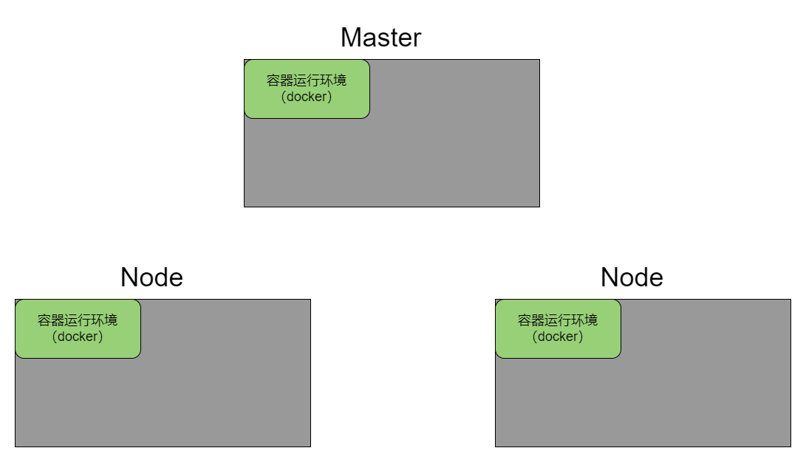
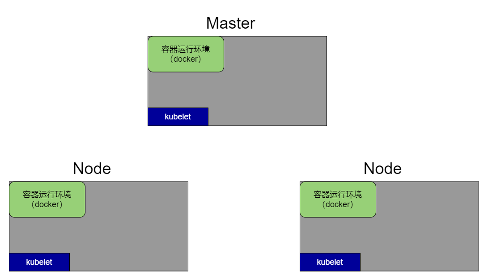
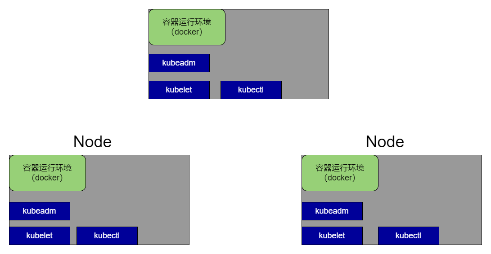
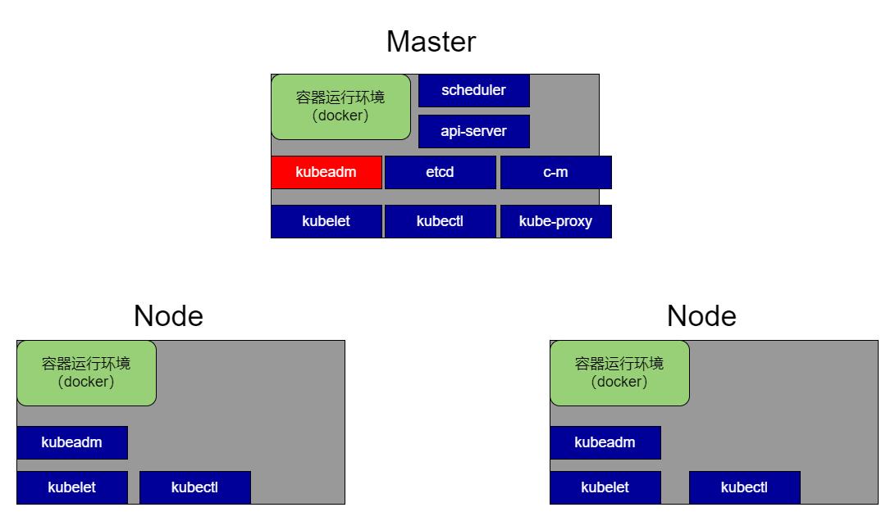
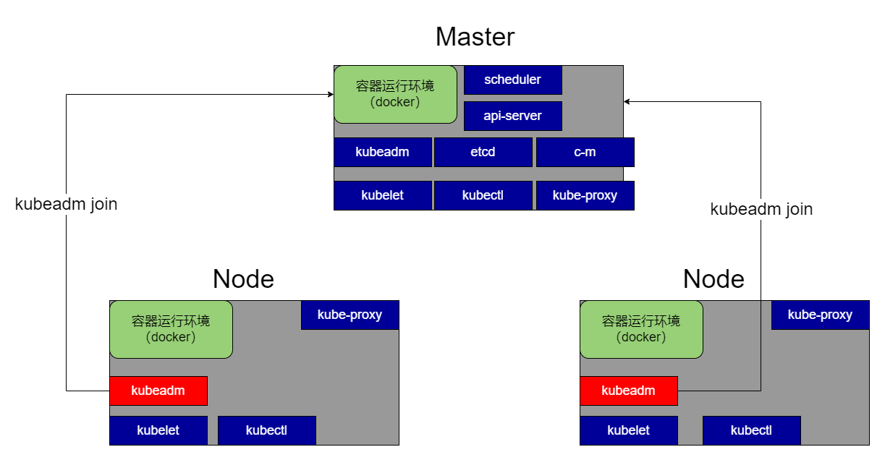

# 机器环境准备

Kubernetes对运行环境有点要求，在安装Kubernetes之前，要做以下准备：

1. 关闭SELinux

   ```bash
   sudo setenforce 0
   sudo sed -i 's/^SELINUX=enforcing$/SELINUX=permissive/' /etc/selinux/config
   ```

2. 关闭swap

   ```bash
   sudo swapoff -a  
   sudo sed -ri 's/.*swap.*/#&/' /etc/fstab
   ```

3. 允许 iptables 检查桥接流量

   ```bash
   cat <<EOF | sudo tee /etc/modules-load.d/k8s.conf
   br_netfilter
   EOF
   
   cat <<EOF | sudo tee /etc/sysctl.d/k8s.conf
   net.bridge.bridge-nf-call-ip6tables = 1
   net.bridge.bridge-nf-call-iptables = 1
   EOF
   sudo sysctl --system
   ```
   
4. 告诉Docker，使用systemd

   ```
   sudo mkdir -p /etc/docker
   sudo tee /etc/docker/daemon.json <<-'EOF'
   {
     "registry-mirrors": ["https://82m9ar63.mirror.aliyuncs.com"],
     "exec-opts": ["native.cgroupdriver=systemd"],
     "log-driver": "json-file",
     "log-opts": {
       "max-size": "100m"
     },
     "storage-driver": "overlay2"
   }
   EOF
   sudo systemctl daemon-reload
   sudo systemctl restart docker
   ```

   

以上3步准备完毕后，就能够安装Kubernetes了。

# 安装流程预演

Kubernetes和其他分布式组件不太一样，它比较复杂，有必要提前说一下 安装步骤 和 安装的内容 分别是干嘛的。

1. 初始环境，机子需要有容器运行环境，这里以Docker为例：

   

2. 安装kubelet，将Kubernetes的基础功能先细分到 **每台机子** 上：

   

3. 安装kubectl和kubeadm，kubectl帮助我们 **操作** Kubernetes，kubeadm帮助我们 **管理** 和 下一步安装Kubernetes：

   

4. 在Master机器 调用 kubeadm init命令，将Master机初始化为Kubernetes的主节点，生成主节点专属的组件，如api-server、scheduler、kube-proxy、etcd、controller-manage：

   

5. 在其他Node机器 调用 kubeadm join命令，加入Master节点，成为Kubernetes集群的一部分，生成kube-proxy：

   

6. 自此，一个Kubernetes集群搭建完毕。

# 三大件安装

1. 添加aptkey

   ```bash
   sudo curl https://mirrors.aliyun.com/kubernetes/apt/doc/apt-key.gpg | apt-key add -
   
   sudo cat << EOF >/etc/apt/sources.list.d/kubernetes.list
   deb https://mirrors.aliyun.com/kubernetes/apt/ kubernetes-xenial main
   EOF
   ```
   
2. 安装kubelet、kubeadm、kubectl：

   ```bash
   apt update
   apt install kubeadm=1.20.9-00 kubelet=1.20.9-00 kubectl=1.20.9-00
   ```
   
3. 启动kubelet：

   ```bash
   sudo systemctl enable --now kubelet
   ```

4. 启动成功后，可以发现kubelet的状态来回在 停止、启动 转换，这是正常的：

   ```bash
   root@kjg-PC:~# systemctl status kubelet
   ● kubelet.service - kubelet: The Kubernetes Node Agent
      Loaded: loaded (/lib/systemd/system/kubelet.service; enabled; vendor preset: enabled)
     Drop-In: /etc/systemd/system/kubelet.service.d
              └─10-kubeadm.conf
      Active: active (running) since Wed 2023-01-18 13:42:34 CST; 6ms ago
        Docs: https://kubernetes.io/docs/home/
    Main PID: 18800 (kubelet)
       Tasks: 1 (limit: 9413)
      Memory: 668.0K
      CGroup: /system.slice/kubelet.service
              └─18800 /usr/bin/kubelet --bootstrap-kubeconfig=/etc/kubernetes/bootstrap-kubelet.conf --kubeconfig=/etc/kubernetes/kubelet.co
   
   1月 18 13:42:34 kjg-PC systemd[1]: Started kubelet: The Kubernetes Node Agent.
   
   
   
   root@kjg-PC:~# systemctl status kubelet
   ● kubelet.service - kubelet: The Kubernetes Node Agent
      Loaded: loaded (/lib/systemd/system/kubelet.service; enabled; vendor preset: enabled)
     Drop-In: /etc/systemd/system/kubelet.service.d
              └─10-kubeadm.conf
      Active: activating (auto-restart) (Result: exit-code) since Wed 2023-01-18 13:43:32 CST; 4s ago
        Docs: https://kubernetes.io/docs/home/
     Process: 19013 ExecStart=/usr/bin/kubelet $KUBELET_KUBECONFIG_ARGS $KUBELET_CONFIG_ARGS $KUBELET_KUBEADM_ARGS $KUBELET_EXTRA_ARGS (code
    Main PID: 19013 (code=exited, status=1/FAILURE)
   
   1月 18 13:43:32 kjg-PC systemd[1]: kubelet.service: Failed with result 'exit-code'.
   ```

# 初始化主节点

## 初始化前

其实像kube-proxy、scheduler、api-server、etcd、c-m这些组件，都是采用 **容器** 的方式运行。

采用kubeadm init的方式初始化主节点，也是先将这些组件的镜像pull过来，再作为初始化一个容器进行启动。为了防止kubeadm拉取镜像时的网络波动，这里建议事先手动将镜像拉下来：

```bash
sudo tee ./images.sh <<-'EOF'
#!/bin/bash
images=(
kube-apiserver:v1.20.9
kube-proxy:v1.20.9
kube-controller-manager:v1.20.9
kube-scheduler:v1.20.9
coredns:1.7.0
etcd:3.4.13-0
pause:3.2
)
for imageName in ${images[@]} ; do
docker pull registry.cn-hangzhou.aliyuncs.com/lfy_k8s_images/$imageName
done
EOF
```

执行脚本：

```bash
chmod +x ./images.sh && ./images.sh
```

检查镜像：

```bash
root@kjg-PC:~# docker images
REPOSITORY                                                                 TAG                 IMAGE ID            CREATED             SIZE
nginx                                                                      latest              605c77e624dd        12 months ago       141MB
registry.cn-hangzhou.aliyuncs.com/lfy_k8s_images/kube-proxy                v1.20.9             8dbf9a6aa186        18 months ago       99.7MB
registry.cn-hangzhou.aliyuncs.com/lfy_k8s_images/kube-scheduler            v1.20.9             295014c114b3        18 months ago       47.3MB
registry.cn-hangzhou.aliyuncs.com/lfy_k8s_images/kube-controller-manager   v1.20.9             eb07fd4ad3b4        18 months ago       116MB
registry.cn-hangzhou.aliyuncs.com/lfy_k8s_images/kube-apiserver            v1.20.9             0d0d57e4f64c        18 months ago       122MB
kibana                                                                     7.12.1              cf1c9961eeb6        21 months ago       1.06GB
elasticsearch                                                              7.12.1              41dc8ea0f139        21 months ago       851MB
registry.cn-hangzhou.aliyuncs.com/lfy_k8s_images/etcd                      3.4.13-0            0369cf4303ff        2 years ago         253MB
registry.cn-hangzhou.aliyuncs.com/lfy_k8s_images/coredns                   1.7.0               bfe3a36ebd25        2 years ago         45.2MB
registry.cn-hangzhou.aliyuncs.com/lfy_k8s_images/pause                     3.2                 80d28bedfe5d        2 years ago         683kB
```

## 初始化

检查各个节点的host文件，ip 和 名称的映射关系对不对得上：

```bash
kjg@kjg-PC:~$ ping ubuntu01
PING ubuntu01 (192.168.120.121) 56(84) bytes of data.
64 bytes from ubuntu01 (192.168.120.121): icmp_seq=1 ttl=64 time=1.05 ms
64 bytes from ubuntu01 (192.168.120.121): icmp_seq=2 ttl=64 time=0.906 ms
^C
--- ubuntu01 ping statistics ---
2 packets transmitted, 2 received, 0% packet loss, time 3ms
rtt min/avg/max/mdev = 0.906/0.977/1.048/0.071 ms
kjg@kjg-PC:~$ ping ubuntu02
PING ubuntu02 (192.168.120.122) 56(84) bytes of data.
64 bytes from ubuntu02 (192.168.120.122): icmp_seq=1 ttl=64 time=7.69 ms
64 bytes from ubuntu02 (192.168.120.122): icmp_seq=2 ttl=64 time=0.981 ms
^C
--- ubuntu02 ping statistics ---
2 packets transmitted, 2 received, 0% packet loss, time 3ms
rtt min/avg/max/mdev = 0.981/4.337/7.694/3.357 ms


kjg1@ubuntu01:~$ ping kjg-PC
PING kjg-PC (192.168.120.161) 56(84) bytes of data.
64 字节，来自 kjg-PC (192.168.120.161): icmp_seq=1 ttl=64 时间=1.09 毫秒
64 字节，来自 kjg-PC (192.168.120.161): icmp_seq=2 ttl=64 时间=1.08 毫秒
64 字节，来自 kjg-PC (192.168.120.161): icmp_seq=3 ttl=64 时间=1.03 毫秒
^C
--- kjg-PC ping 统计 ---
已发送 3 个包， 已接收 3 个包, 0% 包丢失, 耗时 2002 毫秒
rtt min/avg/max/mdev = 1.032/1.066/1.088/0.024 ms
kjg1@ubuntu01:~$ ping ubuntu02
PING ubuntu02 (192.168.120.122) 56(84) bytes of data.
64 字节，来自 ubuntu02 (192.168.120.122): icmp_seq=1 ttl=64 时间=1.82 毫秒
64 字节，来自 ubuntu02 (192.168.120.122): icmp_seq=2 ttl=64 时间=0.997 毫秒
64 字节，来自 ubuntu02 (192.168.120.122): icmp_seq=3 ttl=64 时间=1.41 毫秒
^C
--- ubuntu02 ping 统计 ---
已发送 3 个包， 已接收 3 个包, 0% 包丢失, 耗时 2003 毫秒
rtt min/avg/max/mdev = 0.997/1.408/1.821/0.336 ms
kjg1@ubuntu01:~$ 


kjg1@ubuntu02:~$ ping kjg-PC
PING kjg-PC (192.168.120.161) 56(84) bytes of data.
64 字节，来自 kjg-PC (192.168.120.161): icmp_seq=1 ttl=64 时间=0.952 毫秒
64 字节，来自 kjg-PC (192.168.120.161): icmp_seq=2 ttl=64 时间=1.17 毫秒
64 字节，来自 kjg-PC (192.168.120.161): icmp_seq=3 ttl=64 时间=1.31 毫秒
^C
--- kjg-PC ping 统计 ---
已发送 3 个包， 已接收 3 个包, 0% 包丢失, 耗时 2003 毫秒
rtt min/avg/max/mdev = 0.952/1.143/1.306/0.145 ms
kjg1@ubuntu02:~$ ping ubuntu01
PING ubuntu01 (127.0.1.1) 56(84) bytes of data.
64 字节，来自 ubuntu01 (127.0.1.1): icmp_seq=1 ttl=64 时间=0.032 毫秒
64 字节，来自 ubuntu01 (127.0.1.1): icmp_seq=2 ttl=64 时间=0.079 毫秒
64 字节，来自 ubuntu01 (127.0.1.1): icmp_seq=3 ttl=64 时间=0.074 毫秒
^C
--- ubuntu01 ping 统计 ---
已发送 3 个包， 已接收 3 个包, 0% 包丢失, 耗时 2034 毫秒
rtt min/avg/max/mdev = 0.032/0.061/0.079/0.021 ms
kjg1@ubuntu02:~$ 
```

在Master执行初始化命令：

```bash
kubeadm init \
--apiserver-advertise-address=192.168.120.161 \
--control-plane-endpoint=192.168.120.161 \
--image-repository registry.aliyuncs.com/google_containers \
--kubernetes-version 1.20.9 \
--service-cidr=10.96.0.0/16 \
--pod-network-cidr=172.31.0.0/16

###
异常:failed with error: Get “http://localhost:10248/healthz
解决方法：https://blog.csdn.net/sinat_32900379/article/details/122135698

###
解决异常后的清理：
kubeadm reset
```

还没完，还需要执行以下命令，添加权限：

```bash
  mkdir -p $HOME/.kube
  sudo cp -i /etc/kubernetes/admin.conf $HOME/.kube/config
  sudo chown $(id -u):$(id -g) $HOME/.kube/config
```

自此，Kubernetes的主节点算是初始化好了，可以输入以下命令校验一下：

```bash
#查看Kubernetes集群内所有节点
root@kjg-PC:~# kubectl get nodes
NAME     STATUS     ROLES                  AGE    VERSION
kjg-pc   NotReady   control-plane,master   2m6s   v1.20.9
```

## 初始化后

但是，Master想要连同其他Node，需要添加一个网络插件，Kubernetes有许多网络插件，这里以安装 Calico为例：

下载Calico的配置文件：

```bash
curl https://docs.projectcalico.org/v3.21/manifests/calico.yaml -O
```

修改配置文件内容，将value: "192.168.0.0/16"改成pod-network-cidr的值：

```

```

基于配置文件，给Kubernetes安装Calico：

```bash
kubectl apply -f calico.yaml
```

安装好后，检查一下集群内的容器（和docker ps一样）：

```
kubectl get pods -A
```

对于Kubernetes来说，容器叫Pod。

# 初始化Node节点

## 获取token和hash

虽然主节点初始化后，会生成一个token和hash值 组装好的join命令，直接复制过去给Node使用就好了。但是这个token和hash值有24小时的有效期，下面以过期后重新加入Master为例：

在Master节点：

1. 生成token：

   ```bash
   kubeadm  token create
   ```

2. 获取最新的token信息：

   ```bash
   kubeadm token list
   ```

3. 生成ca的sha256 hash值：

   ```bash
   openssl x509 -pubkey -in /etc/kubernetes/pki/ca.crt | openssl rsa -pubin -outform der 2>/dev/null | openssl dgst -sha256 -hex | sed 's/^.* //'
   ```

4. 组装成join命令，并执行：

   ```bash
   kubeadm join ${masterIP}:6443 --token ${token值} --discovery-token-ca-cert-hash sha256:${hash值}
   ```

5. **也可以直接在Master执行以下命令，获取完成kubeadm join**：

   ```bash
   kubeadm token create --print-join-command
   ```

   

## 在主节点查看nodes状态

```bash
root@kjg-PC:~# kubectl get nodes
NAME       STATUS   ROLES                  AGE     VERSION
kjg-pc     Ready    control-plane,master   42m     v1.20.9
ubuntu01   Ready    <none>                 7m15s   v1.20.9
ubuntu02   Ready    <none>                 105s    v1.20.9
```

会发现noready，等待一段时间后，会发现状态变回ready。

至此，一个Kubernetes集群算是搭建完毕了。

# 部署Dashboard

TODO