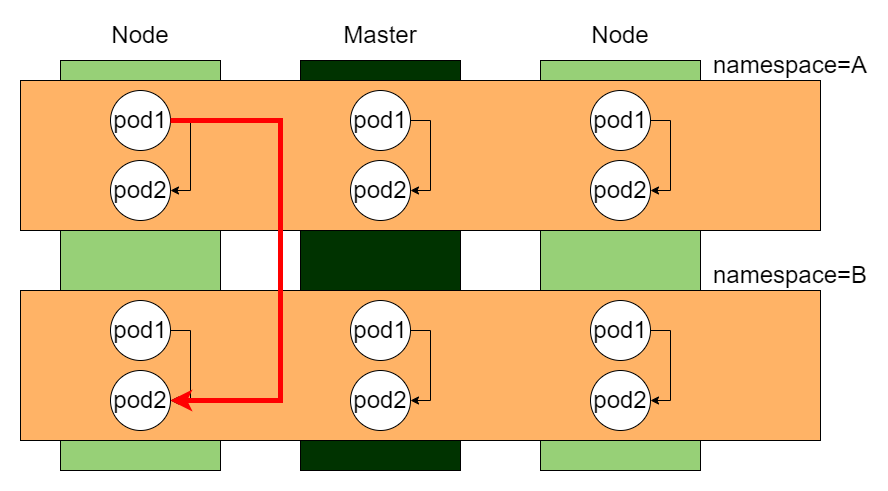
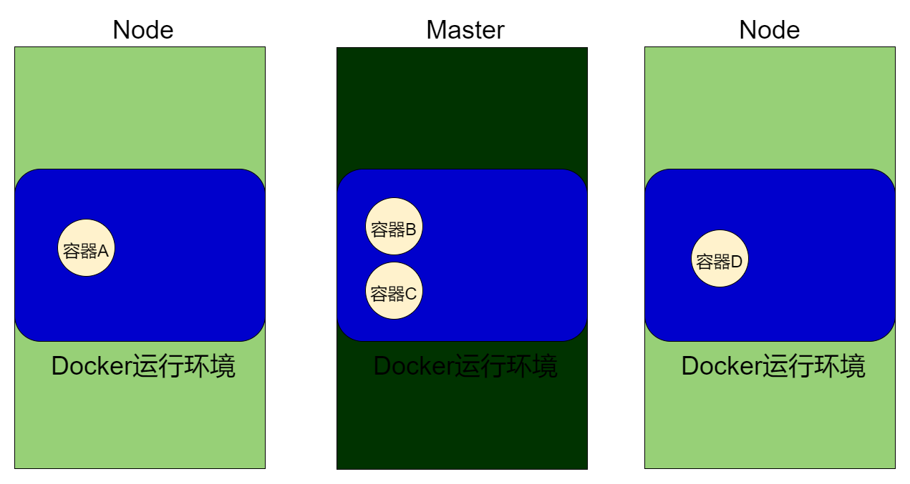
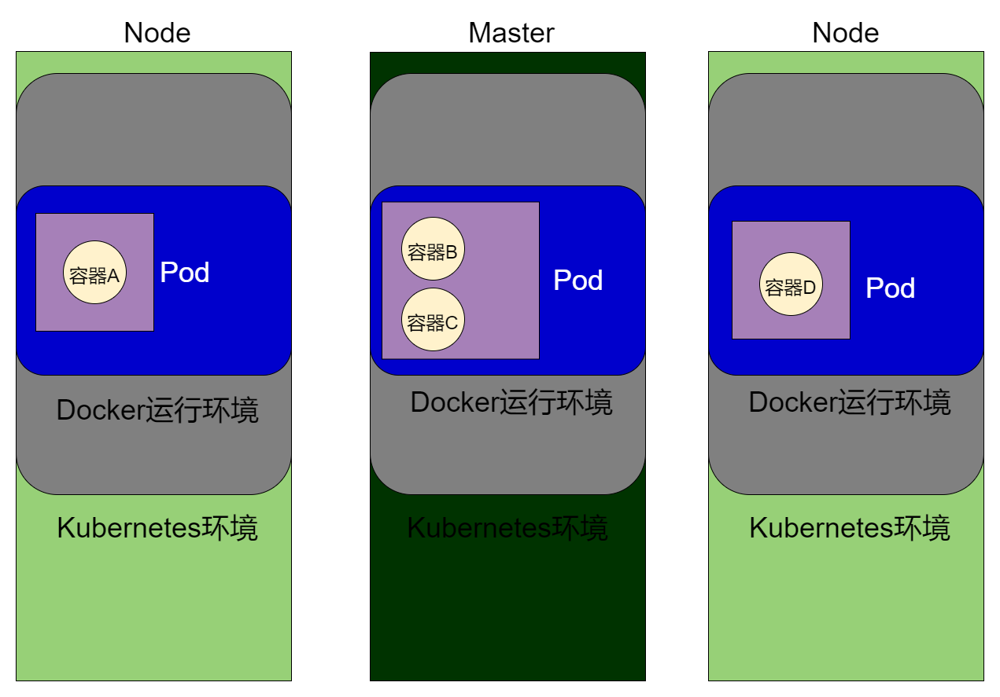

# 隔离资源-Namespace

## 是什么

和微服务组件-配置中心里的Namespace一样，Kubernetes的Namespace也是为了隔离资源而存在的。注意！这里的资源不包含网络，不同Namespace的pod（pod概念在后面，现在可以简单理解为Docker的容器）是可以互相访问的。以一张图为例，最直观感受Namespace在Kubernetes的存在：



## 查

查看kubernetes集群下的namespace：

```bash
root@kjg-PC:~# kubectl get namespace
NAME                   STATUS   AGE
default                Active   3d1h
kube-node-lease        Active   3d1h
kube-public            Active   3d1h
kube-system            Active   3d1h
kubernetes-dashboard   Active   17h
root@kjg-PC:~# kubectl get namespaces
NAME                   STATUS   AGE
default                Active   3d1h
kube-node-lease        Active   3d1h
kube-public            Active   3d1h
kube-system            Active   3d1h
kubernetes-dashboard   Active   17h
root@kjg-PC:~# kubectl get ns
NAME                   STATUS   AGE
default                Active   3d1h
kube-node-lease        Active   3d1h
kube-public            Active   3d1h
kube-system            Active   3d1h
kubernetes-dashboard   Active   17h
root@kjg-PC:~# 
```

可以看到，Kubernetes集群本身就有基础namespace，还有前面安装上去的kubernetes-dashboard。

## 增删

```bash
###增
root@kjg-PC:~# kubectl create ns kjg-namespace
namespace/kjg-namespace created
root@kjg-PC:~# kubectl get ns
NAME                   STATUS   AGE
default                Active   3d1h
kjg-namespace          Active   6s
kube-node-lease        Active   3d1h
kube-public            Active   3d1h
kube-system            Active   3d1h
kubernetes-dashboard   Active   17h

### 删
root@kjg-PC:~# kubectl delete ns kjg-namespace
namespace "kjg-namespace" deleted
root@kjg-PC:~# kubectl get ns
NAME                   STATUS   AGE
default                Active   3d1h
kube-node-lease        Active   3d1h
kube-public            Active   3d1h
kube-system            Active   3d1h
kubernetes-dashboard   Active   17h
```

像**default**这个namespace是无法删除的，最好也不要删除Kubernetes自带的namespace。

# 应用的最小单位-Pod

## 是什么

在Docker中，应用的最小单位是Container，也就是容器。

但是在Kubernetes，应用的最小单位是Pod，它管理着**运行中的一组**容器。

来看一下，以前只用Docker的话，是这样的场景：



每台机子安装了Docker运行环境，容器在运行环境中创建、运行。

引入了Kubernetes后，Kubernetes在容器的基础上又封装了一层Pod（注意！！！这里Kubernetes和Docker的关系可能不太准确，这里以包含关系展示）：



既然是**一组容器**，说明Pod能代表1个容器、多个容器。这也说明了为什么kubectl get pods -A后，Ready是以分子/分母的形式呈现：

```bash
root@kjg-PC:~# kubectl get pods -A
NAMESPACE              NAME                                         READY   STATUS        RESTARTS   AGE
kube-system            calico-kube-controllers-5bb48c55fd-r6txn     1/1     Running       6          3d2h
kube-system            calico-node-7p8wd                            0/1     Running       6          3d2h
kube-system            calico-node-9pxml                            1/1     Running       3          3d1h
kube-system            calico-node-bvrgq                            1/1     Running       3          3d1h
kube-system            coredns-7f89b7bc75-b2r68                     1/1     Running       6          3d2h
kube-system            coredns-7f89b7bc75-kr2m4                     1/1     Running       6          3d2h
kube-system            etcd-kjg-pc                                  1/1     Running       7          3d2h
kube-system            kube-apiserver-kjg-pc                        1/1     Running       7          3d2h
kube-system            kube-controller-manager-kjg-pc               1/1     Running       8          3d2h
kube-system            kube-proxy-2hhr2                             1/1     Running       3          3d1h
kube-system            kube-proxy-9qdgv                             1/1     Running       6          3d2h
kube-system            kube-proxy-tkwf6                             1/1     Running       3          3d1h
kube-system            kube-scheduler-kjg-pc                        1/1     Running       9          3d2h
kubernetes-dashboard   dashboard-metrics-scraper-79c5968bdc-f88vn   1/1     Running       1          18h
kubernetes-dashboard   kubernetes-dashboard-658485d5c7-4d8ml        1/1     Running       0          58m
kubernetes-dashboard   kubernetes-dashboard-658485d5c7-rh46b        1/1     Terminating   0          18h
```

代表这个Pod下，${分母}容器下有${分子}个容器正常运行着。

## 命令行新建Pod

先看一下节点状态是否正常：

```bash
root@kjg-PC:~# kubectl get nodes
NAME       STATUS   ROLES                  AGE    VERSION
kjg-pc     Ready    control-plane,master   3d2h   v1.20.9
ubuntu01   Ready    <none>                 3d1h   v1.20.9
ubuntu02   Ready    <none>                 3d1h   v1.20.9
```

执行kubectl run podNginx --image=nginx命令，因为没有指定ns，默认会创建在default这个名称空间：

```bash
root@kjg-PC:~# kubectl run pod-nginx --image=nginx
pod/pod-nginx created
```

值得注意的是：新建Pod，默认在default名称空间，Pod名称不能用驼峰，只能用-分隔。

查看pod的详细，可以看到podNginx这个pod，被分给了ubuntu01节点：

```bash
root@kjg-PC:~# kubectl describe pod pod-nginx
###省略
Events:
  Type    Reason     Age   From               Message
  ----    ------     ----  ----               -------
  Normal  Scheduled  13s   default-scheduler  Successfully assigned default/pod-nginx to ubuntu01
  Normal  Pulling    12s   kubelet            Pulling image "nginx"
```

验证一下，虽然是Kubernetes，但底层还是Docker在干活，可以看到Master里没有容器，而ubuntu01有：

```bash
root@kjg-PC:~# docker ps | grep nginx
root@kjg-PC:~# 
```

```bash
root@ubuntu01:~# docker ps | grep nginx
56eedd7aed3d   nginx                                               "/docker-entrypoint.…"   5 minutes ago   Up 5 minutes             k8s_pod-nginx_pod-nginx_default_680c8e7b-f3e0-4af0-a6e9-5e493d0aea00_0
26be805180f5   registry.aliyuncs.com/google_containers/pause:3.2   "/pause"                 5 minutes ago   Up 5 minutes             k8s_POD_pod-nginx_default_680c8e7b-f3e0-4af0-a6e9-5e493d0aea00_0
root@ubuntu01:~# 
```

## 配置文件新建Pod

```yaml
#指定版本
apiVersion: v1
#指定资源类型
kind: Pod
#pod的元数据
metadata:
  labels: 
  	#pod要启动哪个container，spec.containers.name相同
    run: pod-nginx
    #pod名称
  name: pod-nginx
spec:
  containers:
  	#pod包含哪些容器
  - image: nginx
  	#这个容器叫什么名字
    name: pod-nginx
```

```bash
root@kjg-PC:~# kubectl apply -f pod-nginx.yaml 
pod/pod-nginx created
```


## 删除Pod

```bash
root@kjg-PC:~# kubectl delete pod pod-nginx
pod "pod-nginx" deleted

root@kjg-PC:~# kubectl get pod -n default
No resources found in default namespace.
```

