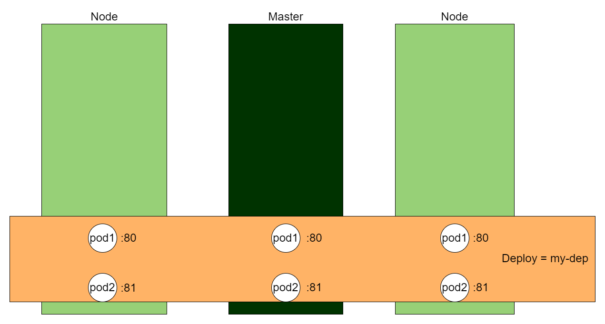
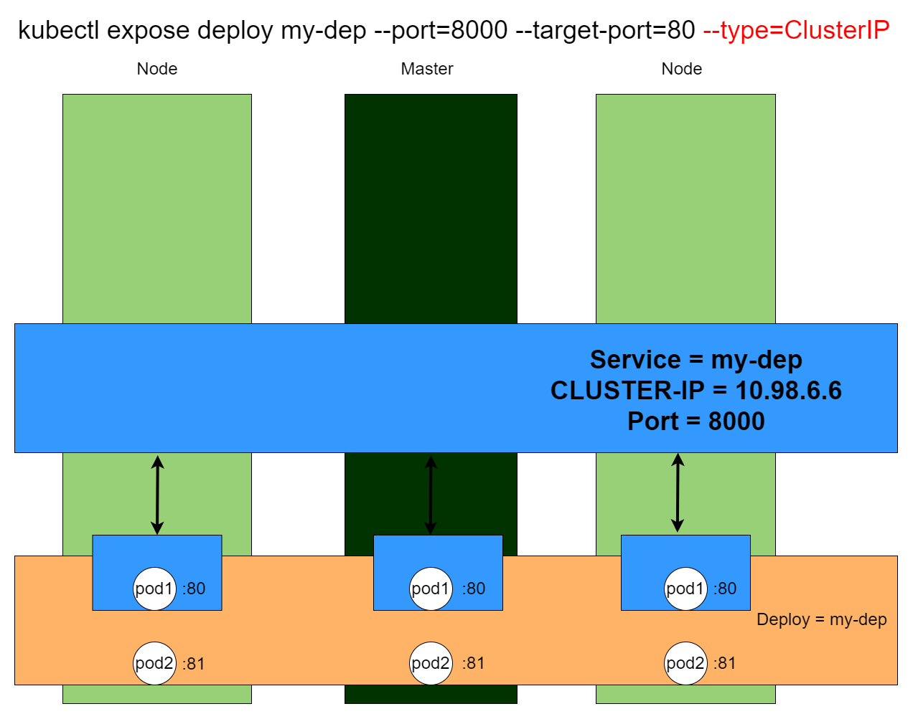
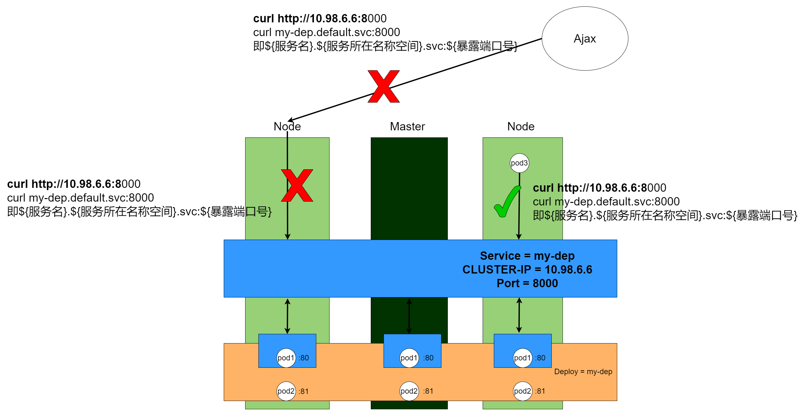
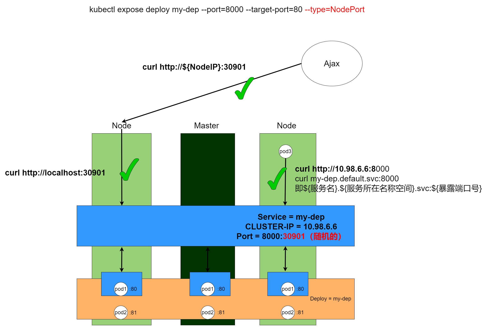
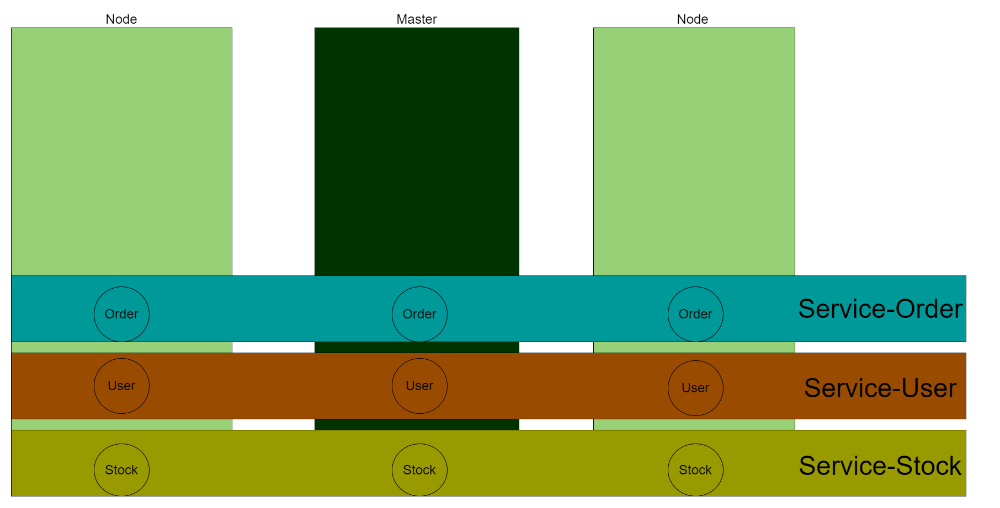
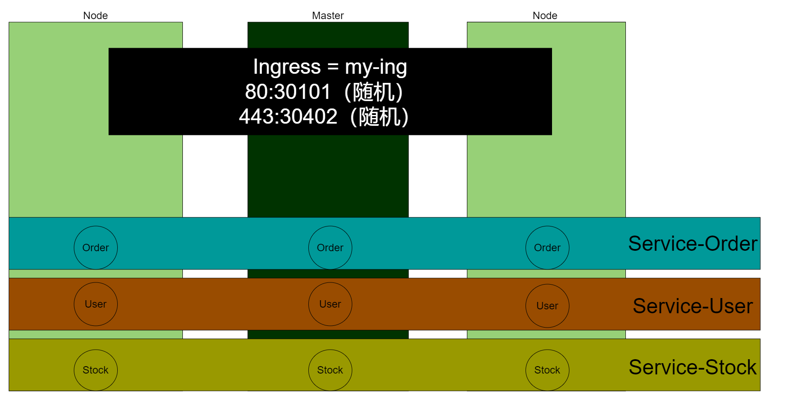
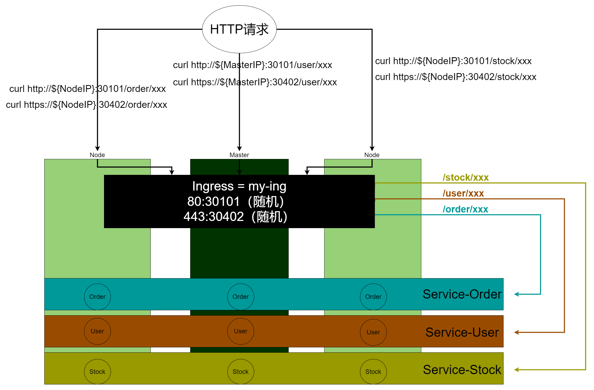

# Kubernetes的“注册中心”-Service

## 概念

如果说Deploy是对Pods的部署功能进行一层封装，那么Service就是对Pods的网络功能进行了一层封装。如图所示：



现在这个Kubernetes集群部署了一个名为my-dep的Deploy，正常来说可以通过每个Pod的IP进行访问，但是这样太麻烦了，**像上图那样有3个Pod1，岂不是要访问3个不同的IP？**

因此引入了Service的概念，作为Deploy的封装，我通过命令kubectl expose deployment my-dep --port=8000 --target-port=80 --type=ClusterIP后，是这样的：



会创建出一个name=my-dep的Service，它的端口是8080，并且会产生一个CLUSTER-IP=10.98.6.6。这有什么作用？看下图：



假设现在Kubernetes内有一个Pod3，Pod3可以通过以下两种方式访问Service，从而对Pod1实现负载均衡、健康返回的访问：

1. curl http://${ClusterIP}:${Port}，即curl http://10.98.6.6:8000。
2. curl ${服务名}.${服务所在的名称空间}.svc:${端口号}，即curl http://my-dep.default.svc:8080。

负载均衡能理解，那什么是健康返回？其实就是Service会监控每个Pod1的状态，如果其中一个Pod1挂了，那么在Pod1自愈 或 故障转移 之前，Service不会将请求转发到这个挂了的Pod1。

**值得注意的是：ClusterIP模式的Service，只允许Kubernetes环境内的容器进行访问。**如果在Kubernetes环境外（物理机以外的请求）进行访问，是不允许的。

**即使是本机调用，也仅限于ClusterIP的方式，localhost和服务名的方式是不允许的**。

那有什么好办法呢？我总不能整个环境都部署到Kubernetes环境里吧？这时候可以用NodePort模式：



创建Service的语句基本一样，只是从--type=ClusterIP改成--type=NodePort。此时Service会随机选择一个端口进行暴露，环境内的访问方式不变。但是环境外可以通过${物理机IP}+${随机端口}的方式进行访问。当然，前提是物理机本身对外暴露了这个端口。

**从访问方式上看，可以理解为，NodePort模式是ClusterIP的一个增强。**

## 实践

### 准备好Deploy

以两个Nginx为Pod的Deploy为例：

```bash
root@kjg-PC:~# kubectl get deploy
NAME                 READY   UP-TO-DATE   AVAILABLE   AGE
multi-deploy-nginx   2/2     2            2           4d5h
root@kjg-PC:~# kubectl get pods -owide
NAME                                  READY   STATUS    RESTARTS   AGE    IP             NODE       NOMINATED NODE   READINESS GATES
multi-deploy-nginx-785f995c7d-cjf5h   1/1     Running   0          4m4s   172.31.3.208   ubuntu01   <none>           <none>
multi-deploy-nginx-785f995c7d-lxpps   1/1     Running   2          4d3h   172.31.79.14   ubuntu02   <none>           <none>
root@kjg-PC:~# 
```

为了方便观看，我还是将nginx里面的欢迎页改一下：

```bash
# 修改cjf5h的欢迎页为nginx1111
root@kjg-PC:~# kubectl exec -it multi-deploy-nginx-785f995c7d-cjf5h -c nginx -- /bin/bash
root@multi-deploy-nginx-785f995c7d-cjf5h:/# cd /usr/share/nginx/html/
root@multi-deploy-nginx-785f995c7d-cjf5h:/usr/share/nginx/html# ls
50x.html  index.html
root@multi-deploy-nginx-785f995c7d-cjf5h:/usr/share/nginx/html# echo nginx1111 > index.html
root@multi-deploy-nginx-785f995c7d-cjf5h:/usr/share/nginx/html# exit
exit
root@kjg-PC:~# curl http://172.31.3.208
nginx1111


# 修改lxpps的欢迎页为nginx2222：
root@kjg-PC:~# kubectl exec -it multi-deploy-nginx-785f995c7d-lxpps -c nginx -- /bin/bash
root@multi-deploy-nginx-785f995c7d-lxpps:/# cd /usr/share/nginx/html/
root@multi-deploy-nginx-785f995c7d-lxpps:/usr/share/nginx/html# echo nginx2222 > index.html 
root@multi-deploy-nginx-785f995c7d-lxpps:/usr/share/nginx/html# exit
exit
root@kjg-PC:~# curl http://172.31.79.14
nginx2222
```

### 创建Service

给multi-deploy-nginx的nginx pod创建Service，对外暴露8000端口，采用ClusterIP的方式：

```bash
root@kjg-PC:~# kubectl expose deployment multi-deploy-nginx --port=8000 --target-port=80 --type=ClusterIP
service/multi-deploy-nginx exposed
root@kjg-PC:~# kubectl get service
NAME                 TYPE        CLUSTER-IP      EXTERNAL-IP   PORT(S)    AGE
kubernetes           ClusterIP   10.96.0.1       <none>        443/TCP    10d
multi-deploy-nginx   ClusterIP   10.96.142.162   <none>        8000/TCP   10s
```

### 负载均衡的体现

可以发现，通过本机通过CLUSTER-IP访问Service，实现了负载均衡的效果：

```bash
root@kjg-PC:~# curl http://10.96.142.162:8000
nginx2222
root@kjg-PC:~# curl http://10.96.142.162:8000
nginx2222
root@kjg-PC:~# curl http://10.96.142.162:8000
nginx2222
root@kjg-PC:~# curl http://10.96.142.162:8000
nginx1111
root@kjg-PC:~# curl http://10.96.142.162:8000
nginx2222
root@kjg-PC:~# curl http://10.96.142.162:8000
nginx1111
root@kjg-PC:~# curl http://10.96.142.162:8000
nginx2222

root@kjg-PC:~# curl http://multi-deploy-nginx.default.svc:8000
curl: (6) Could not resolve host: multi-deploy-nginx.default.svc
```

就算新开一个Pod，也能对这个Service进行负载均衡访问：

```bash
root@kjg-PC:~# kubectl run pod-tomcat --image=tomcat
pod/pod-tomcat created
root@kjg-PC:~# kubectl get pods
NAME                                  READY   STATUS    RESTARTS   AGE
multi-deploy-nginx-785f995c7d-cjf5h   1/1     Running   0          19m
multi-deploy-nginx-785f995c7d-lxpps   1/1     Running   2          4d4h
pod-tomcat                            1/1     Running   0          115s
root@kjg-PC:~# kubectl exec -it pod-tomcat -- /bin/bash
root@pod-tomcat:/usr/local/tomcat# curl http://10.96.142.162:8000
nginx1111
root@pod-tomcat:/usr/local/tomcat# curl http://10.96.142.162:8000
nginx2222
root@pod-tomcat:/usr/local/tomcat# curl http://10.96.142.162:8000
nginx1111
root@pod-tomcat:/usr/local/tomcat# curl http://10.96.142.162:8000
nginx2222


root@pod-tomcat:/usr/local/tomcat# curl http://multi-deploy-nginx.default.svc:8000
nginx2222
root@pod-tomcat:/usr/local/tomcat# curl http://multi-deploy-nginx.default.svc:8000
nginx2222
root@pod-tomcat:/usr/local/tomcat# curl http://multi-deploy-nginx.default.svc:8000
nginx2222
root@pod-tomcat:/usr/local/tomcat# curl http://multi-deploy-nginx.default.svc:8000
nginx2222
root@pod-tomcat:/usr/local/tomcat# curl http://multi-deploy-nginx.default.svc:8000
nginx1111
root@pod-tomcat:/usr/local/tomcat# curl http://multi-deploy-nginx.default.svc:8000
nginx2222
root@pod-tomcat:/usr/local/tomcat# curl http://multi-deploy-nginx.default.svc:8000
nginx1111
```

# Kubernetes的“Nginx”-Ingress

## 概念

**Ingress底层是通过nginx来实现的，可以理解为Nginx在Kubernetes的适配版，用来对Service进行再一层封装。**

有了Service的概念，再看Ingress就比较好理解了，假设有这么一个场景，以**用户、库存、订单**服务为例，每1个服务对应1个Service，每1个服务对应的实例对应N个Pods，部署在3个机子组成的Kubernetes集群里（同1种颜色代表同1个Service）：



即使前面说过，Service可以通过NodePort的方式对外暴露，在这种场景下，不同Service本质通过端口进行区分。假如前端需要访问 订单、用户、库存服务，是不是要维护3份不同的端口号？这样比较麻烦，因此可以使用Ingress对Service再进行一层封装：



新建一个名叫my-ing的Ingress，它根据/order/xxx关联订单服务、/user/xxx关联用户服务、/stock/xxx关联库存服务。同时，my-ing会选择2个随机IP，分别映射物理机的80和443端口。



这样，当外部HTTP请求通过 ${任意IP地址} + ${随机端口} + ${访问路径}的方式，经过Ingress的转发，可以到达集群内不同的Service。对于外部而言，只有固定端口，至于IP可以通过LVS来实现固定IP。

## 实践

