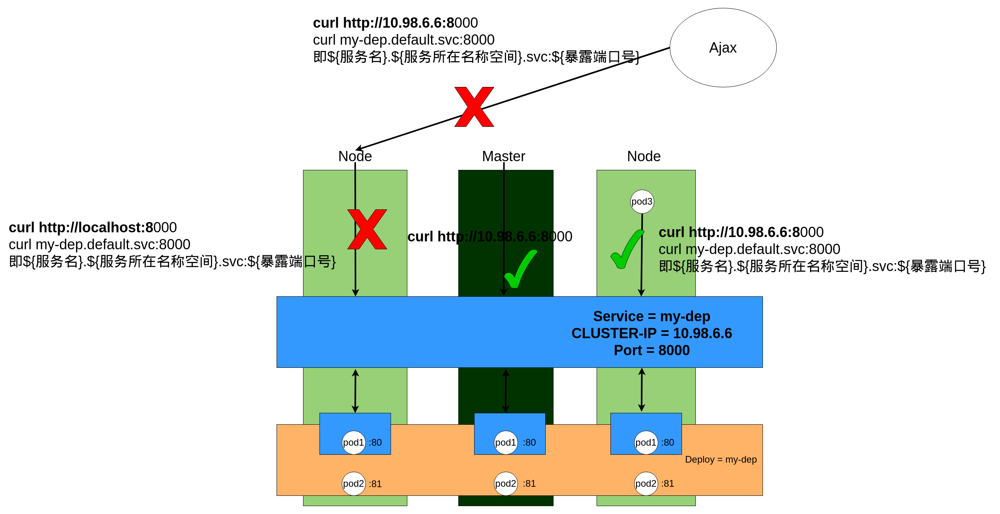

# Kubernetes的“注册中心”-Service

## 概念

如果说Deploy是对Pods的部署功能进行一层封装，那么Service就是对Pods的网络功能进行了一层封装。如图所示：


现在这个Kubernetes集群部署了一个名为my-dep的Deploy，正常来说可以通过每个Pod的IP进行访问，但是这样太麻烦了，**像上图那样有3个Pod1，岂不是要访问3个不同的IP？**

因此引入了Service的概念，作为Deploy的封装，我通过命令kubectl expose deployment my-dep --port=8000 --target-port=80 --type=ClusterIP后，是这样的：


会创建出一个name=my-dep的Service，它的端口是8080，并且会产生一个CLUSTER-IP=10.98.6.6。这有什么作用？看下图：



假设现在Kubernetes内有一个Pod3，Pod3可以通过以下两种方式访问Service，从而对Pod1实现负载均衡、健康返回的访问：

1. curl http://${ClusterIP}:${Port}，即curl http://10.98.6.6:8000。
2. curl ${服务名}.${服务所在的名称空间}.svc:${端口号}，即curl http://my-dep.default.svc:8080。

负载均衡能理解，那什么是健康返回？其实就是Service会监控每个Pod1的状态，如果其中一个Pod1挂了，那么在Pod1自愈 或 故障转移 之前，Service不会将请求转发到这个挂了的Pod1。

**值得注意的是：ClusterIP模式的Service，只允许Kubernetes环境内的容器进行访问。**如果在Kubernetes环境外（物理机以外的请求）进行访问，是不允许的。

**即使是本机调用，也仅限于ClusterIP的方式，localhost和服务名的方式是不允许的**。

那有什么好办法呢？我总不能整个环境都部署到Kubernetes环境里吧？这时候可以用NodePort模式：


创建Service的语句基本一样，只是从--type=ClusterIP改成--type=NodePort。此时Service会随机选择一个端口进行暴露，环境内的访问方式不变。但是环境外可以通过${物理机IP}+${随机端口}的方式进行访问。当然，前提是物理机本身对外暴露了这个端口。

**从访问方式上看，可以理解为，NodePort模式是ClusterIP的一个增强。**

## 实践

### 准备好Deploy

以两个Nginx为Pod的Deploy为例：

```bash
root@kjg-PC:~# kubectl get deploy
NAME                 READY   UP-TO-DATE   AVAILABLE   AGE
multi-deploy-nginx   2/2     2            2           4d5h
root@kjg-PC:~# kubectl get pods -owide
NAME                                  READY   STATUS    RESTARTS   AGE    IP             NODE       NOMINATED NODE   READINESS GATES
multi-deploy-nginx-785f995c7d-cjf5h   1/1     Running   0          4m4s   172.31.3.208   ubuntu01   <none>           <none>
multi-deploy-nginx-785f995c7d-lxpps   1/1     Running   2          4d3h   172.31.79.14   ubuntu02   <none>           <none>
root@kjg-PC:~# 
```

为了方便观看，我还是将nginx里面的欢迎页改一下：

```bash
# 修改cjf5h的欢迎页为nginx1111
root@kjg-PC:~# kubectl exec -it multi-deploy-nginx-785f995c7d-cjf5h -c nginx -- /bin/bash
root@multi-deploy-nginx-785f995c7d-cjf5h:/# cd /usr/share/nginx/html/
root@multi-deploy-nginx-785f995c7d-cjf5h:/usr/share/nginx/html# ls
50x.html  index.html
root@multi-deploy-nginx-785f995c7d-cjf5h:/usr/share/nginx/html# echo nginx1111 > index.html
root@multi-deploy-nginx-785f995c7d-cjf5h:/usr/share/nginx/html# exit
exit
root@kjg-PC:~# curl http://172.31.3.208
nginx1111


# 修改lxpps的欢迎页为nginx2222：
root@kjg-PC:~# kubectl exec -it multi-deploy-nginx-785f995c7d-lxpps -c nginx -- /bin/bash
root@multi-deploy-nginx-785f995c7d-lxpps:/# cd /usr/share/nginx/html/
root@multi-deploy-nginx-785f995c7d-lxpps:/usr/share/nginx/html# echo nginx2222 > index.html 
root@multi-deploy-nginx-785f995c7d-lxpps:/usr/share/nginx/html# exit
exit
root@kjg-PC:~# curl http://172.31.79.14
nginx2222
```

### 创建Service

给multi-deploy-nginx的nginx pod创建Service，对外暴露8000端口，采用ClusterIP的方式：

```bash
root@kjg-PC:~# kubectl expose deployment multi-deploy-nginx --port=8000 --target-port=80 --type=ClusterIP
service/multi-deploy-nginx exposed
root@kjg-PC:~# kubectl get service
NAME                 TYPE        CLUSTER-IP      EXTERNAL-IP   PORT(S)    AGE
kubernetes           ClusterIP   10.96.0.1       <none>        443/TCP    10d
multi-deploy-nginx   ClusterIP   10.96.142.162   <none>        8000/TCP   10s
```

### 负载均衡的体现

可以发现，通过本机通过CLUSTER-IP访问Service，实现了负载均衡的效果：

```bash
root@kjg-PC:~# curl http://10.96.142.162:8000
nginx2222
root@kjg-PC:~# curl http://10.96.142.162:8000
nginx2222
root@kjg-PC:~# curl http://10.96.142.162:8000
nginx2222
root@kjg-PC:~# curl http://10.96.142.162:8000
nginx1111
root@kjg-PC:~# curl http://10.96.142.162:8000
nginx2222
root@kjg-PC:~# curl http://10.96.142.162:8000
nginx1111
root@kjg-PC:~# curl http://10.96.142.162:8000
nginx2222

root@kjg-PC:~# curl http://multi-deploy-nginx.default.svc:8000
curl: (6) Could not resolve host: multi-deploy-nginx.default.svc
```

就算新开一个Pod，也能对这个Service进行负载均衡访问：

```bash
root@kjg-PC:~# kubectl run pod-tomcat --image=tomcat
pod/pod-tomcat created
root@kjg-PC:~# kubectl get pods
NAME                                  READY   STATUS    RESTARTS   AGE
multi-deploy-nginx-785f995c7d-cjf5h   1/1     Running   0          19m
multi-deploy-nginx-785f995c7d-lxpps   1/1     Running   2          4d4h
pod-tomcat                            1/1     Running   0          115s
root@kjg-PC:~# kubectl exec -it pod-tomcat -- /bin/bash
root@pod-tomcat:/usr/local/tomcat# curl http://10.96.142.162:8000
nginx1111
root@pod-tomcat:/usr/local/tomcat# curl http://10.96.142.162:8000
nginx2222
root@pod-tomcat:/usr/local/tomcat# curl http://10.96.142.162:8000
nginx1111
root@pod-tomcat:/usr/local/tomcat# curl http://10.96.142.162:8000
nginx2222


root@pod-tomcat:/usr/local/tomcat# curl http://multi-deploy-nginx.default.svc:8000
nginx2222
root@pod-tomcat:/usr/local/tomcat# curl http://multi-deploy-nginx.default.svc:8000
nginx2222
root@pod-tomcat:/usr/local/tomcat# curl http://multi-deploy-nginx.default.svc:8000
nginx2222
root@pod-tomcat:/usr/local/tomcat# curl http://multi-deploy-nginx.default.svc:8000
nginx2222
root@pod-tomcat:/usr/local/tomcat# curl http://multi-deploy-nginx.default.svc:8000
nginx1111
root@pod-tomcat:/usr/local/tomcat# curl http://multi-deploy-nginx.default.svc:8000
nginx2222
root@pod-tomcat:/usr/local/tomcat# curl http://multi-deploy-nginx.default.svc:8000
nginx1111
```

# Kubernetes的“Nginx”-Ingress

## 概念

**Ingress底层是通过nginx来实现的，可以理解为Nginx在Kubernetes的适配版，用来对Service进行再一层封装。**

有了Service的概念，再看Ingress就比较好理解了，假设有这么一个场景，以**用户、库存、订单**服务为例，每1个服务对应1个Service，每1个服务对应的实例对应N个Pods，部署在3个机子组成的Kubernetes集群里（同1种颜色代表同1个Service）：


即使前面说过，Service可以通过NodePort的方式对外暴露，在这种场景下，不同Service本质通过端口进行区分。假如前端需要访问 订单、用户、库存服务，是不是要维护3份不同的端口号？这样比较麻烦，因此可以使用Ingress对Service再进行一层封装：


新建一个名叫my-ing的Ingress，它根据/order/xxx关联订单服务、/user/xxx关联用户服务、/stock/xxx关联库存服务。同时，my-ing会选择2个随机端口，分别映射物理机的80和443端口。


这样，当外部HTTP请求通过 ${任意IP地址} + ${随机端口} + ${访问路径}的方式，经过Ingress的转发，可以到达集群内不同的Service。对于外部而言，只有固定端口，至于IP可以通过LVS来实现固定IP。

## 实践

### 安装Ingress

因为墙的原因，就不用Github上的官方yaml了，找了一个配置好代理的ingress安装yaml：

```yaml
apiVersion: v1
kind: Namespace
metadata:
  name: ingress-nginx
  labels:
    app.kubernetes.io/name: ingress-nginx
    app.kubernetes.io/instance: ingress-nginx

---
# Source: ingress-nginx/templates/controller-serviceaccount.yaml
apiVersion: v1
kind: ServiceAccount
metadata:
  labels:
    helm.sh/chart: ingress-nginx-3.33.0
    app.kubernetes.io/name: ingress-nginx
    app.kubernetes.io/instance: ingress-nginx
    app.kubernetes.io/version: 0.47.0
    app.kubernetes.io/managed-by: Helm
    app.kubernetes.io/component: controller
  name: ingress-nginx
  namespace: ingress-nginx
automountServiceAccountToken: true
---
# Source: ingress-nginx/templates/controller-configmap.yaml
apiVersion: v1
kind: ConfigMap
metadata:
  labels:
    helm.sh/chart: ingress-nginx-3.33.0
    app.kubernetes.io/name: ingress-nginx
    app.kubernetes.io/instance: ingress-nginx
    app.kubernetes.io/version: 0.47.0
    app.kubernetes.io/managed-by: Helm
    app.kubernetes.io/component: controller
  name: ingress-nginx-controller
  namespace: ingress-nginx
data:
---
# Source: ingress-nginx/templates/clusterrole.yaml
apiVersion: rbac.authorization.k8s.io/v1
kind: ClusterRole
metadata:
  labels:
    helm.sh/chart: ingress-nginx-3.33.0
    app.kubernetes.io/name: ingress-nginx
    app.kubernetes.io/instance: ingress-nginx
    app.kubernetes.io/version: 0.47.0
    app.kubernetes.io/managed-by: Helm
  name: ingress-nginx
rules:
  - apiGroups:
      - ''
    resources:
      - configmaps
      - endpoints
      - nodes
      - pods
      - secrets
    verbs:
      - list
      - watch
  - apiGroups:
      - ''
    resources:
      - nodes
    verbs:
      - get
  - apiGroups:
      - ''
    resources:
      - services
    verbs:
      - get
      - list
      - watch
  - apiGroups:
      - extensions
      - networking.k8s.io   # k8s 1.14+
    resources:
      - ingresses
    verbs:
      - get
      - list
      - watch
  - apiGroups:
      - ''
    resources:
      - events
    verbs:
      - create
      - patch
  - apiGroups:
      - extensions
      - networking.k8s.io   # k8s 1.14+
    resources:
      - ingresses/status
    verbs:
      - update
  - apiGroups:
      - networking.k8s.io   # k8s 1.14+
    resources:
      - ingressclasses
    verbs:
      - get
      - list
      - watch
---
# Source: ingress-nginx/templates/clusterrolebinding.yaml
apiVersion: rbac.authorization.k8s.io/v1
kind: ClusterRoleBinding
metadata:
  labels:
    helm.sh/chart: ingress-nginx-3.33.0
    app.kubernetes.io/name: ingress-nginx
    app.kubernetes.io/instance: ingress-nginx
    app.kubernetes.io/version: 0.47.0
    app.kubernetes.io/managed-by: Helm
  name: ingress-nginx
roleRef:
  apiGroup: rbac.authorization.k8s.io
  kind: ClusterRole
  name: ingress-nginx
subjects:
  - kind: ServiceAccount
    name: ingress-nginx
    namespace: ingress-nginx
---
# Source: ingress-nginx/templates/controller-role.yaml
apiVersion: rbac.authorization.k8s.io/v1
kind: Role
metadata:
  labels:
    helm.sh/chart: ingress-nginx-3.33.0
    app.kubernetes.io/name: ingress-nginx
    app.kubernetes.io/instance: ingress-nginx
    app.kubernetes.io/version: 0.47.0
    app.kubernetes.io/managed-by: Helm
    app.kubernetes.io/component: controller
  name: ingress-nginx
  namespace: ingress-nginx
rules:
  - apiGroups:
      - ''
    resources:
      - namespaces
    verbs:
      - get
  - apiGroups:
      - ''
    resources:
      - configmaps
      - pods
      - secrets
      - endpoints
    verbs:
      - get
      - list
      - watch
  - apiGroups:
      - ''
    resources:
      - services
    verbs:
      - get
      - list
      - watch
  - apiGroups:
      - extensions
      - networking.k8s.io   # k8s 1.14+
    resources:
      - ingresses
    verbs:
      - get
      - list
      - watch
  - apiGroups:
      - extensions
      - networking.k8s.io   # k8s 1.14+
    resources:
      - ingresses/status
    verbs:
      - update
  - apiGroups:
      - networking.k8s.io   # k8s 1.14+
    resources:
      - ingressclasses
    verbs:
      - get
      - list
      - watch
  - apiGroups:
      - ''
    resources:
      - configmaps
    resourceNames:
      - ingress-controller-leader-nginx
    verbs:
      - get
      - update
  - apiGroups:
      - ''
    resources:
      - configmaps
    verbs:
      - create
  - apiGroups:
      - ''
    resources:
      - events
    verbs:
      - create
      - patch
---
# Source: ingress-nginx/templates/controller-rolebinding.yaml
apiVersion: rbac.authorization.k8s.io/v1
kind: RoleBinding
metadata:
  labels:
    helm.sh/chart: ingress-nginx-3.33.0
    app.kubernetes.io/name: ingress-nginx
    app.kubernetes.io/instance: ingress-nginx
    app.kubernetes.io/version: 0.47.0
    app.kubernetes.io/managed-by: Helm
    app.kubernetes.io/component: controller
  name: ingress-nginx
  namespace: ingress-nginx
roleRef:
  apiGroup: rbac.authorization.k8s.io
  kind: Role
  name: ingress-nginx
subjects:
  - kind: ServiceAccount
    name: ingress-nginx
    namespace: ingress-nginx
---
# Source: ingress-nginx/templates/controller-service-webhook.yaml
apiVersion: v1
kind: Service
metadata:
  labels:
    helm.sh/chart: ingress-nginx-3.33.0
    app.kubernetes.io/name: ingress-nginx
    app.kubernetes.io/instance: ingress-nginx
    app.kubernetes.io/version: 0.47.0
    app.kubernetes.io/managed-by: Helm
    app.kubernetes.io/component: controller
  name: ingress-nginx-controller-admission
  namespace: ingress-nginx
spec:
  type: ClusterIP
  ports:
    - name: https-webhook
      port: 443
      targetPort: webhook
  selector:
    app.kubernetes.io/name: ingress-nginx
    app.kubernetes.io/instance: ingress-nginx
    app.kubernetes.io/component: controller
---
# Source: ingress-nginx/templates/controller-service.yaml
apiVersion: v1
kind: Service
metadata:
  annotations:
  labels:
    helm.sh/chart: ingress-nginx-3.33.0
    app.kubernetes.io/name: ingress-nginx
    app.kubernetes.io/instance: ingress-nginx
    app.kubernetes.io/version: 0.47.0
    app.kubernetes.io/managed-by: Helm
    app.kubernetes.io/component: controller
  name: ingress-nginx-controller
  namespace: ingress-nginx
spec:
  type: NodePort
  ports:
    - name: http
      port: 80
      protocol: TCP
      targetPort: http
    - name: https
      port: 443
      protocol: TCP
      targetPort: https
  selector:
    app.kubernetes.io/name: ingress-nginx
    app.kubernetes.io/instance: ingress-nginx
    app.kubernetes.io/component: controller
---
# Source: ingress-nginx/templates/controller-deployment.yaml
apiVersion: apps/v1
kind: Deployment
metadata:
  labels:
    helm.sh/chart: ingress-nginx-3.33.0
    app.kubernetes.io/name: ingress-nginx
    app.kubernetes.io/instance: ingress-nginx
    app.kubernetes.io/version: 0.47.0
    app.kubernetes.io/managed-by: Helm
    app.kubernetes.io/component: controller
  name: ingress-nginx-controller
  namespace: ingress-nginx
spec:
  selector:
    matchLabels:
      app.kubernetes.io/name: ingress-nginx
      app.kubernetes.io/instance: ingress-nginx
      app.kubernetes.io/component: controller
  revisionHistoryLimit: 10
  minReadySeconds: 0
  template:
    metadata:
      labels:
        app.kubernetes.io/name: ingress-nginx
        app.kubernetes.io/instance: ingress-nginx
        app.kubernetes.io/component: controller
    spec:
      dnsPolicy: ClusterFirst
      containers:
        - name: controller
          image: registry.cn-hangzhou.aliyuncs.com/lfy_k8s_images/ingress-nginx-controller:v0.46.0
          imagePullPolicy: IfNotPresent
          lifecycle:
            preStop:
              exec:
                command:
                  - /wait-shutdown
          args:
            - /nginx-ingress-controller
            - --election-id=ingress-controller-leader
            - --ingress-class=nginx
            - --configmap=$(POD_NAMESPACE)/ingress-nginx-controller
            - --validating-webhook=:8443
            - --validating-webhook-certificate=/usr/local/certificates/cert
            - --validating-webhook-key=/usr/local/certificates/key
          securityContext:
            capabilities:
              drop:
                - ALL
              add:
                - NET_BIND_SERVICE
            runAsUser: 101
            allowPrivilegeEscalation: true
          env:
            - name: POD_NAME
              valueFrom:
                fieldRef:
                  fieldPath: metadata.name
            - name: POD_NAMESPACE
              valueFrom:
                fieldRef:
                  fieldPath: metadata.namespace
            - name: LD_PRELOAD
              value: /usr/local/lib/libmimalloc.so
          livenessProbe:
            failureThreshold: 5
            httpGet:
              path: /healthz
              port: 10254
              scheme: HTTP
            initialDelaySeconds: 10
            periodSeconds: 10
            successThreshold: 1
            timeoutSeconds: 1
          readinessProbe:
            failureThreshold: 3
            httpGet:
              path: /healthz
              port: 10254
              scheme: HTTP
            initialDelaySeconds: 10
            periodSeconds: 10
            successThreshold: 1
            timeoutSeconds: 1
          ports:
            - name: http
              containerPort: 80
              protocol: TCP
            - name: https
              containerPort: 443
              protocol: TCP
            - name: webhook
              containerPort: 8443
              protocol: TCP
          volumeMounts:
            - name: webhook-cert
              mountPath: /usr/local/certificates/
              readOnly: true
          resources:
            requests:
              cpu: 100m
              memory: 90Mi
      nodeSelector:
        kubernetes.io/os: linux
      serviceAccountName: ingress-nginx
      terminationGracePeriodSeconds: 300
      volumes:
        - name: webhook-cert
          secret:
            secretName: ingress-nginx-admission
---
# Source: ingress-nginx/templates/admission-webhooks/validating-webhook.yaml
# before changing this value, check the required kubernetes version
# https://kubernetes.io/docs/reference/access-authn-authz/extensible-admission-controllers/#prerequisites
apiVersion: admissionregistration.k8s.io/v1
kind: ValidatingWebhookConfiguration
metadata:
  labels:
    helm.sh/chart: ingress-nginx-3.33.0
    app.kubernetes.io/name: ingress-nginx
    app.kubernetes.io/instance: ingress-nginx
    app.kubernetes.io/version: 0.47.0
    app.kubernetes.io/managed-by: Helm
    app.kubernetes.io/component: admission-webhook
  name: ingress-nginx-admission
webhooks:
  - name: validate.nginx.ingress.kubernetes.io
    matchPolicy: Equivalent
    rules:
      - apiGroups:
          - networking.k8s.io
        apiVersions:
          - v1beta1
        operations:
          - CREATE
          - UPDATE
        resources:
          - ingresses
    failurePolicy: Fail
    sideEffects: None
    admissionReviewVersions:
      - v1
      - v1beta1
    clientConfig:
      service:
        namespace: ingress-nginx
        name: ingress-nginx-controller-admission
        path: /networking/v1beta1/ingresses
---
# Source: ingress-nginx/templates/admission-webhooks/job-patch/serviceaccount.yaml
apiVersion: v1
kind: ServiceAccount
metadata:
  name: ingress-nginx-admission
  annotations:
    helm.sh/hook: pre-install,pre-upgrade,post-install,post-upgrade
    helm.sh/hook-delete-policy: before-hook-creation,hook-succeeded
  labels:
    helm.sh/chart: ingress-nginx-3.33.0
    app.kubernetes.io/name: ingress-nginx
    app.kubernetes.io/instance: ingress-nginx
    app.kubernetes.io/version: 0.47.0
    app.kubernetes.io/managed-by: Helm
    app.kubernetes.io/component: admission-webhook
  namespace: ingress-nginx
---
# Source: ingress-nginx/templates/admission-webhooks/job-patch/clusterrole.yaml
apiVersion: rbac.authorization.k8s.io/v1
kind: ClusterRole
metadata:
  name: ingress-nginx-admission
  annotations:
    helm.sh/hook: pre-install,pre-upgrade,post-install,post-upgrade
    helm.sh/hook-delete-policy: before-hook-creation,hook-succeeded
  labels:
    helm.sh/chart: ingress-nginx-3.33.0
    app.kubernetes.io/name: ingress-nginx
    app.kubernetes.io/instance: ingress-nginx
    app.kubernetes.io/version: 0.47.0
    app.kubernetes.io/managed-by: Helm
    app.kubernetes.io/component: admission-webhook
rules:
  - apiGroups:
      - admissionregistration.k8s.io
    resources:
      - validatingwebhookconfigurations
    verbs:
      - get
      - update
---
# Source: ingress-nginx/templates/admission-webhooks/job-patch/clusterrolebinding.yaml
apiVersion: rbac.authorization.k8s.io/v1
kind: ClusterRoleBinding
metadata:
  name: ingress-nginx-admission
  annotations:
    helm.sh/hook: pre-install,pre-upgrade,post-install,post-upgrade
    helm.sh/hook-delete-policy: before-hook-creation,hook-succeeded
  labels:
    helm.sh/chart: ingress-nginx-3.33.0
    app.kubernetes.io/name: ingress-nginx
    app.kubernetes.io/instance: ingress-nginx
    app.kubernetes.io/version: 0.47.0
    app.kubernetes.io/managed-by: Helm
    app.kubernetes.io/component: admission-webhook
roleRef:
  apiGroup: rbac.authorization.k8s.io
  kind: ClusterRole
  name: ingress-nginx-admission
subjects:
  - kind: ServiceAccount
    name: ingress-nginx-admission
    namespace: ingress-nginx
---
# Source: ingress-nginx/templates/admission-webhooks/job-patch/role.yaml
apiVersion: rbac.authorization.k8s.io/v1
kind: Role
metadata:
  name: ingress-nginx-admission
  annotations:
    helm.sh/hook: pre-install,pre-upgrade,post-install,post-upgrade
    helm.sh/hook-delete-policy: before-hook-creation,hook-succeeded
  labels:
    helm.sh/chart: ingress-nginx-3.33.0
    app.kubernetes.io/name: ingress-nginx
    app.kubernetes.io/instance: ingress-nginx
    app.kubernetes.io/version: 0.47.0
    app.kubernetes.io/managed-by: Helm
    app.kubernetes.io/component: admission-webhook
  namespace: ingress-nginx
rules:
  - apiGroups:
      - ''
    resources:
      - secrets
    verbs:
      - get
      - create
---
# Source: ingress-nginx/templates/admission-webhooks/job-patch/rolebinding.yaml
apiVersion: rbac.authorization.k8s.io/v1
kind: RoleBinding
metadata:
  name: ingress-nginx-admission
  annotations:
    helm.sh/hook: pre-install,pre-upgrade,post-install,post-upgrade
    helm.sh/hook-delete-policy: before-hook-creation,hook-succeeded
  labels:
    helm.sh/chart: ingress-nginx-3.33.0
    app.kubernetes.io/name: ingress-nginx
    app.kubernetes.io/instance: ingress-nginx
    app.kubernetes.io/version: 0.47.0
    app.kubernetes.io/managed-by: Helm
    app.kubernetes.io/component: admission-webhook
  namespace: ingress-nginx
roleRef:
  apiGroup: rbac.authorization.k8s.io
  kind: Role
  name: ingress-nginx-admission
subjects:
  - kind: ServiceAccount
    name: ingress-nginx-admission
    namespace: ingress-nginx
---
# Source: ingress-nginx/templates/admission-webhooks/job-patch/job-createSecret.yaml
apiVersion: batch/v1
kind: Job
metadata:
  name: ingress-nginx-admission-create
  annotations:
    helm.sh/hook: pre-install,pre-upgrade
    helm.sh/hook-delete-policy: before-hook-creation,hook-succeeded
  labels:
    helm.sh/chart: ingress-nginx-3.33.0
    app.kubernetes.io/name: ingress-nginx
    app.kubernetes.io/instance: ingress-nginx
    app.kubernetes.io/version: 0.47.0
    app.kubernetes.io/managed-by: Helm
    app.kubernetes.io/component: admission-webhook
  namespace: ingress-nginx
spec:
  template:
    metadata:
      name: ingress-nginx-admission-create
      labels:
        helm.sh/chart: ingress-nginx-3.33.0
        app.kubernetes.io/name: ingress-nginx
        app.kubernetes.io/instance: ingress-nginx
        app.kubernetes.io/version: 0.47.0
        app.kubernetes.io/managed-by: Helm
        app.kubernetes.io/component: admission-webhook
    spec:
      containers:
        - name: create
          image: docker.io/jettech/kube-webhook-certgen:v1.5.1
          imagePullPolicy: IfNotPresent
          args:
            - create
            - --host=ingress-nginx-controller-admission,ingress-nginx-controller-admission.$(POD_NAMESPACE).svc
            - --namespace=$(POD_NAMESPACE)
            - --secret-name=ingress-nginx-admission
          env:
            - name: POD_NAMESPACE
              valueFrom:
                fieldRef:
                  fieldPath: metadata.namespace
      restartPolicy: OnFailure
      serviceAccountName: ingress-nginx-admission
      securityContext:
        runAsNonRoot: true
        runAsUser: 2000
---
# Source: ingress-nginx/templates/admission-webhooks/job-patch/job-patchWebhook.yaml
apiVersion: batch/v1
kind: Job
metadata:
  name: ingress-nginx-admission-patch
  annotations:
    helm.sh/hook: post-install,post-upgrade
    helm.sh/hook-delete-policy: before-hook-creation,hook-succeeded
  labels:
    helm.sh/chart: ingress-nginx-3.33.0
    app.kubernetes.io/name: ingress-nginx
    app.kubernetes.io/instance: ingress-nginx
    app.kubernetes.io/version: 0.47.0
    app.kubernetes.io/managed-by: Helm
    app.kubernetes.io/component: admission-webhook
  namespace: ingress-nginx
spec:
  template:
    metadata:
      name: ingress-nginx-admission-patch
      labels:
        helm.sh/chart: ingress-nginx-3.33.0
        app.kubernetes.io/name: ingress-nginx
        app.kubernetes.io/instance: ingress-nginx
        app.kubernetes.io/version: 0.47.0
        app.kubernetes.io/managed-by: Helm
        app.kubernetes.io/component: admission-webhook
    spec:
      containers:
        - name: patch
          image: docker.io/jettech/kube-webhook-certgen:v1.5.1
          imagePullPolicy: IfNotPresent
          args:
            - patch
            - --webhook-name=ingress-nginx-admission
            - --namespace=$(POD_NAMESPACE)
            - --patch-mutating=false
            - --secret-name=ingress-nginx-admission
            - --patch-failure-policy=Fail
          env:
            - name: POD_NAMESPACE
              valueFrom:
                fieldRef:
                  fieldPath: metadata.namespace
      restartPolicy: OnFailure
      serviceAccountName: ingress-nginx-admission
      securityContext:
        runAsNonRoot: true
        runAsUser: 2000
```

```bash
root@kjg-PC:~# vim ingress.yaml
root@kjg-PC:~# kubectl apply -f ingress.yaml 
namespace/ingress-nginx created
serviceaccount/ingress-nginx created
configmap/ingress-nginx-controller created
clusterrole.rbac.authorization.k8s.io/ingress-nginx created
clusterrolebinding.rbac.authorization.k8s.io/ingress-nginx created
role.rbac.authorization.k8s.io/ingress-nginx created
rolebinding.rbac.authorization.k8s.io/ingress-nginx created
service/ingress-nginx-controller-admission created
service/ingress-nginx-controller created
deployment.apps/ingress-nginx-controller created
validatingwebhookconfiguration.admissionregistration.k8s.io/ingress-nginx-admission created
serviceaccount/ingress-nginx-admission created
clusterrole.rbac.authorization.k8s.io/ingress-nginx-admission created
clusterrolebinding.rbac.authorization.k8s.io/ingress-nginx-admission created
role.rbac.authorization.k8s.io/ingress-nginx-admission created
rolebinding.rbac.authorization.k8s.io/ingress-nginx-admission created
job.batch/ingress-nginx-admission-create created
job.batch/ingress-nginx-admission-patch created
```

```bash
root@kjg-PC:~# kubectl get pods -n ingress-nginx
NAME                                        READY   STATUS      RESTARTS   AGE
ingress-nginx-admission-create-n8mqs        0/1     Completed   0          4m2s		#不用关心这两个Completed
ingress-nginx-admission-patch-22nbp         0/1     Completed   0          4m2s
ingress-nginx-controller-65bf56f7fc-xpmkt   1/1     Running     0          4m2s
root@kjg-PC:~# kubectl get service -n ingress-nginx
NAME                                 TYPE        CLUSTER-IP     EXTERNAL-IP   PORT(S)                      AGE
ingress-nginx-controller             NodePort    10.96.61.211   <none>        80:30258/TCP,443:31132/TCP   4m44s
ingress-nginx-controller-admission   ClusterIP   10.96.35.85    <none>        443/TCP                      4m44s
```

**对于Ingress来说，最重要的是ingress-nginx-controller的NodePort，比如本次安装完成后，主机30258对应80端口，主机31132对应443端口。**在我的本机（我的真正物理机，Kubernetes集群搭建在3台虚拟机上，是Windows11）访问任意一台虚拟机的30258、31132端口，可以看到Ingress的响应：

```
C:\Users\ASUS>curl http://192.168.120.161:30258
<html>
<head><title>404 Not Found</title></head>
<body>
<center><h1>404 Not Found</h1></center>
<hr><center>nginx</center>
</body>
</html>


C:\Users\ASUS>curl http://192.168.120.161:31132
<html>
<head><title>400 The plain HTTP request was sent to HTTPS port</title></head>
<body>
<center><h1>400 Bad Request</h1></center>
<center>The plain HTTP request was sent to HTTPS port</center>
<hr><center>nginx</center>
</body>
</html>
```

### 准备2个Service

还是以上面名为multi-deploy-nginx的Service为例，再创建一个新的Deploy叫multi-deploy-tomcat，并且为multi-deploy-tomcat也创建一个Service，这样就有2个Service了：multi-deploy-nginx和multi-deploy-tomcat

```bash
root@kjg-PC:~# kubectl create deploy multi-deploy-tomcat --image=tomcat --replicas=2
deployment.apps/multi-deploy-tomcat created
root@kjg-PC:~# kubectl get pods -A
NAMESPACE              NAME                                         READY   STATUS      RESTARTS   AGE
default                multi-deploy-tomcat-5bdc676588-lwztt         1/1     Running     0          44s
default                multi-deploy-tomcat-5bdc676588-x95bw         1/1     Running     0          44s
root@kjg-PC:~# kubectl get deploy -A
NAMESPACE              NAME                        READY   UP-TO-DATE   AVAILABLE   AGE
default                multi-deploy-tomcat         2/2     2            2           89s
root@kjg-PC:~# kubectl expose deployment multi-deploy-tomcat --port=8001 --target-port=8080 --type=ClusterIP
service/multi-deploy-tomcat exposed
root@kjg-PC:~# kubectl get service -A
NAMESPACE              NAME                                 TYPE        CLUSTER-IP      EXTERNAL-IP   PORT(S)                      AGE
default                multi-deploy-tomcat                  ClusterIP   10.96.28.201    <none>        8001/TCP                     17


# 访问Service的8001端口，没问题。
root@kjg-PC:~# curl http://10.96.28.201:8001
<!doctype html><html lang="en"><head><title>HTTP Status 404 – Not Found</title><style type="text/css">body {font-family:Tahoma,Arial,sans-serif;} h1, h2, h3, b {color:white;background-color:#525D76;} h1 {font-size:22px;} h2 {font-size:16px;} h3 {font-size:14px;} p {font-size:12px;} a {color:black;} .line {height:1px;background-color:#525D76;border:none;}</style></head><body><h1>HTTP Status 404 – Not Found</h1><hr class="line" /><p><b>Type</b> Status Report</p><p><b>Description</b> The origin server did not find a current representation for the target resource or is not willing to disclose that one exists.</p><hr class="line" /><h3>Apache Tomcat/10.0.14</h3></body></html>r
```

### 创建Ingress

现在我想达到这样的效果：

1. 首先我在真实的物理机（Window11）配置一下host，请求http://www.genn.com/时会转发到三台虚拟机上（Kubernetes的物理机），从而模拟生产环境中的外网LVS。
2. 我在物理机请求http://www.genn.com/nginx的时候，会实际请求到multi-deploy-nginx这个Service。我在物理机请求http://www.genn.com/nginx的时候，会实际请求到multi-deploy-tomcat这个Service。

基于2.的需求，创建以下Ingree配置文件：

```yaml
apiVersion: networking.k8s.io/v1
kind: Ingress  
metadata:
  name: ingress-nginx-tomcat
spec:
  ingressClassName: nginx
  rules:
  - host: "www.genn.com"
    http:
      paths:
      - pathType: Prefix
        path: "/nginx" # 会把/nginx请求会转给下面的服务处理
        backend:
          service:
            name: multi-deploy-nginx
            port:
              number: 8000
      - pathType: Prefix
        path: "/tomcat"  # 会把/tomcat请求会转给下面的服务处理
        backend:
          service:
            name: multi-deploy-tomcat  
            port:
              number: 8001
```

```bash
root@kjg-PC:~# vim ingress-nginx-tomcat.yaml 
root@kjg-PC:~# kubectl apply -f ingress-nginx-tomcat.yaml 
ingress.networking.k8s.io/ingress-nginx-tomcat created
root@kjg-PC:~# kubectl get ing -A
NAMESPACE   NAME                   CLASS   HOSTS          ADDRESS           PORTS   AGE
default     ingress-nginx-tomcat   nginx   www.genn.com   192.168.120.121   80      17s
```

修改物理机的hosts文件（Windows11）：

```
192.168.120.161 www.genn.com
192.168.120.121 www.genn.com
192.168.120.122 www.genn.com
```

在物理机进行访问（Windows11）：

```
C:\Users\ASUS>ipconfig /flushdns

Windows IP 配置

已成功刷新 DNS 解析缓存。

C:\Users\ASUS>ping www.genn.com

正在 Ping www.genn.com [192.168.120.121] 具有 32 字节的数据:
来自 192.168.120.121 的回复: 字节=32 时间<1ms TTL=64
来自 192.168.120.121 的回复: 字节=32 时间<1ms TTL=64

192.168.120.121 的 Ping 统计信息:
    数据包: 已发送 = 2，已接收 = 2，丢失 = 0 (0% 丢失)，
往返行程的估计时间(以毫秒为单位):
    最短 = 0ms，最长 = 0ms，平均 = 0ms
Control-C
^C
C:\Users\ASUS>curl http://www.genn.com:30258/nginx
<html>
<head><title>404 Not Found</title></head>
<body>
<center><h1>404 Not Found</h1></center>
<hr><center>nginx/1.21.5</center>
</body>
</html>

C:\Users\ASUS>curl http://www.genn.com:30258/tomcat
<!doctype html><html lang="en"><head><title>HTTP Status 404 – Not Found</title><style type="text/css">body {font-family:Tahoma,Arial,sans-serif;} h1, h2, h3, b {color:white;background-color:#525D76;} h1 {font-size:22px;} h2 {font-size:16px;} h3 {font-size:14px;} p {font-size:12px;} a {color:black;} .line {height:1px;background-color:#525D76;border:none;}</style></head><body><h1>HTTP Status 404 – Not Found</h1><hr class="line" /><p><b>Type</b> Status Report</p><p><b>Description</b> The origin server did not find a current representation for the target resource or is not willing to disclose that one exists.</p><hr class="line" /><h3>Apache Tomcat/10.0.14</h3></body></html>
```

### 匹配路径与下游Service

访问Tomcat没问题，为什么访问Nginx会报404？不应该是nginx1111或者nginx2222吗？因为ingress-nginx-tomcat配置文件里会将匹配的请求带给下游服务，比如我通过/nginx命中multi-deploy-nginx服务，转发请求的时候会将/nginx这个路径带过去。

也可以通过修改配置文件的方式，**匹配路径的同时，不将路径带给下游Service：**

```bash
root@kjg-PC:~# kubectl edit ing ingress-nginx-tomcat

apiVersion: networking.k8s.io/v1
kind: Ingress  
metadata:
  annotations:
  	# 改动点1！！！！！！！！！！！！！！！！！！！！！！！！！！！！！！！！！！！！！！
    nginx.ingress.kubernetes.io/rewrite-target: /$2
  name: ingress-nginx-tomcat
spec:
  ingressClassName: nginx
  rules:
  - host: "www.genn.com"
    http:
      paths:
      - pathType: Prefix
        path: "/nginx(/|$)(.*)" # 改动点2 如果传/nginx/aaa，只会将/aaa传给下游
        backend:
          service:
            name: multi-deploy-nginx
            port:
              number: 8000
      - pathType: Prefix
        path: "/tomcat"  # 会把/tomcat请求转给下面的服务处理
        backend:
          service:
            name: multi-deploy-tomcat  
            port:
              number: 8001
:wq

ingress.networking.k8s.io/ingress-nginx-tomcat edited
```

之后再通过物理机（Windows11）访问，发现成功到达Nginx首页：

```
C:\Users\ASUS>curl http://www.genn.com:30258/nginx/
nginx2222

C:\Users\ASUS>curl http://www.genn.com:30258/nginx/
nginx1111

C:\Users\ASUS>curl http://www.genn.com:30258/nginx/
nginx2222

C:\Users\ASUS>curl http://www.genn.com:30258/nginx/
nginx1111

C:\Users\ASUS>curl http://www.genn.com:30258/nginx/aaa
<html>
<head><title>404 Not Found</title></head>
<body>
<center><h1>404 Not Found</h1></center>
<hr><center>nginx/1.21.5</center>
</body>
</html>
```

