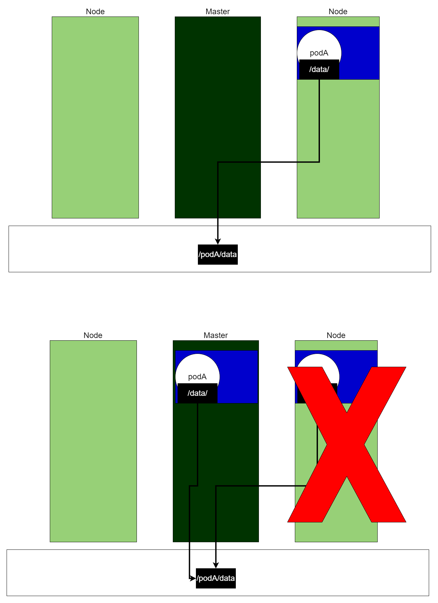
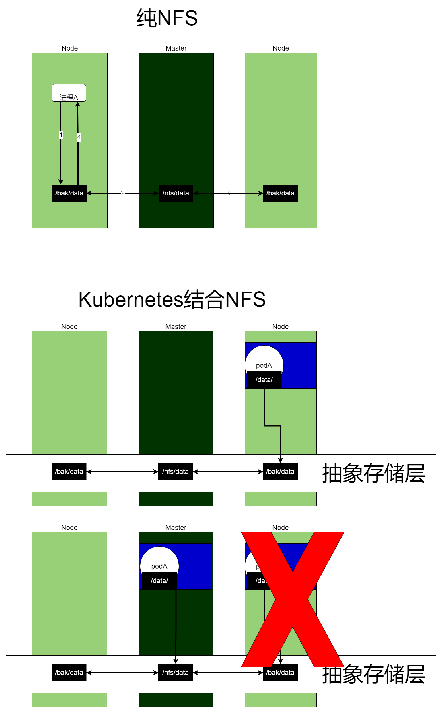
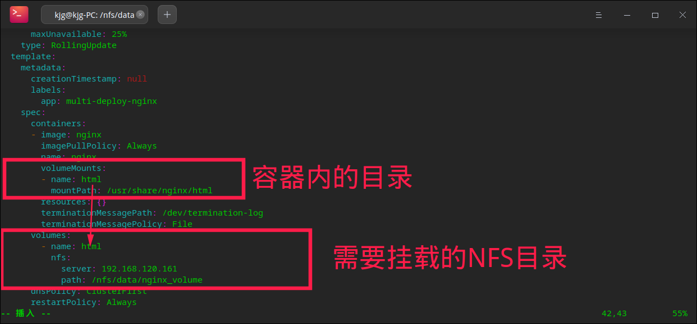

# 写在前面

通过许多文章可以得知，Kubernetes大部分使用在无状态服务，比如后端代码编写的服务本身（XX系统的实例），而不是有状态服务，比如Redis、MySQL、RabbitMQ、Kafka等承担实际存储数据的组件。

但作为Kubernetes的知识点之一，而且未来我考虑研究Kubernetes与TiDB这种天然的分布式数据库的结合使用，还是有必要了解一下的。

# Kubernetes-抽象存储

## 抽象存储的引出

我们在使用Docker的时候，也有这种使用场景：通过挂载的方式，将容器内的目录映射到宿主机的目录，通过修改宿主机的目录，从而实现容器内目录的修改。

同样的，Kubernetes也有这种需求，只不过从 容器映射宿主机 变成 Pod映射宿主机。但是，如果还是像Docker那样直接挂载，会有一个问题，要知道Kubernetes有故障转移功能，如果PodA原先在NodeB，挂载了NodeB的目录，因为一些不可抗力的原因NodeB挂掉了，作为Kubernetes会将PodA故障转移到NodeA，那此时PodA在NodeB的挂载行为就是失效了。用文字可能有点绕口，如图所示：


对于这种问题，Kubernetes采用抽象存储层的方式解决，Pod不是直接挂载宿主机的目录，而是挂载一个抽象的存储层。这样，即使某台宿主机挂了，只要抽象存储层的数据还在，Pod的数据就能够保证可用性：



## Kubernetes与抽象存储结合

说是说抽象存储，但落实下来，肯定是物理存储。能够在三台宿主机上独立出来一个存储层，本质就是分布式存储，我猜测是采用 **三台宿主机保持强一致性同步存储** 或 **宿主机外通过网络通信，存储到文件系统（参考TiDB Server 与 TiKV的设计）**。

其实，Kubernetes不是实现抽象存储层的，它只提供抽象存储层 与 Pod的接入功能，成熟的抽象存储层有Glusterfs、NFS、CephFS等。

以NFS为例，它是一种独立存储、共享操作的抽象存储，注意是共享！！！假设我在Master上开一个/nfs/data目录，并开启NFS抽象存储功能，同步到其他Node机的/bak/data目录，效果是往Master的/nfs/data或者其他Node机的/bak/data写入数据，都会同步到其他机器上。**但数据只会存储在Master上，Node机可以理解为远程读写Master的数据，实际操作同一份数据，Master挂了数据就没了**：



NFS会因为Master的宕机而数据丢失，不还是有单点故障问题的吗？实际上，NFS的使用最好采用存储分离的原则（参考TiKV的设计），数据操作机 和 数据存储机 进行分离，落实到上面的图，可以理解为Kubernetes的机子，都应该通过NFS挂载到一台独立NFS Master。**这里为了演示方便，将Master机作为NFS的Master了**。

## NFS的搭建

主机先把/nfs/data目录共享出来：

```bash
# 安装NFS服务
root@kjg-PC:~# apt-get install nfs-kernel-server
# 主节点创建共享目录
root@kjg-PC:~# mkdir -p /nfs/data
# 将共享目录配置到nfs的配置文件里
root@kjg-PC:~# echo "/nfs/data  *(rw,sync,no_root_squash)" > /etc/exports
# 启动portmap、nfs-kernel-server，开启NFS共享目录
root@kjg-PC:~# service portmap start
root@kjg-PC:~# service nfs-kernel-server start
root@kjg-PC:~# exportfs -rv
exportfs: /etc/exports [1]: Neither 'subtree_check' or 'no_subtree_check' specified for export "*:/nfs/data".
  Assuming default behaviour ('no_subtree_check').
  NOTE: this default has changed since nfs-utils version 1.0.x

exporting *:/nfs/data
# 查看挂载情况
root@kjg-PC:~# showmount -e
Export list for kjg-PC:
/nfs/data *
```

从机再进行挂载：

```bash
# 安装NFS服务
root@ubuntu01:~# apt-get install nfs-kernel-server
# 查看Master的可挂载目录
root@ubuntu01:~# showmount -e 192.168.120.161
Export list for 192.168.120.161:
/nfs/data *
# 新建本机的备份目录
root@ubuntu01:~# mkdir -p /nfs/bak
# 将备份目录，挂载到Master的/nfs/data
root@ubuntu01:~# mount -t nfs 192.168.120.161:/nfs/data /nfs/bak
```

两台从机都完成后，尝试一下写操作：

```bash
# Node1新建一个文件
root@ubuntu01:/nfs/bak# echo "ubuntu01" > test_nfs_01
# Master能感受到这个文件
root@kjg-PC:~# cat /nfs/data/test_nfs_01 
ubuntu01

# Node2写这个文件
root@ubuntu02:~# echo "ubuntu02" > /nfs/bak/test_nfs_01 
# Master也能感受到这个文件
root@kjg-PC:~# cat /nfs/data/test_nfs_01 
ubuntu02
```

## 挂载Pod到NFS

给/nfs/data目录下创建一个nginx_volume文件夹：

```bash
root@kjg-PC:/nfs/data# mkdir -p /nfs/data/nginx_volume
```

之前我在实践Service和Ingress的时候，用到1个由2个Nginx Pod组成的Deploy：

```bash
root@kjg-PC:/nfs/data# kubectl get deploy
NAME                  READY   UP-TO-DATE   AVAILABLE   AGE
multi-deploy-nginx    2/2     2            2           10d
```

直接复用它，修改这个Deploy的配置文件：

```bash
root@kjg-PC:/nfs/data# kubectl edit deploy multi-deploy-nginx
deployment.apps/multi-deploy-nginx edited
```

红框为新增内容：



挂载完成后，看一下nginx容器的目录，可以发现/usr/share/nginx/html的内容丢失了：

```bash
root@kjg-PC:/nfs/data/nginx_volume# kubectl exec -it multi-deploy-nginx-54754c5c67-4c975 -- /bin/bash
root@multi-deploy-nginx-54754c5c67-4c975:/# ls /usr/share/nginx/html/
root@multi-deploy-nginx-54754c5c67-4c975:/# 
```

因为挂载到NFS后，默认会使用挂载目录的内容，而nginx_volume目录是刚才新建的，肯定没有内容，我往里面加一个index.html试试：

```bash
root@kjg-PC:/nfs/data/nginx_volume# cd /nfs/data/nginx_volume/
root@kjg-PC:/nfs/data/nginx_volume# echo "hello! nfs!" > index.html
```

再回去看一眼：

```bash
root@kjg-PC:/nfs/data/nginx_volume# kubectl exec -it multi-deploy-nginx-54754c5c67-4c975 -- /bin/bash
root@multi-deploy-nginx-54754c5c67-4c975:/# ls /usr/share/nginx/html/
index.html
root@multi-deploy-nginx-54754c5c67-4c975:/# exit
```

可以看到，容器内的文件也生成了，试着访问一下这个Deploy之前封装的Service，能得到hello nfs的内容：

```bash
root@kjg-PC:/nfs/data/nginx_volume# kubectl get service
NAME                  TYPE        CLUSTER-IP      EXTERNAL-IP   PORT(S)    AGE
kubernetes            ClusterIP   10.96.0.1       <none>        443/TCP    16d
multi-deploy-nginx    ClusterIP   10.96.142.162   <none>        8000/TCP   5d18h
multi-deploy-tomcat   ClusterIP   10.96.28.201    <none>        8001/TCP   5d6h
root@kjg-PC:/nfs/data/nginx_volume# curl http://10.96.142.162:8000
hello! nfs!
root@kjg-PC:/nfs/data/nginx_volume# curl http://10.96.142.162:8000
hello! nfs!
root@kjg-PC:/nfs/data/nginx_volume# curl http://10.96.142.162:8000
hello! nfs!
root@kjg-PC:/nfs/data/nginx_volume# curl http://10.96.142.162:8000
hello! nfs!
```

挂载成功。