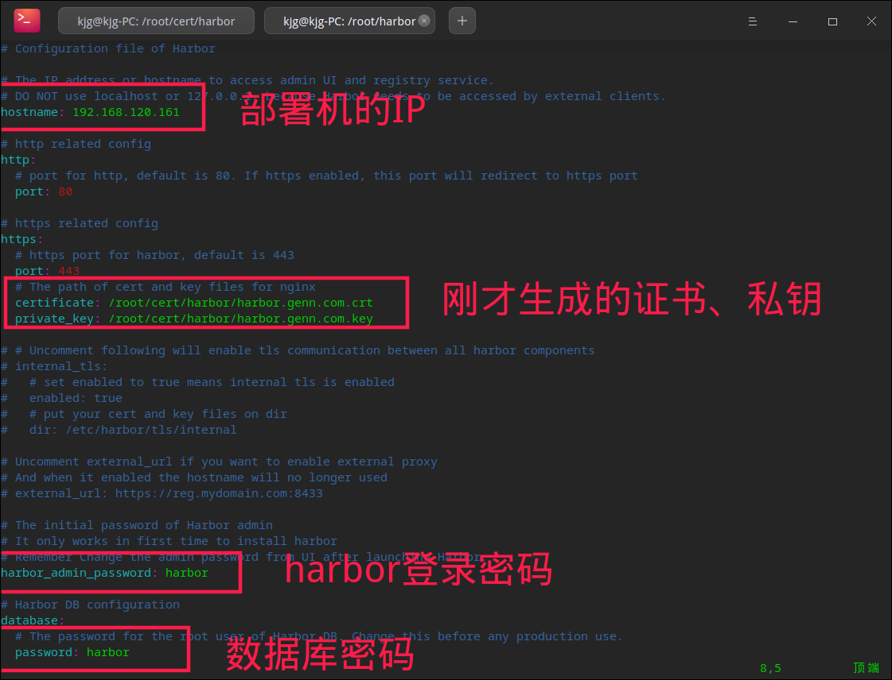
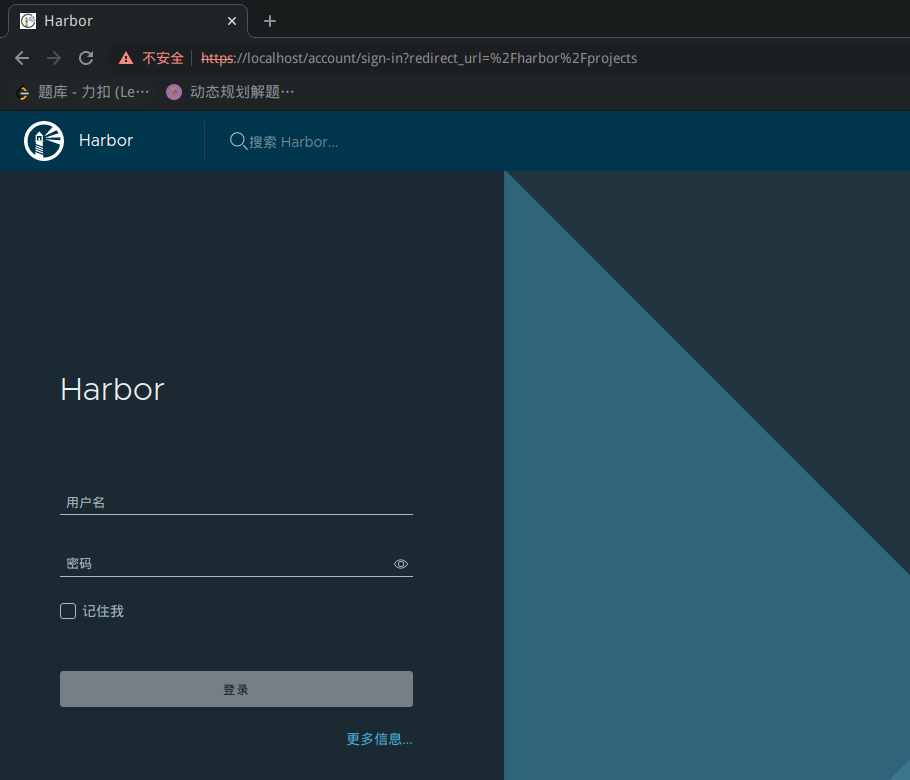
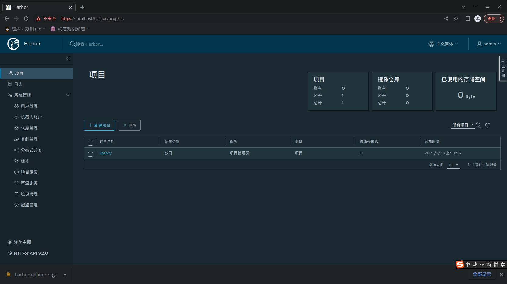
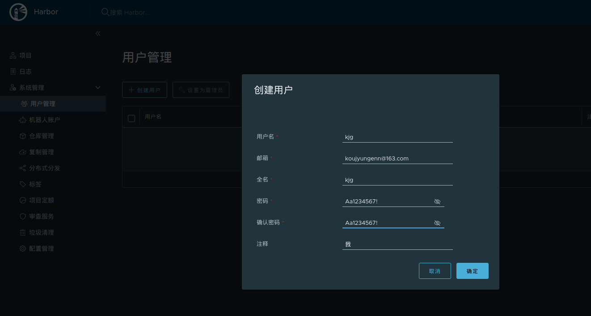
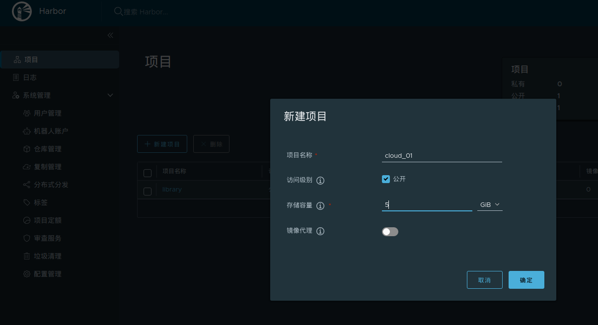
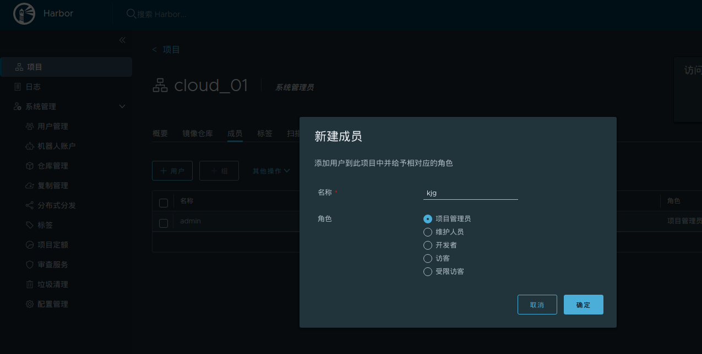
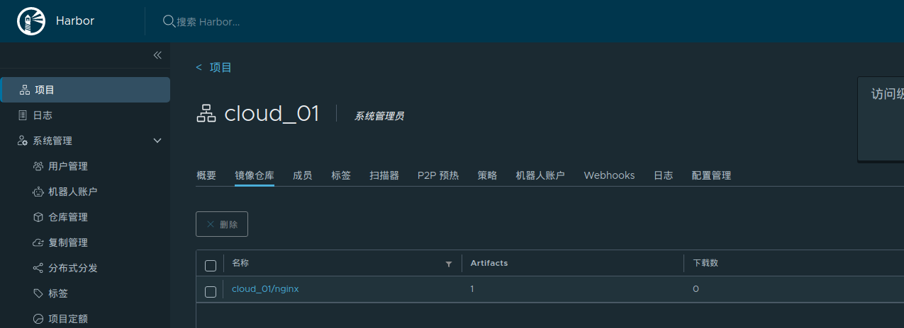
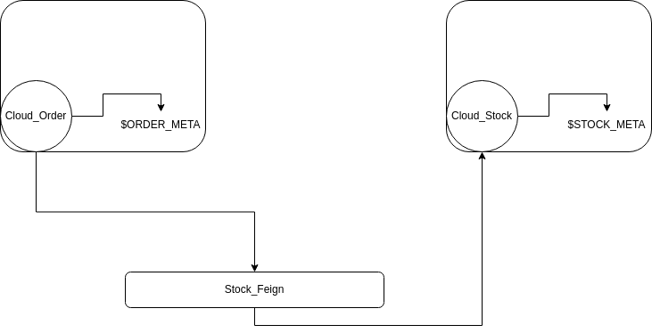
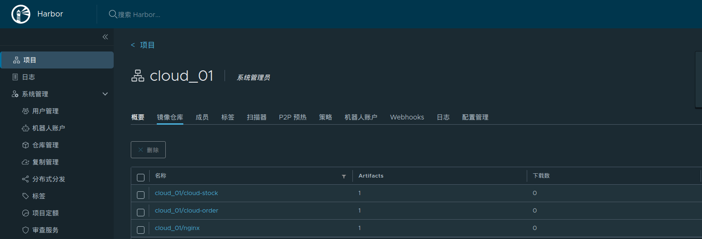

此时本机（Master）的环境截止于05-Kubernets的存储.md

# 前置准备

## 安装Docker Compose

```bash
root@kjg-PC:~# curl -SL https://github.com/docker/compose/releases/download/v2.16.0/docker-compose-linux-x86_64 -o /usr/local/bin/docker-compose
  % Total    % Received % Xferd  Average Speed   Time    Time     Time  Current
                                 Dload  Upload   Total   Spent    Left  Speed
  0     0    0     0    0     0      0      0 --:--:--  0:00:01 --:--:--     0
100 45.4M  100 45.4M    0     0  1629k      0  0:00:28  0:00:28 --:--:-- 11.2M
root@kjg-PC:~# cd /usr/local/bin/
root@kjg-PC:/usr/local/bin# chmod +x docker-compose 
root@kjg-PC:/usr/local/bin# docker-compose
Usage:  docker compose [OPTIONS] COMMAND
```

## 安装Harbor

### 证书准备

```bash
# 准备一个证书存放目录
root@kjg-PC:~# mkdir -p ~/cert/harbor
root@kjg-PC:~# cd ~/cert/harbor

# 生成CA证书私钥
root@kjg-PC:~/cert/harbor# openssl genrsa -out ca.key 4096
Generating RSA private key, 4096 bit long modulus (2 primes)
.............................................++++
.............................++++
e is 65537 (0x010001)

# 生成 CA 证书，注意这个harbor.genn.com，比较重要
root@kjg-PC:~/cert/harbor# openssl req -x509 -new -nodes -sha512 -days 3650 \
> -subj "/C=CN/ST=Beijing/L=Beijing/O=example/OU=Personal/CN=harbor.genn.com" \
> -key ca.key \
> -out ca.crt

# 生成 CA 证书私钥
root@kjg-PC:~/cert/harbor# sudo openssl genrsa -out harbor.genn.com.key 4096
Generating RSA private key, 4096 bit long modulus (2 primes)
.................................................................................................................++++
..................................................................................................................................................++++
e is 65537 (0x010001)

# 生成证书签名请求
root@kjg-PC:~/cert/harbor# sudo openssl req -sha512 -new \
-subj "/C=CN/ST=Beijing/L=Beijing/O=example/OU=Personal/CN=harbor.genn.com" \
-key c.key \
-out harbor.genn.com.csr

# 新建x509 v3拓展文件
root@kjg-PC:~/cert/harbor# vim v3.ext
authorityKeyIdentifier=keyid,issuer
basicConstraints=CA:FALSE
keyUsage = digitalSignature, nonRepudiation, keyEncipherment, dataEncipherment
extendedKeyUsage = serverAuth
subjectAltName = @alt_names
 
[alt_names] 
DNS.1=harbor.genn.com

# 使用v3.ext给harbor主机生成证书
root@kjg-PC:~/cert/harbor# openssl x509 -req -sha512 -days 3650 \
> -extfile v3.ext \
> -CA ca.crt -CAkey ca.key -CAcreateserial \
> -in harbor.genn.com.csr \
> -out harbor.genn.com.crt
Signature ok
subject=C = CN, ST = Beijing, L = Beijing, O = example, OU = Personal, CN = harbor.genn.com
Getting CA Private Key

# 转换crt为cert 供 Docker 使用
root@kjg-PC:~/cert/harbor# openssl x509 -inform PEM -in harbor.genn.com.crt -out harbor.genn.com.cert

# 复制证书给Docker使用
root@kjg-PC:~/cert/harbor# mkdir -p /ect/docker/certs.d/harbor.genn.com
root@kjg-PC:~/cert/harbor# cp harbor.genn.com.cert harbor.genn.com.key ca.crt /etc/docker/certs.d/harbor.genn.com/

# 重启Docker
root@kjg-PC:~/cert/harbor# systemctl restart docker
```

### 下载与安装Harbor

在https://github.com/goharbor/harbor/releases找到v2.5.0，下载[harbor-offline-installer-v2.5.0.tgz](https://github.com/goharbor/harbor/releases/download/v2.5.0/harbor-offline-installer-v2.5.0.tgz)。

```bash
root@kjg-PC:~# tar -xvf harbor-offline-installer-v2.5.0.tgz 
harbor/harbor.v2.5.0.tar.gz
harbor/prepare
harbor/LICENSE
harbor/install.sh
harbor/common.sh
harbor/harbor.yml.tmpl

root@kjg-PC:~# cd harbor
# 准备配置文件，并修改
root@kjg-PC:~/harbor# cp harbor.yml.tmpl harbor.yml
root@kjg-PC:~/harbor# vim harbor.yml
```

更改内容如下：



安装harbor：

```bash
root@kjg-PC:~/harbor# ./install.sh 

[Step 0]: checking if docker is installed ...

Note: docker version: 18.09.1

[Step 1]: checking docker-compose is installed ...

Note: docker-compose version: 2.16.0

[Step 2]: loading Harbor images ...
2728eced976d: Loading layer [==================================================>]  37.53MB/37.53MB
cc3b18252fc8: Loading layer [==================================================>]  8.682MB/8.682MB
e27442ada648: Loading layer [==================================================>]  3.584kB/3.584kB
510fffdc5915: Loading layer [==================================================>]   2.56kB/2.56kB
30467ddcf6f2: Loading layer [==================================================>]  78.68MB/78.68MB
7e04a5612589: Loading layer [==================================================>]  5.632kB/5.632kB
0ac0247e2d58: Loading layer [==================================================>]  99.84kB/99.84kB
420bc1ee1df5: Loading layer [==================================================>]  15.87kB/15.87kB
cc2bd615d6c2: Loading layer [==================================================>]  79.59MB/79.59MB
f10b6ae8e460: Loading layer [==================================================>]   2.56kB/2.56kB
Loaded image: goharbor/harbor-core:v2.5.0
2c3687cd3c96: Loading layer [==================================================>]  8.682MB/8.682MB
ffaf1e983398: Loading layer [==================================================>]  3.584kB/3.584kB
6dca51eebde6: Loading layer [==================================================>]   2.56kB/2.56kB
e4bbd379d36f: Loading layer [==================================================>]  90.73MB/90.73MB
0c5623dfd7c8: Loading layer [==================================================>]  91.52MB/91.52MB
Loaded image: goharbor/harbor-jobservice:v2.5.0
6693dd6cc84d: Loading layer [==================================================>]  5.535MB/5.535MB
3a46d81a0f15: Loading layer [==================================================>]  8.543MB/8.543MB
1e10a48739ea: Loading layer [==================================================>]  14.47MB/14.47MB
b54aab661800: Loading layer [==================================================>]  29.29MB/29.29MB
8f500c8fb731: Loading layer [==================================================>]  22.02kB/22.02kB
15fdd079b41a: Loading layer [==================================================>]  14.47MB/14.47MB
Loaded image: goharbor/notary-signer-photon:v2.5.0
06b7933f92b4: Loading layer [==================================================>]  1.097MB/1.097MB
69fae5574072: Loading layer [==================================================>]  5.889MB/5.889MB
af3112c929b0: Loading layer [==================================================>]    168MB/168MB
03f5f7cbe3a7: Loading layer [==================================================>]  16.27MB/16.27MB
61c47e73996b: Loading layer [==================================================>]  4.096kB/4.096kB
ca3b66c3cab8: Loading layer [==================================================>]  6.144kB/6.144kB
94865dea6411: Loading layer [==================================================>]  3.072kB/3.072kB
2c98011427ba: Loading layer [==================================================>]  2.048kB/2.048kB
b497970298a9: Loading layer [==================================================>]   2.56kB/2.56kB
3b6f7dbc8aef: Loading layer [==================================================>]   2.56kB/2.56kB
2e79a86e0f4c: Loading layer [==================================================>]   2.56kB/2.56kB
9a01f04243a5: Loading layer [==================================================>]  8.704kB/8.704kB
Loaded image: goharbor/harbor-db:v2.5.0
826c5dd08e02: Loading layer [==================================================>]   5.54MB/5.54MB
7c9c7bdcf444: Loading layer [==================================================>]  4.096kB/4.096kB
f223cbf045aa: Loading layer [==================================================>]  17.32MB/17.32MB
38956705c7f1: Loading layer [==================================================>]  3.072kB/3.072kB
99a84179e4ff: Loading layer [==================================================>]  29.12MB/29.12MB
acbe177c3da5: Loading layer [==================================================>]  47.23MB/47.23MB
Loaded image: goharbor/harbor-registryctl:v2.5.0
a04b11a8a6ee: Loading layer [==================================================>]    122MB/122MB
5fd3685787a9: Loading layer [==================================================>]  3.072kB/3.072kB
4ee52d1501b6: Loading layer [==================================================>]   59.9kB/59.9kB
cfcae3e40a56: Loading layer [==================================================>]  61.95kB/61.95kB
Loaded image: goharbor/redis-photon:v2.5.0
95de1218b455: Loading layer [==================================================>]  7.453MB/7.453MB
0332b27525fd: Loading layer [==================================================>]  7.362MB/7.362MB
2b702d470d2f: Loading layer [==================================================>]      1MB/1MB
Loaded image: goharbor/harbor-portal:v2.5.0
16ab1b0f6423: Loading layer [==================================================>]  6.067MB/6.067MB
71741b9e40d6: Loading layer [==================================================>]  4.096kB/4.096kB
b6227c4d071e: Loading layer [==================================================>]  3.072kB/3.072kB
ce0427bdf83d: Loading layer [==================================================>]  47.85MB/47.85MB
2e2a73e9bf05: Loading layer [==================================================>]  12.38MB/12.38MB
ec1590e149e7: Loading layer [==================================================>]  61.02MB/61.02MB
Loaded image: goharbor/trivy-adapter-photon:v2.5.0
c91db62634c3: Loading layer [==================================================>]  7.453MB/7.453MB
Loaded image: goharbor/nginx-photon:v2.5.0
d7cf625fc9a4: Loading layer [==================================================>]   5.54MB/5.54MB
b451f0ec0b7a: Loading layer [==================================================>]  4.096kB/4.096kB
b88e800d533f: Loading layer [==================================================>]  3.072kB/3.072kB
db6daabbcca3: Loading layer [==================================================>]  17.32MB/17.32MB
695d78a7189a: Loading layer [==================================================>]  18.12MB/18.12MB
Loaded image: goharbor/registry-photon:v2.5.0
89c925538f60: Loading layer [==================================================>]  5.535MB/5.535MB
e4324e4ca305: Loading layer [==================================================>]  8.543MB/8.543MB
81fb5fe866e7: Loading layer [==================================================>]  15.88MB/15.88MB
d7a351be6527: Loading layer [==================================================>]  29.29MB/29.29MB
1a27b90552b4: Loading layer [==================================================>]  22.02kB/22.02kB
9cbf49e39556: Loading layer [==================================================>]  15.88MB/15.88MB
Loaded image: goharbor/notary-server-photon:v2.5.0
d157647932aa: Loading layer [==================================================>]  5.539MB/5.539MB
47c8814697b5: Loading layer [==================================================>]  90.86MB/90.86MB
101c95239656: Loading layer [==================================================>]  3.072kB/3.072kB
ab57dc233b33: Loading layer [==================================================>]  4.096kB/4.096kB
a5fa5daa44ac: Loading layer [==================================================>]  91.65MB/91.65MB
Loaded image: goharbor/chartmuseum-photon:v2.5.0
c7b58a7cc092: Loading layer [==================================================>]  167.8MB/167.8MB
b3dc882c87d2: Loading layer [==================================================>]  67.83MB/67.83MB
d84728b46c3d: Loading layer [==================================================>]   2.56kB/2.56kB
b2451fcf6b6e: Loading layer [==================================================>]  1.536kB/1.536kB
c0d555c98da7: Loading layer [==================================================>]  12.29kB/12.29kB
2bf34ea57de3: Loading layer [==================================================>]  2.621MB/2.621MB
77c438a147df: Loading layer [==================================================>]  354.8kB/354.8kB
Loaded image: goharbor/prepare:v2.5.0
79d6933e24a3: Loading layer [==================================================>]  126.1MB/126.1MB
3488b7bd8881: Loading layer [==================================================>]  3.584kB/3.584kB
7c322822684a: Loading layer [==================================================>]  3.072kB/3.072kB
3a1942a8665c: Loading layer [==================================================>]   2.56kB/2.56kB
68dc95a925af: Loading layer [==================================================>]  3.072kB/3.072kB
f5ad41459af9: Loading layer [==================================================>]  3.584kB/3.584kB
fcf472032de4: Loading layer [==================================================>]  20.99kB/20.99kB
Loaded image: goharbor/harbor-log:v2.5.0
c548f6088999: Loading layer [==================================================>]  8.682MB/8.682MB
cca18a30887f: Loading layer [==================================================>]  20.98MB/20.98MB
0625337d71b6: Loading layer [==================================================>]  4.608kB/4.608kB
65af3866d520: Loading layer [==================================================>]  21.77MB/21.77MB
Loaded image: goharbor/harbor-exporter:v2.5.0


[Step 3]: preparing environment ...

[Step 4]: preparing harbor configs ...
prepare base dir is set to /root/harbor
Generated configuration file: /config/portal/nginx.conf
Generated configuration file: /config/log/logrotate.conf
Generated configuration file: /config/log/rsyslog_docker.conf
Generated configuration file: /config/nginx/nginx.conf
Generated configuration file: /config/core/env
Generated configuration file: /config/core/app.conf
Generated configuration file: /config/registry/config.yml
Generated configuration file: /config/registryctl/env
Generated configuration file: /config/registryctl/config.yml
Generated configuration file: /config/db/env
Generated configuration file: /config/jobservice/env
Generated configuration file: /config/jobservice/config.yml
Generated and saved secret to file: /data/secret/keys/secretkey
Successfully called func: create_root_cert
Generated configuration file: /compose_location/docker-compose.yml
Clean up the input dir


[Step 5]: starting Harbor ...
[+] Running 10/10
 ⠿ Network harbor_harbor        Created                                                                                0.1s
 ⠿ Container harbor-log         Started                                                                                2.5s 
 ⠿ Container harbor-portal      Started                                                                                3.4s 
 ⠿ Container registryctl        Started                                                                                3.5s 
 ⠿ Container redis              Started                                                                                3.3s 
 ⠿ Container registry           Started                                                                                3.3s 
 ⠿ Container harbor-db          Started                                                                                3.6s 
 ⠿ Container harbor-core        Started                                                                                3.9s 
 ⠿ Container nginx              Started                                                                                4.7s 
 ⠿ Container harbor-jobservice  Started                                                                                4.6s 
✔ ----Harbor has been installed and started successfully.----   

# 通过docker-compose可以发现，Harbor正常启动
root@kjg-PC:~/harbor# docker-compose ps
NAME                IMAGE                                COMMAND                  SERVICE             CREATED             STATUS                   PORTS
harbor-core         goharbor/harbor-core:v2.5.0          "/harbor/entrypoint.…"   core                5 minutes ago       Up 5 minutes (healthy)   
harbor-db           goharbor/harbor-db:v2.5.0            "/docker-entrypoint.…"   postgresql          5 minutes ago       Up 5 minutes (healthy)   
harbor-jobservice   goharbor/harbor-jobservice:v2.5.0    "/harbor/entrypoint.…"   jobservice          5 minutes ago       Up 5 minutes (healthy)   
harbor-log          goharbor/harbor-log:v2.5.0           "/bin/sh -c /usr/loc…"   log                 5 minutes ago       Up 5 minutes (healthy)   127.0.0.1:1514->10514/tcp
harbor-portal       goharbor/harbor-portal:v2.5.0        "nginx -g 'daemon of…"   portal              5 minutes ago       Up 5 minutes (healthy)   
nginx               goharbor/nginx-photon:v2.5.0         "nginx -g 'daemon of…"   proxy               5 minutes ago       Up 5 minutes (healthy)   0.0.0.0:80->8080/tcp, 0.0.0.0:443->8443/tcp
redis               goharbor/redis-photon:v2.5.0         "redis-server /etc/r…"   redis               5 minutes ago       Up 5 minutes (healthy)   
registry            goharbor/registry-photon:v2.5.0      "/home/harbor/entryp…"   registry            5 minutes ago       Up 5 minutes (healthy)   
registryctl         goharbor/harbor-registryctl:v2.5.0   "/home/harbor/start.…"   registryctl         5 minutes ago       Up 5 minutes (healthy) 
```

访问localhost成功，通过用户名admin，密码harbor登录成功：





## Docker使用Harbor

先创建出一个用户，并且设为管理员：



创建出一个项目，名叫cloud_01，它是本篇文章部署的微服务基础：



给cloud_01配置刚才创建的kjg用户：



先让Docker登录Harbor：

```bash
root@kjg-PC:~# docker login harbor.genn.com
Username: kjg
Password: 
WARNING! Your password will be stored unencrypted in /root/.docker/config.json.
Configure a credential helper to remove this warning. See
https://docs.docker.com/engine/reference/commandline/login/#credentials-store

Login Succeeded
root@kjg-PC:~# 
```

尝试从Docker上传镜像到Harbor：

```bash
# 继续拿Nginx开刀
root@kjg-PC:~# docker images | grep nginx
goharbor/nginx-photon                                                      v2.5.0              5041274b8b8a        10 months ago       44MB
nginx                                                                      latest              605c77e624dd        14 months ago       141MB

# copy一个nginx镜像，改名
root@kjg-PC:~# docker tag nginx:latest harbor.genn.com/cloud_01/nginx:aaa
root@kjg-PC:~# docker images | grep nginx
goharbor/nginx-photon                                                      v2.5.0              5041274b8b8a        10 months ago       44MB
nginx                                                                      latest              605c77e624dd        14 months ago       141MB
harbor.genn.com/cloud01/nginx                                              aaa                 605c77e624dd        14 months ago       141MB
harbor.genn.com/cloud_01/nginx                                             aaa                 605c77e624dd        14 months ago       141MB


# 上传镜像到harbor：
root@kjg-PC:~# docker push harbor.genn.com/cloud_01/nginx:aaa
The push refers to repository [harbor.genn.com/cloud_01/nginx]
d874fd2bc83b: Pushed 
32ce5f6a5106: Pushed 
f1db227348d0: Pushed 
b8d6e692a25e: Pushed 
e379e8aedd4d: Pushed 
2edcec3590a4: Pushed 
aaa: digest: sha256:ee89b00528ff4f02f2405e4ee221743ebc3f8e8dd0bfd5c4c20a2fa2aaa7ede3 size: 
```

可以看到，镜像被推到harbor了：



接下来，尝试在Ubuntu01从harbor拉取镜像：

```bash
# 先把证书和密钥发过去
root@kjg-PC:~/cert/harbor# scp harbor.genn.com.cert harbor.genn.com.key ca.crt kjg1@ubuntu01:/etc/docker/certs.d/harbor.genn.com/
kjg1@ubuntu01's password: 
harbor.genn.com.cert                                                                                                                                    100% 2090     1.1MB/s   00:00    
harbor.genn.com.key                                                                                                                                     100% 3243     1.8MB/s   00:00    
ca.crt 


# Ubuntu01，先将harbor地址配置到daemon.json里面：
{
  "registry-mirrors": ["https://82m9ar63.mirror.aliyuncs.com"],
  "insecure-registries": ["http://harbor.genn.com"],
  "exec-opts": ["native.cgroupdriver=systemd"],
  "log-driver": "json-file",
  "log-opts": {
    "max-size": "100m"
  },
  "storage-driver": "overlay2"
}
# 然后进行登录
root@ubuntu01:~# docker login harbor.genn.com
Username: kjg
Password: 
WARNING! Your password will be stored unencrypted in /root/.docker/config.json.
Configure a credential helper to remove this warning. See
https://docs.docker.com/engine/reference/commandline/login/#credentials-store
Login Succeeded

# 最后进行拉取
root@ubuntu01:~# docker pull harbor.genn.com/cloud_01/nginx@sha256:ee89b00528ff4f02f2405e4ee221743ebc3f8e8dd0bfd5c4c20a2fa2aaa7ede3
harbor.genn.com/cloud_01/nginx@sha256:ee89b00528ff4f02f2405e4ee221743ebc3f8e8dd0bfd5c4c20a2fa2aaa7ede3: Pulling from cloud_01/nginx
Digest: sha256:ee89b00528ff4f02f2405e4ee221743ebc3f8e8dd0bfd5c4c20a2fa2aaa7ede3
Status: Downloaded newer image for harbor.genn.com/cloud_01/nginx@sha256:ee89b00528ff4f02f2405e4ee221743ebc3f8e8dd0bfd5c4c20a2fa2aaa7ede3
harbor.genn.com/cloud_01/nginx@sha256:ee89b00528ff4f02f2405e4ee221743ebc3f8e8dd0bfd5c4c20a2fa2aaa7ede3

# 检查镜像，拉取成功
root@ubuntu01:~# docker images | grep nginx
nginx                                                                       latest    605c77e624dd   14 months ago   141MB
harbor.genn.com/cloud_01/nginx                                              <none>    605c77e624dd   14 months ago   141MB
registry.cn-hangzhou.aliyuncs.com/lfy_k8s_images/ingress-nginx-controller   v0.46.0   f4a8538d4445   22 months ago   282MB
nginx                                                                       1.16.1    dfcfd8e9a5d3   2 years ago     127MB
```

同样的操作，执行于Ubuntu02。

# 微服务准备

## 工程搭建

为了简单示例，准备生产者、消费者模式的微服务，代码见Cloud_Order、Cloud_Stock、Stock_Feign模块。

Cloud_Order对外暴露一个preOrder接口，接收请求路径的订单id，通过Stock_Feign请求Cloud_Stock。

Cloud_Stock根据部署环境的环境变量$STOCK_META给Cloud_Order响应结果，Cloud_Order也根据部署环境的环境变量$ORDER_META给外部响应结果。通过着两个变量方便观察Pod的唯一性：



## 打包镜像

编写Dockerfile:

```dockerfile
FROM java:8
EXPOSE 8001
ADD Cloud_Order-1.0-SNAPSHOT.jar /
ENTRYPOINT ["java","-jar","-Dfile-encoding=utf-8 -Xmx100M","/Cloud_Order-1.0-SNAPSHOT.jar"]
```

生成镜像：

```bash
kjg@kjg-PC:~/projects/java/Kubernetes_Study/Cloud_Order/src/main/dockerfiles$ docker build -t cloud-order .
Sending build context to Docker daemon  36.21MB
Step 1/4 : FROM java:8
 ---> d23bdf5b1b1b
Step 2/4 : EXPOSE 8001
 ---> Using cache
 ---> afba27cd8895
Step 3/4 : ADD Cloud_Order-1.0-SNAPSHOT.jar /
 ---> acb923aee3d1
Step 4/4 : ENTRYPOINT ["java","-jar","-Dfile-encoding=utf-8 -Xmx100M","/Cloud_Order-1.0-SNAPSHOT.jar"]
 ---> Running in cc3c15bd0938
Removing intermediate container cc3c15bd0938
 ---> 75c65696daf1
Successfully built 75c65696daf1
Successfully tagged cloud-order:latest
```

同样地处理Cloud_Stock，最终生成两个镜像：

```dockerfile
FROM java:8
EXPOSE 9001
ADD Cloud_Stock-1.0-SNAPSHOT.jar /
ENTRYPOINT ["java","-jar","-Dfile-encoding=utf-8 -Xmx100M","/Cloud_Stock-1.0-SNAPSHOT.jar"]
```

## 测试容器

为了防止容器内的ip注册进Nacos，启动容器的时候要指定network模式为host：

```bash
# 启动cloud-order，指定ORDER_META为this is order meta，添加nacos的host映射
kjg@kjg-PC:~/projects/java/Kubernetes_Study/Cloud_Order/src/main/dockerfiles$ docker run -d --network=host -p 8001:8001 -e "ORDER_META=this is order meta" --add-host=kjg-pc:192.168.120.161 cloud-order --name=test-order-env
dfef0da6b7c870a72ea4842b313b2193f3880259a0e6fa3f91abda578223ab41

# 测试环境变量
kjg@kjg-PC:~/projects/java/Kubernetes_Study/Cloud_Order/src/main/dockerfiles$ curl http://localhost:8001/order/order/env
this is order meta

# 启动cloud-meta，指定STOCK_META为8000，添加nacos的host映射
kjg@kjg-PC:~/projects/java/Kubernetes_Study/Cloud_Order/src/main/dockerfiles$ docker run -d --network=host -p 9001:9001 -e "STOCK_META=8000" --add-host=kjg-pc:192.168.120.161 cloud-stock --name=test-stock-env

# 测试请求，查看元数据是否准确
root@kjg-PC:/usr/local/nacos/nacos/bin# curl http://localhost:8001/order/order/preOrder/1
{"metaId":"this is order meta","orderId":1,"stock":8000}
```

## 上传镜像上传到harbor

```bash
root@kjg-PC:~# docker tag cloud-order harbor.genn.com/cloud_01/cloud-order:latest
root@kjg-PC:~# docker tag cloud-stock harbor.genn.com/cloud_01/cloud-stock:latest
root@kjg-PC:~# docker push harbor.genn.com/cloud_01/cloud-order:latest
The push refers to repository [harbor.genn.com/cloud_01/cloud-order]
484339410427: Pushed 
35c20f26d188: Pushed 
c3fe59dd9556: Pushed 
6ed1a81ba5b6: Pushed 
a3483ce177ce: Pushed 
ce6c8756685b: Pushed 
30339f20ced0: Pushed 
0eb22bfb707d: Pushed 
a2ae92ffcd29: Pushed 
latest: digest: sha256:d1725b75325b0ef126fde6485b6e1a7fadc28ba1b3b5cfdf18a612ee24ad27ed size: 2212
root@kjg-PC:~# docker push harbor.genn.com/cloud_01/cloud-stock:latest
The push refers to repository [harbor.genn.com/cloud_01/cloud-stock]
ce6f96496618: Pushed 
35c20f26d188: Mounted from cloud_01/cloud-order 
c3fe59dd9556: Mounted from cloud_01/cloud-order 
6ed1a81ba5b6: Mounted from cloud_01/cloud-order 
a3483ce177ce: Mounted from cloud_01/cloud-order 
ce6c8756685b: Mounted from cloud_01/cloud-order 
30339f20ced0: Mounted from cloud_01/cloud-order 
0eb22bfb707d: Mounted from cloud_01/cloud-order 
a2ae92ffcd29: Mounted from cloud_01/cloud-order 
latest: digest: sha256:131a1ba5334144845f941176edf118a915e8508aa09bf67927919b80e1dde093 size: 2212
```

查看harbor，镜像成功上传：



# 由浅入深通过Kubernetes搭建SpringCloud

## Pod

创建一个专属的namespace:

```bash
root@kjg-PC:~# kubectl create namespace cloud
namespace/cloud created
root@kjg-PC:~# kubectl get namespace
NAME                   STATUS   AGE
cloud                  Active   10s
default                Active   34d
ingress-nginx          Active   23d
kube-node-lease        Active   34d
kube-public            Active   34d
kube-system            Active   34d
kubernetes-dashboard   Active   31d
```

创建一个cloud文件夹，编写cloud-stock的pod资源：

```bash
root@kjg-PC:~# mkdir cloud
root@kjg-PC:~# cd cloud
root@kjg-PC:~/cloud# vim cloud-stock-pod.yaml

######################以下是vim cloud-stock-pod.yaml的内容######################
apiVersion: v1
kind: Pod
metadata:
  namespace: cloud # Pod的namespace
  name: cloud-stock-pod # Pod的名称
  labels:
    run: cloud-stock # 启动哪个容器
spec:
  hostAliases:
    - ip: "192.168.120.161"
      hostnames:
        - "kjg-pc"
  containers:
    - name: cloud-stock # 容器名称
      image: harbor.genn.com/cloud_01/cloud-stock # 容器镜像
      env:
        - name: STOCK_META # 配置容器内的环境变量
          value: "6009"
######################以上是vim cloud-stock-pod.yaml的内容######################

root@kjg-PC:~/cloud# kubectl apply -f cloud-stock-pod.yaml
pod/cloud-stock-pod created
root@kjg-PC:~/cloud# kubectl get pods -n cloud
NAME              READY   STATUS              RESTARTS   AGE
cloud-stock-pod   0/1     ContainerCreating   0          17s
# 查看cloud-stock的日志
root@kjg-PC:~/cloud# kubectl logs cloud-stock-pod -n cloud
# 有点长，截取关键部分：
2023-03-04 03:43:33.301  INFO 1 --- [           main] o.s.b.w.embedded.tomcat.TomcatWebServer  : Tomcat started on port(s): 9001 (http) with context path '/stock'
2023-03-04 03:43:33.313  INFO 1 --- [           main] com.alibaba.nacos.client.naming          : [REGISTER-SERVICE] 960dc00f-5243-494d-ad9d-1be9ddd0ed95 registering service DEFAULT_GROUP@@cloudstock with instance: Instance{instanceId='null', ip='172.31.3.218', port=9001, weight=1.0, healthy=true, enabled=true, ephemeral=true, clusterName='DEFAULT', serviceName='null', metadata={preserved.register.source=SPRING_CLOUD}}


root@kjg-PC:~/cloud# kubectl get pods -n cloud -owide
NAME              READY   STATUS    RESTARTS   AGE   IP             NODE       NOMINATED NODE   READINESS GATES
cloud-stock-pod   1/1     Running   0          12m   172.31.3.218   ubuntu01   <none>           <none>
root@kjg-PC:~/cloud# curl http://172.31.3.218:9001/stock/stock/env
6009
```

可以看到，cloud-stock以172.31.3.218的ip注册进Nacos，并且和Pod的IP保持一致，这是我希望看到的。

同样的操作，执行于cloud-order，最终效果：

```bash
root@kjg-PC:~/cloud# cp cloud-stock-pod.yaml cloud-order-pod.yaml
root@kjg-PC:~/cloud# vim cloud-order-pod.yaml
######################以下是vim cloud-order-pod.yaml的内容######################
apiVersion: v1
kind: Pod
metadata:
  namespace: cloud # Pod的namespace
  name: cloud-order-pod # Pod的名称
  labels:
    run: cloud-order # 启动哪个容器
spec:
  hostAliases:
    - ip: "192.168.120.161"
      hostnames:
        - "kjg-pc"
  containers:
    - name: cloud-order # 容器名称
      image: harbor.genn.com/cloud_01/cloud-order # 容器镜像
      env:
        - name: ORDER_META # 配置容器内的环境变量
          value: "this is order meta(k8s)"
######################以上是vim cloud-order-pod.yaml的内容######################
root@kjg-PC:~/cloud# kubectl apply -f cloud-order-pod.yaml 
pod/cloud-order-pod created
root@kjg-PC:~/cloud# kubectl get pods -n cloud
NAME              READY   STATUS    RESTARTS   AGE
cloud-order-pod   1/1     Running   0          19s
cloud-stock-pod   1/1     Running   0          165m
root@kjg-PC:~/cloud# kubectl logs cloud-order-pod -n cloud
2023-03-04 06:28:24.143  INFO 1 --- [           main] o.s.b.w.embedded.tomcat.TomcatWebServer  : Tomcat started on port(s): 8001 (http) with context path '/order'
2023-03-04 06:28:24.163  INFO 1 --- [           main] com.alibaba.nacos.client.naming          : [REGISTER-SERVICE] 960dc00f-5243-494d-ad9d-1be9ddd0ed95 registering service DEFAULT_GROUP@@cloudorder with instance: Instance{instanceId='null', ip='172.31.3.221', port=8001, weight=1.0, healthy=true, enabled=true, ephemeral=true, clusterName='DEFAULT', serviceName='null', metadata={preserved.register.source=SPRING_CLOUD}}
root@kjg-PC:~/cloud# kubectl get pods -n cloud -owide
NAME              READY   STATUS    RESTARTS   AGE     IP             NODE       NOMINATED NODE   READINESS GATES
cloud-order-pod   1/1     Running   0          2m16s   172.31.3.221   ubuntu01   <none>           <none>
cloud-stock-pod   1/1     Running   0          167m    172.31.3.218   ubuntu01   <none>           <none>


root@kjg-PC:~/cloud# curl http://172.31.3.221:8001/order/order/env
this is order meta(k8s)
root@kjg-PC:~/cloud# curl http://172.31.3.221:8001/order/order/preOrder/2
{"metaId":"this is order meta(k8s)","orderId":2,"stock":6009}
```

## Deployment

TODO
