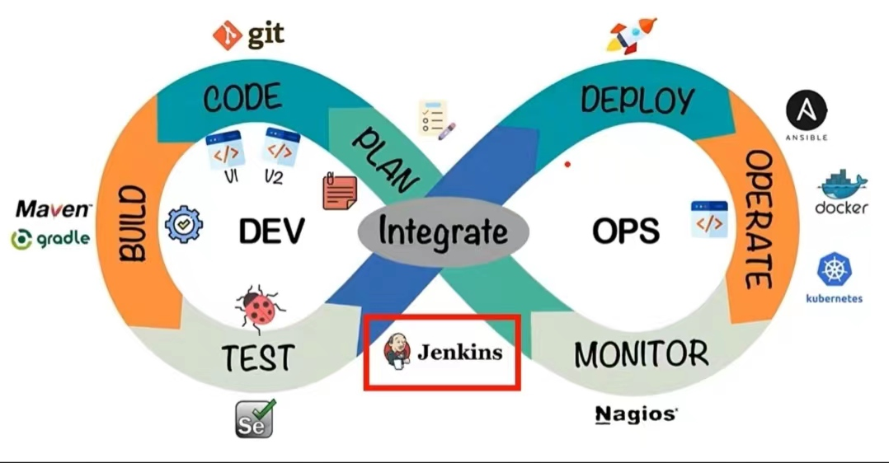
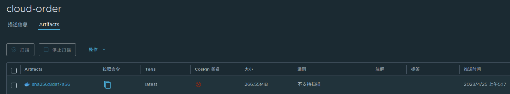

# DevOps的引出

## DevOps解决了什么问题

传统的项目开发模式中，往往有开发、测试、运维团队共同参与。作为开发，根据需求进行功能开发，从功能层面保证业务的正确性；在敏捷开发的模式下，功能往往会快速迭代，久而久之整个系统会有不稳定性。作为运维，更专注如何保证系统安全、稳定地运行，这种工作与业务功能是隔离开的，可以理解为业务功能的运行基石。

`开发`和`运维`作为两个部分，在迭代一个需求的时候，往往是 开发完成代码、自测，配合测试人员完成缺陷修复，再将代码打包转发给运维团队，运维人员将包部署到特定环境上。这个流程看似完美，但是在敏捷开发的场景下，需求需要快速地迭代上线，开发过程中需要不断的发版、测试、修复缺陷、再发版、再测试....如果每次发版都要运维团队部署，会导致时间成本、沟通成本变大。

而DevOps是为了解决`开发` 与`运维`的沟通成本、时间成本带来的影响而存在的，它能够使项目开发周期更加流畅。

## DevOps的流程

完整的开发流程一般包含以下步骤：

	1. PLAN：需求规划、分析、流程设计、编码设计。
	1. CODE：编写代码、完成功能。代码本身需要放在仓库。
	1. BUILD：代码构建、打包，形成一个可执行的程序。
	1. TEST：构建项目后，需要检查代码里是否存在BUG。
	1. DEPLOY：认为项目达到部署要求，准备进行部署。
	1. OPERATE：部署项目到特定环境。
	1. MONITOR：持续监控运行在特定环境的系统。

而DevOps，则是将这几个步骤通过特定工具串联起来，自动化执行，形成一个闭环，这个工具最典型的代表就是Jenkins，Jenkins管家的图标也预示着开发人员只要配置好相关流水线，这位“管家”就能帮你自动化解决这套流程：



比如说我接下来打算 拉取代码、通过maven将代码打包成可执行jar包、将jar包封装成镜像、将镜像上传到Harbor、通过K8S拉取镜像、部署成Deployment这些部署，统统在Jenkins配置好，让它帮我自动化完成。

# 搭建Jenkins

0. 先保证安装、配置好JDK17。

1. 下载jenkins的war包，根据JDK版本选择最优的LTS。

```
https://get.jenkins.io/war-stable/2.346.1/
```

2. 新建Jenkins目录，将war包复制到目录下。

```bash
root@kjg-PC:~# mkdir -p /usr/local/jenkins
root@kjg-PC:~# mv /home/kjg/Downloads/jenkins.war /usr/local/jenkins
root@kjg-PC:~# mkdir -p /usr/local/jenkins/logs
```

3. 编写启动脚本，启动jenkins。

```bash
root@kjg-PC:~# cd /usr/local/jenkins
root@kjg-PC:~# vim jenkins.sh

#!/bin/bash
export JENKINS_HOME=/usr/local/jenkins
cd $JENKINS_HOME
nohup java -Dhudson.model.DownloadService.noSignatureCheck=true -Xmx2g -jar jenkins.war --httpPort=9999 > logs/jenkins.log 2>&1 &
tail -f logs/jenkins.log

root@kjg-PC:~# sh jenkins.sh
```

4. 访问http://localhost:9999	按照提示完成初始化操作。

5. 配置代理，下载插件

   默认情况下插件会大范围下载失败，因此需要配置国内代理（http://mirror.esuni.jp/jenkins/updates/update-center.json）：

   

6. 配置JDK和Git（按照本机的路径）

   


7. 配置SSH（**拉到最下面，这里我发现配本机会连接失败，所以最后配了另一台机子ubuntu02**）

   

8. 添加凭据，方便后续Jenkins从Git托管平台上拉取代码：

   
   
   9. 下载JDK Parameter插件，保证可以使用低版本JDK构建项目
   
      

# Jenkins部署Cloud-Order、Cloud-Stock

## java jar部署

1. 新建一个Maven项目：

   
   
2. 通过JDK Parameter插件，指定项目构建的JDK版本为上面配置的JDK8

   

3. 指定源码git，凭据用上面配置好的GitHub凭据

   

4. 在Post Steps阶段传输构建好的Jar包到Ubuntu02

   

5. 在Post Steps阶段将Cloud-Order、Cloud-Stock的启动脚本传输到Ubuntu02

   

   

6. 顺便看一下Cloud-Order和Cloud-Stock的启动脚本，逻辑大差不差，只是变量的区别，都是判断PID是否存在，决定在nohup java -jar之前是否kill：

   ```bash
   #!/bin/bash
   APP_NAME=Cloud_Order-1.0-SNAPSHOT.jar
   APP_LOG=order.log
   APP_HOME=/home/kjg1/jenkins_output/Cloud_Order/target
   pid=`ps -ef | grep ${APP_NAME} | grep -v grep | awk '{print $2}'`
   
   # 判断Cloud-Order是否运行中，存在：返回1，不存在：返回0
   exist() {
     if [ -z "${pid}" ]
     then
           return 0
     else
           return 1
     fi
   }
   
   stop() {
           exist
           if [ $? -eq "1" ]; then
                   kill ${pid}
                   rm -f $APP_HOME/$APP_LOG
           else
                   echo "not running"
           fi
   }
   
   start(){
           nohup /usr/local/jdk/jdk1.8.0_311/bin/java -jar -Dfile.encoding=utf-8 $APP_HOME/$APP_NAME  > $APP_HOME/$APP_LOG 2>&1 &
   }
   
   restart(){
           stop
           start
   }
   
   restart
   ```

   ```bash
   #!/bin/bash
   APP_NAME=Cloud_Stock-1.0-SNAPSHOT.jar
   APP_LOG=stock.log
   APP_HOME=/home/kjg1/jenkins_output/Cloud_Stock/target
   pid=`ps -ef | grep ${APP_NAME} | grep -v grep | awk '{print $2}'`
   
   # 判断Cloud-Order是否运行中，存在：返回1，不存在：返回0
   exist() {
     if [ -z "${pid}" ]
     then
           return 0
     else
           return 1
     fi
   }
   
   
   stop() {
           exist
           if [ $? -eq "1" ]; then
                   kill ${pid}
                   rm -f $APP_HOME/$APP_LOG
           else
                   echo "not running"
           fi
   }
   
   start(){
           nohup /usr/local/jdk/jdk1.8.0_311/bin/java -jar -Dfile.encoding=utf-8 $APP_HOME/$APP_NAME  > $APP_HOME/$APP_LOG 2>&1 &
   }
   
   
   restart(){
           stop
           start
   }
   
   restart
   ```

   **值得注意的是：判断pid是否存在的时候，要基于${APP_HOME}进行grep，而不是简单的Order或者Stock，否则会kill掉脚本本身。**

## 镜像部署

准备好Dockerfile内容：

```dockerfile
FROM java:8
EXPOSE 8001
ADD Cloud_Order-1.0-SNAPSHOT.jar /
ENTRYPOINT ["java","-jar","-Dfile-encoding=utf-8 -Xmx100M","/Cloud_Order-1.0-SNAPSHOT.jar"]
```

```dockerfile
FROM java:8
EXPOSE 9001
ADD Cloud_Stock-1.0-SNAPSHOT.jar /
ENTRYPOINT ["java","-jar","-Dfile-encoding=utf-8 -Xmx100M","/Cloud_Stock-1.0-SNAPSHOT.jar"]
```

将dockerfile内容放到项目目录下的dockerfiles文件夹内，同时在原有Transfer Set上新增各自的Dockerfile（注意用,分隔）：


Build项目，可以发现Ubuntu02内，起码Dockerfile是被传过来了：

```
kjg1@ubuntu02:~/jenkins_output$ tree .
.
├── Cloud_Order
│   ├── dockerfiles
│   │   └── Dockerfile
│   ├── sh
│   │   └── start-order.sh
│   └── target
│       ├── Cloud_Order-1.0-SNAPSHOT.jar
│       └── order.log
├── Cloud_Stock
│   ├── dockerfiles
│   │   └── Dockerfile
│   ├── sh
│   │   └── start-stock.sh
│   └── target
│       ├── Cloud_Stock-1.0-SNAPSHOT.jar
│       └── stock.log
└── Stock_Feign
    └── target
        └── Stock_Feign-1.0-SNAPSHOT.jar

10 directories, 9 files
```

更改启动脚本，从原本的

1. 通过jar包判断pid是否存在，如果存在则kill。
2. nohup java -jar。

变成

1. 判断jar包的container是否存在，如果存在则docker stop && docker rm。
2. 判断jar包的镜像是否存在，如果存在则docker rmi。
3. 打包镜像。
4. 将镜像推到Harbor（这一步在`镜像部署`章节并非关键）。
5. 启动容器。

注意network用物理机的IP，同时加上Nacos的host映射，不然会启动失败：

```shell
#!/bin/bash
IMAGE_NAME=harbor.genn.com/cloud_01/cloud-order
containerId=`docker ps -a | grep "$IMAGE_NAME" | awk '{print $1}'`
imageId=`docker images | grep "$IMAGE_NAME" | awk '{print $3}'`
echo "containerId=$containerId,imageId=$imageId"

docker stop $containerId
docker rm $containerId
docker rmi $imageId
cp /home/kjg1/jenkins_output/Cloud_Order/target/*.jar /home/kjg1/jenkins_output/Cloud_Order/dockerfiles
docker build -t $IMAGE_NAME /home/kjg1/jenkins_output/Cloud_Order/dockerfiles
docker run -d --network=host -p 8001:8001 -e "ORDER_META=this is order meta" --add-host=kjg-pc:192.168.120.161 $IMAGE_NAME --name=test-order-env
docker push $IMAGE_NAME
```

```shell
#!/bin/bash
IMAGE_NAME=harbor.genn.com/cloud_01/cloud-stock
containerId=`docker ps -a | grep "$IMAGE_NAME" | awk '{print $1}'`
imageId=`docker images | grep "$IMAGE_NAME" | awk '{print $3}'`
echo "containerId=$containerId,imageId=$imageId"

docker stop $containerId
docker rm $containerId
docker rmi $imageId
cp /home/kjg1/jenkins_output/Cloud_Stock/target/*.jar /home/kjg1/jenkins_output/Cloud_Stock/dockerfiles
docker build -t $IMAGE_NAME /home/kjg1/jenkins_output/Cloud_Stock/dockerfiles
docker run -d --network=host -p 9001:9001 -e "STOCK_META=10086" --add-host=kjg-pc:192.168.120.161 $IMAGE_NAME --name=test-stock-env
docker push $IMAGE_NAME
```

Ubuntu02一开始没有镜像、也没有容器，部署成功后，发现正常运行：

```bash
kjg1@ubuntu02:~/jenkins_output/Cloud_Order/sh$ docker images | grep cloud-
kjg1@ubuntu02:~/jenkins_output/Cloud_Order/sh$ docker ps -a | grep cloud-
kjg1@ubuntu02:~/jenkins_output/Cloud_Order/sh$ docker images | grep cloud-
harbor.genn.com/cloud_01/cloud-stock                                        latest    860f73c37ad1   52 seconds ago   679MB
harbor.genn.com/cloud_01/cloud-order                                        latest    dc2346fb73b4   56 seconds ago   679MB
kjg1@ubuntu02:~/jenkins_output/Cloud_Order/sh$ docker ps -a | grep cloud-
52816744ce18   harbor.genn.com/cloud_01/cloud-stock                "java -jar '-Dfile-e…"   54 seconds ago   Up 53 seconds                       vigilant_edison
f974e77d31fd   harbor.genn.com/cloud_01/cloud-order                "java -jar '-Dfile-e…"   58 seconds ago   Up 57 seconds                       relaxed_northcutt
kjg1@ubuntu02:~/jenkins_output/Cloud_Order/sh$ curl http://localhost:8001/order/order/env
this is order meta
kjg1@ubuntu02:~/jenkins_output/Cloud_Order/sh$ curl http://localhost:9001/stock/stock/env
10086
kjg1@ubuntu02:~/jenkins_output/Cloud_Order/sh$ curl http://localhost:8001/order/order/preOrder/1
{"metaId":"this is order meta","orderId":1,"stock":10086}
```

## pipeline+镜像部署

### pipeline模板

一般情况下不会使用上面“构建一个maven项目”的方式配置Jenkins项目，而是使用灵活性更高的pipeline方式。从名称以及Jenkins的部署流程来看，pipeline是一种更原生的部署方式，可以提供更灵活的部署操作。

新建一个pipeline项目：


在配置的最下面，编写pipeline脚本：


这么看来，pipeline部署的大部分工作，在于pipeline(grovvy)脚本的编写。那么pipeline脚本该如何写呢？以下写一个demo，并解释它的结构含义：

```groovy
pipeline {
    agent any
    
    environment {
        a = 'b'
    }
    
    stages {
        stage('GitHub拉取代码') {
            steps{
                echo 'GitHub拉取代码成功'
            }
        }
        stage('Maven构建代码') {
            steps{
                echo 'Maven构建代码成功'
            }
        }
        stage('打包镜像') {
            steps{
                echo '打包镜像成功'
            }
        }
        stage('镜像上传至Harbor') {
            steps{
                echo '镜像上传至Harbor成功'
            }
        }
        stage('Ubuntu02拉取镜像并部署') {
            steps{
                echo 'Ubuntu02拉取镜像并部署成功'
            }
        }
    }
}
```

1. agent any：Jenkins集群中的任意一个节点都能执行这条流水线。
2. enviroment：Jenkins构建过程中的环境变量，以key='value'的方式命名，通过$key的方式引用。
3. stages：包含多个stage，一个stage代表一次行为，比如拉取代码是一个stage，构建代码是一个stage，打包镜像是一个stage。
4. steps：一个stage里面的具体操作，多个step用回车行划分。
5. jenkins自带step脚本生成器，将操作配置好，可以生成可用的step脚本，将step脚本放在steps{}内即可，多条step脚本用回车行划分。
6. step脚本可以通过$的方式读取jenkins的构建参数、enviroment参数。

上面的pipeline脚本只是打印步骤，没有执行真实操作，值得注意的是：上面的`镜像部署`章节是Jenkins将构建好的jar包、脚本传到Ubuntu02，在Ubuntu02完成镜像打包、容器启动、上传Harbor的操作。**而这里的pipeline脚本是Jenkins将构建好的jar包在本地打包镜像、上传到Harbor，再通知Ubuntu02从Harbor拉取镜像、启动容器**。

好了，接下来保存，Build一下K8S_SpringCloud_Demo_Pipeline：


Jenkins会根据pipeline的stage划分不同步骤，每个步骤各自的日志（Logs），因为只是样例，这里的日志（Logs）是echo的内容，不存在有价值的日志，接下来按顺序，逐个步骤完善pipeline的内容。

### 步骤1：拉取代码

Jenkins提供了pipeline生成器，在流水线下面的“流水线语法”里，选择checkout操作，配置好仓库信息，就能一键生成pipeline脚本：


将pipeline脚本复制到对应的steps里，得到：

```
pipeline {
    agent any
    
    environment {
        a = 'b'
    }
    
    stages {
        stage('GitHub拉取代码') {
            steps{
            	checkout([$class: 'GitSCM', branches: [[name: '*/master']], extensions: [], userRemoteConfigs: [[credentialsId: '18fcfa81-dfd3-407f-8729-4db78285f4d5', url: 'https://github.com/9029HIME/jenkins_k8s_demo_project.git']]])
                echo 'GitHub拉取代码成功'
            }
        }
        stage('Maven构建代码') {
            steps{
                echo 'Maven构建代码成功'
            }
        }
        stage('打包镜像') {
            steps{
                echo '打包镜像成功'
            }
        }
        stage('镜像上传至Harbor') {
            steps{
                echo '镜像上传至Harbor成功'
            }
        }
        stage('Ubuntu02拉取镜像并部署') {
            steps{
                echo 'Ubuntu02拉取镜像并部署成功'
            }
        }
    }
}
```

保存、Build，可以发现：


```bash
root@kjg-PC:/usr/local/jenkins/workspace/K8S_SpringCloud_Demo_Pipeline# ll
总用量 16
drwxr-sr-x 5 root staff 4096 4月  24 22:39 Cloud_Order
drwxr-sr-x 5 root staff 4096 4月  24 22:39 Cloud_Stock
-rw-r--r-- 1 root staff 1961 4月  24 22:39 pom.xml
drwxr-sr-x 3 root staff 4096 4月  24 22:39 Stock_Feign
```

### 步骤2：Maven构建代码

在步骤1拉取代码成功后，需要通过Maven手动打包代码，同样的，也是基于pipeline的生成器，这里使用原生shell script的方式：


此时Jenkins会基于项目目录进行操作（即workspace/K8S_SpringCloud_Demo_Pipeline），所以直接执行mvn命令即可，不需要指定root pom的路径。将pipeline脚本复制到对应的step里，得到：

```groovy
pipeline {
    agent any
    
    environment {
        a = 'b'
    }
    
    stages {
        stage('GitHub拉取代码') {
            steps{
            	checkout([$class: 'GitSCM', branches: [[name: '*/master']], extensions: [], userRemoteConfigs: [[credentialsId: '18fcfa81-dfd3-407f-8729-4db78285f4d5', url: 'https://github.com/9029HIME/jenkins_k8s_demo_project.git']]])
                echo 'GitHub拉取代码成功'
            }
        }
        stage('Maven构建代码') {
            steps{
                sh '/usr/local/maven/bin/mvn clean package -DskipTests'
                echo 'Maven构建代码成功'
            }
        }
        stage('打包镜像') {
            steps{
                echo '打包镜像成功'
            }
        }
        stage('镜像上传至Harbor') {
            steps{
                echo '镜像上传至Harbor成功'
            }
        }
        stage('Ubuntu02拉取镜像并部署') {
            steps{
                echo 'Ubuntu02拉取镜像并部署成功'
            }
        }
    }
}
```

在此之前，检查一遍workspace/K8S_SpringCloud_Demo_Pipeline下没有jar包：

```bash
root@kjg-PC:/usr/local/jenkins/workspace/K8S_SpringCloud_Demo_Pipeline# ll
总用量 16
drwxr-sr-x 5 root staff 4096 4月  24 22:39 Cloud_Order
drwxr-sr-x 5 root staff 4096 4月  24 22:39 Cloud_Stock
-rw-r--r-- 1 root staff 1961 4月  24 22:39 pom.xml
drwxr-sr-x 3 root staff 4096 4月  24 22:39 Stock_Feign
root@kjg-PC:/usr/local/jenkins/workspace/K8S_SpringCloud_Demo_Pipeline# find .  -name *.jar 
root@kjg-PC:/usr/local/jenkins/workspace/K8S_SpringCloud_Demo_Pipeline# 
```

保存、Build，可以发现：


再检查一下jar包：

```bash
root@kjg-PC:/usr/local/jenkins/workspace/K8S_SpringCloud_Demo_Pipeline# find .  -name *.jar 
./Stock_Feign/target/Stock_Feign-1.0-SNAPSHOT.jar
./Cloud_Order/target/Cloud_Order-1.0-SNAPSHOT.jar
./Cloud_Stock/target/Cloud_Stock-1.0-SNAPSHOT.jar
```

打包成功。

### 步骤3：打包镜像

同样地以Shell脚本的方式执行，要注意默认工作路径是workspace/K8S_SpringCloud_Demo_Pipeline：


得到：

```groovy
pipeline {
    agent any
    
    environment {
        a = 'b'
    }
    
    stages {
        stage('GitHub拉取代码') {
            steps{
            	checkout([$class: 'GitSCM', branches: [[name: '*/master']], extensions: [], userRemoteConfigs: [[credentialsId: '18fcfa81-dfd3-407f-8729-4db78285f4d5', url: 'https://github.com/9029HIME/jenkins_k8s_demo_project.git']]])
                echo 'GitHub拉取代码成功'
            }
        }
        stage('Maven构建代码') {
            steps{
                sh '/usr/local/maven/bin/mvn clean package -DskipTests'
                echo 'Maven构建代码成功'
            }
        }
        stage('打包镜像') {
            steps{
                sh '''mv ./Cloud_Order/target/Cloud_Order-1.0-SNAPSHOT.jar  ./Cloud_Order/dockerfiles/
docker build -t harbor.genn.com/cloud_01/cloud-order ./Cloud_Order/dockerfiles/

mv ./Cloud_Stock/target/Cloud_Stock-1.0-SNAPSHOT.jar  ./Cloud_Stock/dockerfiles/
docker build -t harbor.genn.com/cloud_01/cloud-stock ./Cloud_Stock/dockerfiles/'''
                echo '打包镜像成功'
            }
        }
        stage('镜像上传至Harbor') {
            steps{
                echo '镜像上传至Harbor成功'
            }
        }
        stage('Ubuntu02拉取镜像并部署') {
            steps{
                echo 'Ubuntu02拉取镜像并部署成功'
            }
        }
    }
}
```

执行之前，检查Master机不存在相关镜像：

```bash
root@kjg-PC:/usr/local/jenkins/workspace/K8S_SpringCloud_Demo_Pipeline# docker images | grep cloud-
root@kjg-PC:/usr/local/jenkins/workspace/K8S_SpringCloud_Demo_Pipeline# 
```

保存、Build，可以发现：


并且镜像也成功生成：

```bash
root@kjg-PC:/usr/local/jenkins/workspace/K8S_SpringCloud_Demo_Pipeline# docker images | grep cloud-
harbor.genn.com/cloud_01/cloud-stock                                       latest              deb25b47d37d        About a minute ago   679MB
harbor.genn.com/cloud_01/cloud-order                                       latest              8bf7e8e44d48        About a minute ago   679MB
```

### 步骤4：推送镜像到Harbor

在推送镜像指向，将Harbor的地址、用户名、密码配置到全局变量里：

```groovy
environment {
        harborHost = 'harbor.genn.com'
    	harborUser = 'admin'
    	harborPwd = 'harbor'
}
```

通过shell脚本生成groovy脚本，用$使用上面定义好的变量：


最终得到脚本：

```groovy
pipeline {
    agent any
    
    environment {
        harborHost = 'harbor.genn.com'
    	harborUser = 'admin'
    	harborPwd = 'harbor'
    }
    
    stages {
        stage('GitHub拉取代码') {
            steps{
            	checkout([$class: 'GitSCM', branches: [[name: '*/master']], extensions: [], userRemoteConfigs: [[credentialsId: '18fcfa81-dfd3-407f-8729-4db78285f4d5', url: 'https://github.com/9029HIME/jenkins_k8s_demo_project.git']]])
                echo 'GitHub拉取代码成功'
            }
        }
        stage('Maven构建代码') {
            steps{
                sh '/usr/local/maven/bin/mvn clean package -DskipTests'
                echo 'Maven构建代码成功'
            }
        }
        stage('打包镜像') {
            steps{
                sh '''mv ./Cloud_Order/target/Cloud_Order-1.0-SNAPSHOT.jar  ./Cloud_Order/dockerfiles/
docker build -t harbor.genn.com/cloud_01/cloud-order ./Cloud_Order/dockerfiles/

mv ./Cloud_Stock/target/Cloud_Stock-1.0-SNAPSHOT.jar  ./Cloud_Stock/dockerfiles/
docker build -t harbor.genn.com/cloud_01/cloud-stock ./Cloud_Stock/dockerfiles/'''
                echo '打包镜像成功'
            }
        }
        stage('镜像上传至Harbor') {
            steps{
                sh '''docker login -u $harborUser -p $harborPwd $harborHost
docker push harbor.genn.com/cloud_01/cloud-order
docker push harbor.genn.com/cloud_01/cloud-stock'''
                echo '镜像上传至Harbor成功'
            }
        }
        stage('Ubuntu02拉取镜像并部署') {
            steps{
                echo 'Ubuntu02拉取镜像并部署成功'
            }
        }
    }
}
```

保存、Build，可以发现：


同时在harbor也能看到最新版本的镜像：




### 步骤5：Ubuntu02拉取镜像、部署容器

在这一步可以通过Master通过ssh的方式连接Ubuntu02完成。将之前的脚本精简一下，去掉打包镜像、上传镜像的步骤，同时新增拉取镜像的操作：

```shell
#!/bin/bash
IMAGE_NAME=harbor.genn.com/cloud_01/cloud-order
containerId=`docker ps -a | grep "$IMAGE_NAME" | awk '{print $1}'`
imageId=`docker images | grep "$IMAGE_NAME" | awk '{print $3}'`
echo "containerId=$containerId,imageId=$imageId"
docker stop $containerId
docker rm $containerId
docker rmi $imageId
docker pull $IMAGE_NAME
docker run -d --network=host -p 8001:8001 -e "ORDER_META=this is order meta" --add-host=kjg-pc:192.168.120.161 $IMAGE_NAME --name=test-order-env
```

```shell
#!/bin/bash
IMAGE_NAME=harbor.genn.com/cloud_01/cloud-stock
containerId=`docker ps -a | grep "$IMAGE_NAME" | awk '{print $1}'`
imageId=`docker images | grep "$IMAGE_NAME" | awk '{print $3}'`
echo "containerId=$containerId,imageId=$imageId"
docker stop $containerId
docker rm $containerId
docker rmi $imageId
docker pull $IMAGE_NAME
docker run -d --network=host -p 9001:9001 -e "STOCK_META=10086" --add-host=kjg-pc:192.168.120.161 $IMAGE_NAME --name=test-stock-env
```

通过sshPublisher步骤生成groovy脚本，可以复用之前配置好的Ubuntu02：


最终得到脚本：

```groovy
pipeline {
    agent any
    
    environment {
        harborHost = 'harbor.genn.com'
    	harborUser = 'admin'
    	harborPwd = 'harbor'
    }
    
    stages {
        stage('GitHub拉取代码') {
            steps{
            	checkout([$class: 'GitSCM', branches: [[name: '*/master']], extensions: [], userRemoteConfigs: [[credentialsId: '18fcfa81-dfd3-407f-8729-4db78285f4d5', url: 'https://github.com/9029HIME/jenkins_k8s_demo_project.git']]])
                echo 'GitHub拉取代码成功'
            }
        }
        stage('Maven构建代码') {
            steps{
                sh '/usr/local/maven/bin/mvn clean package -DskipTests'
                echo 'Maven构建代码成功'
            }
        }
        stage('打包镜像') {
            steps{
                sh '''mv ./Cloud_Order/target/Cloud_Order-1.0-SNAPSHOT.jar  ./Cloud_Order/dockerfiles/
docker build -t harbor.genn.com/cloud_01/cloud-order ./Cloud_Order/dockerfiles/

mv ./Cloud_Stock/target/Cloud_Stock-1.0-SNAPSHOT.jar  ./Cloud_Stock/dockerfiles/
docker build -t harbor.genn.com/cloud_01/cloud-stock ./Cloud_Stock/dockerfiles/'''
                echo '打包镜像成功'
            }
        }
        stage('镜像上传至Harbor') {
            steps{
                sh '''docker login -u $harborUser -p $harborPwd $harborHost
docker push harbor.genn.com/cloud_01/cloud-order
docker push harbor.genn.com/cloud_01/cloud-stock'''
                echo '镜像上传至Harbor成功'
            }
        }
        stage('Ubuntu02拉取镜像并部署') {
            steps{
            	sshPublisher(publishers: [sshPublisherDesc(configName: 'ubuntu02', transfers: [sshTransfer(cleanRemote: false, excludes: '', execCommand: '''/usr/bin/sh /home/kjg1/scripts/start-order.sh
/usr/bin/sh /home/kjg1/scripts/start-stock.sh''', execTimeout: 120000, flatten: false, makeEmptyDirs: false, noDefaultExcludes: false, patternSeparator: '[, ]+', remoteDirectory: '/home/kjg1/scripts/', remoteDirectorySDF: false, removePrefix: '', sourceFiles: 'Cloud_Order/sh/start-order.sh,Cloud_Stock/sh/start-stock.sh')], usePromotionTimestamp: false, useWorkspaceInPromotion: false, verbose: false)])
                echo 'Ubuntu02拉取镜像并部署成功'
            }
        }
    }
}
```

保存、Build，可以发现：


同时Ubuntu02的镜像、容器状态正常，curl测试也和之前的一样：

```bash
kjg1@ubuntu02:~$ docker images | grep cloud-
harbor.genn.com/cloud_01/cloud-stock                                        latest    49354ece431e   33 seconds ago   679MB
harbor.genn.com/cloud_01/cloud-order                                        latest    16d41465e25e   35 seconds ago   679MB
kjg1@ubuntu02:~$ docker ps -a | grep cloud-
75ee62722b9b   harbor.genn.com/cloud_01/cloud-stock                "java -jar '-Dfile-e…"   29 seconds ago   Up 28 seconds                           mystifying_zhukovsky
5d53a021ab9d   harbor.genn.com/cloud_01/cloud-order                "java -jar '-Dfile-e…"   31 seconds ago   Up 30 seconds                           compassionate_perlman
kjg1@ubuntu02:~$ curl http://localhost:8001/order/order/env
this is order meta
kjg1@ubuntu02:~$ curl http://localhost:9001/stock/stock/env
10086
kjg1@ubuntu02:~$ curl http://localhost:8001/order/order/preOrder/1
{"metaId":"this is order meta","orderId":1,"stock":10086}
```

# Jenkins+K8S部署

有了前面的基础，接下来结合K8S完成部署，大致流程是：

1. Jenkins机（Master机）拉取代码。
2. Jenkins机构建代码。
3. Jenkins机打包镜像。
4. Jenkins机上传镜像到Harbor。
5. Jenkins机执行kubectl，部署编写好的Deployment。
6. Jenkins机将容器编排到Ubuntu02和Ubuntu01。

1-4步之前已经做好了，现在重点是第5步，编写好Deploy的Yaml，并且通过pipeline控制K8S部署它。在这里修改一下[之前的Yaml](https://github.com/9029HIME/Kubernetes_Note/blob/master/src/main/mds/%E9%9B%B6%E6%95%A3/06-Kubernetes%E6%90%AD%E5%BB%BASpringCloud%E6%9C%8D%E5%8A%A1.md)，得到以下结果：

```yaml
apiVersion: apps/v1
kind: Deployment
metadata: 
  namespace: cloud
  name: cloud-order-deployment
spec:
  replicas: 2
  selector: 
    matchLabels:  
      app: cloud-order-deployment
      ctlr: balance
  template:
    metadata:
      labels:
        app: cloud-order-deployment
        ctlr: balance 
    spec: 
      hostAliases:
      - ip: "192.168.120.161"
        hostnames:
          - "kjg-pc"
      containers: 
        - name: cloud-order-deployment-pod
          image: harbor.genn.com/cloud_01/cloud-order
          imagePullPolicy: Always # 让每次部署都重新从Harbor拉取镜像
          env: 
            - name: ORDER_META
              value: "this is k8s order(balance)"
      affinity:
        podAntiAffinity:                  
          requiredDuringSchedulingIgnoredDuringExecution: 
          - labelSelector:                       、
              matchExpressions:
              - key: app
                operator: In
                values:
                - cloud-order-deployment
              - key: ctlr
                operator: In
                values: 
                - balance
            namespaces:
              - cloud
            topologyKey: kubernetes.io/hostname
```

```yaml
apiVersion: apps/v1
kind: Deployment
metadata: 
  namespace: cloud
  name: cloud-stock-deployment
spec:
  replicas: 2 
  selector: 
    matchLabels:  
      app: cloud-stock-deployment
      ctlr: balance 
  template:
    metadata:
      labels:
        app: cloud-stock-deployment
        ctlr: balance
    spec: 
      hostAliases:
      - ip: "192.168.120.161"
        hostnames:
          - "kjg-pc"
      containers: 
        - name: cloud-stock-deployment-pod
          image: harbor.genn.com/cloud_01/cloud-stock
          imagePullPolicy: Always # 让每次部署都重新从Harbor拉取镜像
          env: 
            - name: STOCK_META
              value: "1011"
      affinity:
        podAntiAffinity:                   
          requiredDuringSchedulingIgnoredDuringExecution:    
          - labelSelector:                      
              matchExpressions:
              - key: app
                operator: In
                values:
                - cloud-stock-deployment
              - key: ctlr
                operator: In
                values: 
                - balance
            namespaces:
              - cloud
            topologyKey: kubernetes.io/hostname 
```

我将两个yaml文件放在/script目录下，让Pipeline去执行，得到最终脚本：

```groovy
pipeline {
    agent any
    
    environment {
        harborHost = 'harbor.genn.com'
    	harborUser = 'admin'
    	harborPwd = 'harbor'
    }
    
    stages {
        stage('GitHub拉取代码') {
            steps{
            	checkout([$class: 'GitSCM', branches: [[name: '*/master']], extensions: [], userRemoteConfigs: [[credentialsId: '18fcfa81-dfd3-407f-8729-4db78285f4d5', url: 'https://github.com/9029HIME/jenkins_k8s_demo_project.git']]])
                echo 'GitHub拉取代码成功'
            }
        }
        stage('Maven构建代码') {
            steps{
                sh '/usr/local/maven/bin/mvn clean package -DskipTests'
                echo 'Maven构建代码成功'
            }
        }
        stage('打包镜像') {
            steps{
                sh '''mv ./Cloud_Order/target/Cloud_Order-1.0-SNAPSHOT.jar  ./Cloud_Order/dockerfiles/
docker build -t harbor.genn.com/cloud_01/cloud-order ./Cloud_Order/dockerfiles/

mv ./Cloud_Stock/target/Cloud_Stock-1.0-SNAPSHOT.jar  ./Cloud_Stock/dockerfiles/
docker build -t harbor.genn.com/cloud_01/cloud-stock ./Cloud_Stock/dockerfiles/'''
                echo '打包镜像成功'
            }
        }
        stage('镜像上传至Harbor') {
            steps{
                sh '''docker login -u $harborUser -p $harborPwd $harborHost
docker push harbor.genn.com/cloud_01/cloud-order
docker push harbor.genn.com/cloud_01/cloud-stock'''
                echo '镜像上传至Harbor成功'
            }
        }
        stage('K8S部署容器') {
            steps{
                sh 'kubectl apply -f /scripts/'
            }
        }
//         stage('Ubuntu02拉取镜像并部署') {
//             steps{
//             	sshPublisher(publishers: [sshPublisherDesc(configName: 'ubuntu02', transfers: [sshTransfer(cleanRemote: false, excludes: '', execCommand: '''/usr/bin/sh /home/kjg1/scripts/start-order.sh
// /usr/bin/sh /home/kjg1/scripts/start-stock.sh''', execTimeout: 120000, flatten: false, makeEmptyDirs: false, noDefaultExcludes: false, patternSeparator: '[, ]+', remoteDirectory: '/home/kjg1/scripts/', remoteDirectorySDF: false, removePrefix: '', sourceFiles: 'Cloud_Order/sh/start-order.sh,Cloud_Stock/sh/start-stock.sh')], usePromotionTimestamp: false, useWorkspaceInPromotion: false, verbose: false)])
//                 echo 'Ubuntu02拉取镜像并部署成功'
//             }
//         }
    }
}
```

保存、Build，可以看到：


同时项目也成功部署到Ubuntu01和Ubuntu02：

```bash
root@kjg-PC:~# kubectl get pods -n cloud -owide
NAME                                      READY   STATUS    RESTARTS   AGE     IP             NODE       NOMINATED NODE   READINESS GATES
cloud-order-deployment-5cfff576db-qlskz   1/1     Running   0          2m44s   172.31.3.235   ubuntu01   <none>           <none>
cloud-order-deployment-5cfff576db-vxhlr   1/1     Running   1          2m44s   172.31.79.25   ubuntu02   <none>           <none>
cloud-stock-deployment-58896c9db8-dvrj9   1/1     Running   0          2m44s   172.31.3.234   ubuntu01   <none>           <none>
cloud-stock-deployment-58896c9db8-h9gmz   1/1     Running   0          2m44s   172.31.79.24   ubuntu02   <none>           <none>
```

# Jenkins+K8S部署-优化

上面的部署其实是不完美的，我希望对它做一些优化：

1. 可以指定分支进行Build。
1. K8S部署的时候，可以采用滚动更新的方式。
1. 使用Helm部署（结合08-Kubernetes的生产运用须知.md）。
