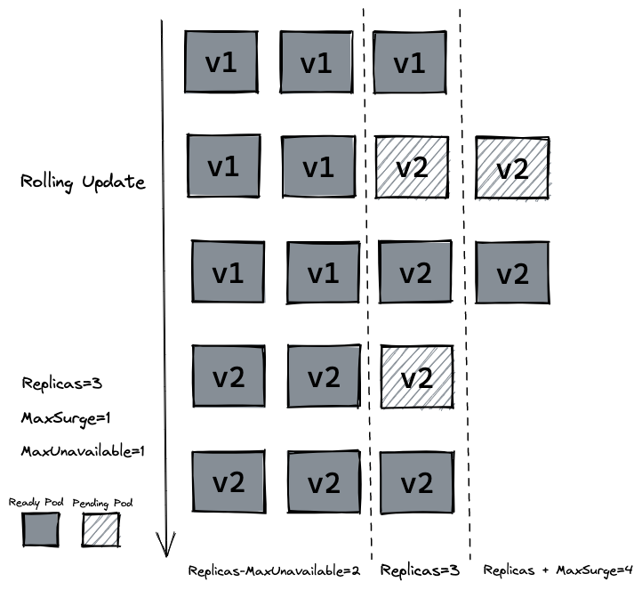

# 版本更新

## Rolling Update

前面已经讲过Kubernetes的Deployment可以使用Rolling Update进行更新，以下对Rolling Update进行一些补充。**Rolling Update会导致同一时间段内存在新旧实例对外服务，这是毋容置疑的，尽管比较短暂，但使用之前仍需要评估新旧实例的同时存在是否对业务有影响。**

Rolling Update由两个关键的参数控制滚动更新速率：

1. 最大峰值maxSurge：在滚动更新过程中Deployment的最大**额外**Pod数。replicas + maxSurge = 滚动更新过程中，Deployment内最大Pod数（包括unready）。
2. 最大不可用maxUnavailable：在滚动更新过程中Deployment的最大**减去**Pod数。replicas - maxUnavailable = 滚动更新过程中，Deployment内最小可提供服务Pod数（仅包含ready）

文字过于晦涩，以更新某个Deployment从v1到v2为例，其中replicas都为3，MaxSurge=1，maxUnavailable=1：

## Recreate

和Rolling Update不同的是，Recreate是一种比较粗暴的更新方式，从它的名字就能得知：重建。在构建新版本Pod之前，K8S会将旧版本Deployment的所有Pod删除，然后构建新版本Deployment，直到构建成功对外提供访问。因为太粗暴了，实际生产一般很少使用。

## 蓝绿或者红黑发布

结合之前做的[笔记](https://github.com/9029HIME/Emphasis/blob/master/project_emphasis/src/main/mds/01-%E9%A1%B9%E7%9B%AE%E5%8F%91%E5%B8%83-%E8%93%9D%E7%BB%BF%E3%80%81%E7%BA%A2%E9%BB%91%E3%80%81%E7%81%B0%E5%BA%A6%E5%8F%91%E5%B8%83.md)回顾发布方式可以发现，Rolling Update比较平滑，但会新旧实例同时对外服务，Recreate只会有新实例服务，但比较粗暴。K8S有没有一种折中的发布方式，类似蓝绿发布、红黑发布那样采用空间冗余的策略，既保证旧服务在更新成功前正常提供服务，又保证新服务更新成功后全面接管流量，在这个过程中新旧服务不会同时处理请求？

# Pod的存活与就绪

## 存活指针

## 就绪指针

# 重新梳理一下Deployment的对外访问

## Service

## NodePort

## LoadBalancer

## Ingress

# K8S提供的配置中心：ConfigMap

# K8S提供的密钥中心：Secret

# K8S的部署管家：Helm

