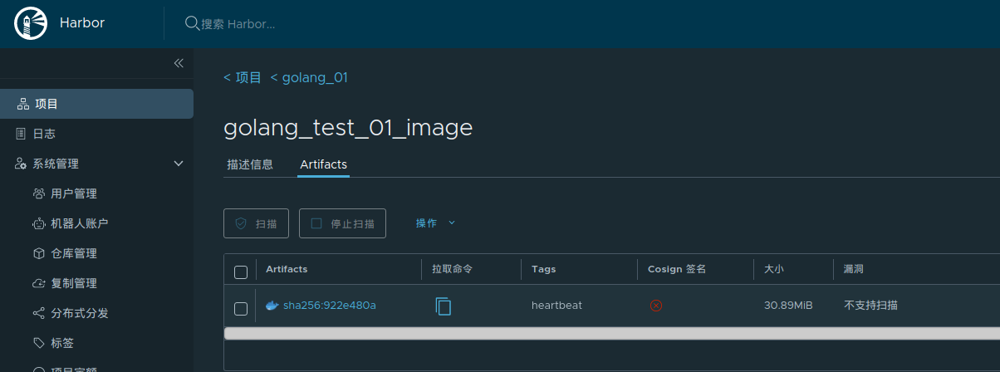

# 版本更新

## Rolling Update

前面已经讲过Kubernetes的Deployment可以使用Rolling Update进行更新，以下对Rolling Update进行一些补充。**Rolling Update会导致同一时间段内存在新旧实例对外服务，这是毋容置疑的，尽管比较短暂，但使用之前仍需要评估新旧实例的同时存在是否对业务有影响。**

Rolling Update由两个关键的参数控制滚动更新速率：

1. 最大峰值maxSurge：在滚动更新过程中Deployment的最大**额外**Pod数。replicas + maxSurge = 滚动更新过程中，Deployment内最大Pod数（包括unready）。
2. 最大不可用maxUnavailable：在滚动更新过程中Deployment的最大**减去**Pod数。replicas - maxUnavailable = 滚动更新过程中，Deployment内最小可提供服务Pod数（仅包含ready）

文字过于晦涩，以更新某个Deployment从v1到v2为例，其中replicas都为3，MaxSurge=1，maxUnavailable=1：


## Recreate

和Rolling Update不同的是，Recreate是一种比较粗暴的更新方式，从它的名字就能得知：重建。在构建新版本Pod之前，K8S会将旧版本Deployment的所有Pod删除，然后构建新版本Deployment，直到构建成功对外提供访问。因为太粗暴了，实际生产一般很少使用。

## 蓝绿或者红黑发布

### 概述

结合之前做的[笔记](https://github.com/9029HIME/Emphasis/blob/master/project_emphasis/src/main/mds/01-%E9%A1%B9%E7%9B%AE%E5%8F%91%E5%B8%83-%E8%93%9D%E7%BB%BF%E3%80%81%E7%BA%A2%E9%BB%91%E3%80%81%E7%81%B0%E5%BA%A6%E5%8F%91%E5%B8%83.md)回顾发布方式可以发现，Rolling Update比较平滑，但会新旧实例同时对外服务，Recreate只会有新实例服务，但比较粗暴。K8S有没有一种折中的发布方式，类似蓝绿发布、红黑发布那样采用空间冗余的策略，既保证旧服务在更新成功前正常提供服务，又保证新服务更新成功后全面接管流量，在这个过程中新旧服务不会同时处理请求？

K8S没有自带的蓝绿/红黑发布策略，但是可以通过kubectl patch service命令变相实现蓝绿/红黑发布。大致流程是：

1. Service的yaml文件，需要配置好spec.selector.version: v1。
2. Deployment v1的yaml文件，需要配置好metadata.labels.version: v1，值需要与1.的version一致，从而被Service路由流量。
3. 部署Service、Deployment v1，投入生产使用。
4. 需要更新服务为Deployment v2，新增Deployment v2的yaml文件，配置好metadata.labels.version: v2。
5. 部署Deployment v2，部署成功后进行验收测试。
6. 验收测试通过，通过kubectl patch service ${serviceName} -p '{"spec":{"selector":{"version":"v2"}}}'，修改1.的Service的spec.selector.version为v2。
7. 至此，1.的Service会将流量转发到Deployment v2，蓝绿/红黑发布完毕。

### 程序与镜像准备

为了方便演示，我准备了两个Golang程序：

v1：

```golang
package main

import (
   "io"
   "net/http"
)

func main() {
   http.HandleFunc("/", Handler)
   http.ListenAndServe(":10000", nil)
}

func Handler(rw http.ResponseWriter, request *http.Request) {
   io.WriteString(rw, "HERE IS VERSION 1")
}
```

v2：

```golang
package main

import (
	"io"
	"net/http"
)

func main() {
	http.HandleFunc("/", Handler)
	http.ListenAndServe(":10000", nil)
}

func Handler(rw http.ResponseWriter, request *http.Request) {
	io.WriteString(rw, "HERE IS VERSION 2")
}
```

两个程序的Dockerfile是一致的：

```dockerfile
FROM golang:1.20 AS builder

# copy ./Server.go 到 golang:1.20镜像内的/build目录下
COPY Server.go /build/
COPY go.mod /build/

# 将golang:1.20镜像内的/build目录作为工作目录，接下来的操作都是基于/build进行
WORKDIR /build

# 编译build目录下的main文件，输出名为main的可执行文件
RUN GOOS=linux go build -o main

FROM ubuntu:20.04

WORKDIR /

# 将golang:1.20镜像内的/build/main拷贝到ubuntu:20.04镜像的根目录下
COPY --from=builder /build/main /main

EXPOSE 10000

ENTRYPOINT ["/main"]
```

分别在不同目录下打包镜像：

```bash
kjg@kjg-PC:~/GolandProjects/Kubernetes_Note_Golang_Code/08_01_03_v1$ docker build -t golang_test_image:v1 .
Sending build context to Docker daemon  6.144kB
Step 1/10 : FROM golang:1.20 AS builder
 ---> e1567729a36d
Step 2/10 : COPY Server.go /build/
 ---> Using cache
 ---> d35f659501b4
Step 3/10 : COPY go.mod /build/
 ---> Using cache
 ---> c21eaf1452e7
Step 4/10 : WORKDIR /build
 ---> Using cache
 ---> 53f40fbaa495
Step 5/10 : RUN GOOS=linux go build -o main
 ---> Using cache
 ---> ed4a2faeb34a
Step 6/10 : FROM ubuntu:20.04
 ---> ba6acccedd29
Step 7/10 : WORKDIR /
 ---> Running in 53845a911a7f
Removing intermediate container 53845a911a7f
 ---> 2ec8cdc1ef19
Step 8/10 : COPY --from=builder /build/main /main
 ---> 459a71d3d6e5
Step 9/10 : EXPOSE 10000
 ---> Running in 1e09ada32fef
Removing intermediate container 1e09ada32fef
 ---> e319687a4243
Step 10/10 : ENTRYPOINT ["/main"]
 ---> Running in 3fe123f53d22
Removing intermediate container 3fe123f53d22
 ---> e7f4a2b597e7
Successfully built e7f4a2b597e7
Successfully tagged golang_test_image:v1
```

```bash
kjg@kjg-PC:~/GolandProjects/Kubernetes_Note_Golang_Code/08_01_03_v2$ docker build -t golang_test_image:v2 .
Sending build context to Docker daemon  4.608kB
Step 1/10 : FROM golang:1.20 AS builder
 ---> e1567729a36d
Step 2/10 : COPY Server.go /build/
 ---> 1889fa70543e
Step 3/10 : COPY go.mod /build/
 ---> fd49e46377e8
Step 4/10 : WORKDIR /build
 ---> Running in c8ee255cf93c
Removing intermediate container c8ee255cf93c
 ---> c5c1cd81d26f
Step 5/10 : RUN GOOS=linux go build -o main
 ---> Running in db24a840bfdb
Removing intermediate container db24a840bfdb
 ---> 983222db2b63
Step 6/10 : FROM ubuntu:20.04
 ---> ba6acccedd29
Step 7/10 : WORKDIR /
 ---> Using cache
 ---> 2ec8cdc1ef19
Step 8/10 : COPY --from=builder /build/main /main
 ---> 6e4477918163
Step 9/10 : EXPOSE 10000
 ---> Running in bc1400a70240
Removing intermediate container bc1400a70240
 ---> f4fcf76ff85c
Step 10/10 : ENTRYPOINT ["/main"]
 ---> Running in badf7e3f1313
Removing intermediate container badf7e3f1313
 ---> 8beffaff1d2a
Successfully built 8beffaff1d2a
Successfully tagged golang_test_image:v2
```

检查镜像，并上传到Harbor

```bash
kjg@kjg-PC:~$ docker images | grep golang_test
golang_test_image                                                          v2                  8beffaff1d2a        35 seconds ago      79.4MB
golang_test_image                                                          v1                  e7f4a2b597e7        2 minutes ago       79.4MB

kjg@kjg-PC:~$ docker tag golang_test_image:v1 harbor.genn.com/golang_01/golang_test_image:v1
kjg@kjg-PC:~$ docker push harbor.genn.com/golang_01/golang_test_image:v1
The push refers to repository [harbor.genn.com/golang_01/golang_test_image]
11380fa3213a: Pushed 
9f54eef41275: Pushed 
v1: digest: sha256:f40c5ad15ac2f3b7d40875468f6b19996009b8e8c610538b813a0c683b8eea1e size: 740

kjg@kjg-PC:~$ docker tag golang_test_image:v2 harbor.genn.com/golang_01/golang_test_image:v2
kjg@kjg-PC:~$ docker push harbor.genn.com/golang_01/golang_test_image:v2
The push refers to repository [harbor.genn.com/golang_01/golang_test_image]
74f5119f6b11: Pushed 
9f54eef41275: Layer already exists 
v2: digest: sha256:af02a504a5968315187d2d149ca42d412baecf7fa727b7834aaf91c5017440ff size: 740
```

检查Harbor，镜像已成功上传：


### Kubernetes准备

编写Service：

```yaml
apiVersion: v1
kind: Service
metadata:
  name: golang-test-01-service
  namespace: golang-test-01
  labels:
    app: golang-test-01-app
spec: 
  ports:    
    - port: 10000 
      targetPort: 10000
      protocol: TCP 
      name: http
  # 注意这里我们匹配 app 和 version 标签，当要切换流量的时候，我们更新 version 标签的值，比如：v2
  selector:   
    app: golang-test-01-app
    version: v1
```

编写Deployment v1：

```yaml
apiVersion: apps/v1
kind: Deployment
metadata:
  name: golang-test-01-deployment-v1
  namespace: golang-test-01
  labels:
    app: golang-test-01-app
    version: v1
spec:
  replicas: 2
  selector:
    matchLabels:
      app: golang-test-01-app
      version: v1
  template:
    metadata:
      labels:
        app: golang-test-01-app
        version: v1
    spec:
      containers:
      - name: golang-test-01-v1-pod
        image: harbor.genn.com/golang_01/golang_test_image:v1
        ports:
          - name: http
            containerPort: 10000
            protocol: TCP
      affinity:
        podAntiAffinity:                   # Pod工作负载反亲和，类似的还有Node工作负载反亲和(nodeAffintity)
          requiredDuringSchedulingIgnoredDuringExecution:    # 必须满足如下条件
          - labelSelector:                       # 选择Pod的标签，与工作负载本身反亲和
              matchExpressions:
              - key: app
                operator: In
                values:
                - golang-test-01-app
              - key: version
                operator: In
                values: 
                - v1
            namespaces:
              - golang-test-01
            topologyKey: kubernetes.io/hostname # 必须指明
```

编写Deployment v2：

```yaml
apiVersion: apps/v1
kind: Deployment
metadata:
  name: golang-test-01-deployment-v2
  namespace: golang-test-01
  labels:
    app: golang-test-01-app
    version: v2
spec:
  replicas: 2
  selector:
    matchLabels:
      app: golang-test-01-app
      version: v2
  template:
    metadata:
      labels:
        app: golang-test-01-app
        version: v2
    spec:
      containers:
      - name: golang-test-01-v2-pod
        image: harbor.genn.com/golang_01/golang_test_image:v2
        ports:
          - name: http
            containerPort: 10000
            protocol: TCP
      affinity:
        podAntiAffinity:                   # Pod工作负载反亲和，类似的还有Node工作负载反亲和(nodeAffintity)
          requiredDuringSchedulingIgnoredDuringExecution:    # 必须满足如下条件
          - labelSelector:                       # 选择Pod的标签，与工作负载本身反亲和
              matchExpressions:
              - key: app
                operator: In
                values:
                - golang-test-01-app
              - key: version
                operator: In
                values: 
                - v2
            namespaces:
              - golang-test-01
            topologyKey: kubernetes.io/hostname # 必须指明
```

正常部署Deployment v1和Service，测试连通性：

```bash
root@kjg-PC:~/golang_test_01# kubectl apply -f golang-test-01-deployment-v1.yaml -f golang-test-01-service.yaml 
deployment.apps/golang-test-01-deployment created
service/golang-test-01-service created
root@kjg-PC:~/golang_test_01# kubectl get pods -n golang-test-01 -owide
NAME                                         READY   STATUS    RESTARTS   AGE   IP             NODE       NOMINATED NODE   READINESS GATES
golang-test-01-deployment-74fcbf6bfc-4778c   1/1     Running   0          19s   172.31.79.8    ubuntu02   <none>           <none>
golang-test-01-deployment-74fcbf6bfc-qktkb   1/1     Running   0          19s   172.31.3.201   ubuntu01   <none>           <none>
root@kjg-PC:~/golang_test_01# curl http://172.31.79.8:10000
HERE IS VERSION 1
root@kjg-PC:~/golang_test_01# curl http://172.31.3.201:10000
HERE IS VERSION 1
root@kjg-PC:~/golang_test_01# kubectl get svc -n golang-test-01
NAME                     TYPE        CLUSTER-IP     EXTERNAL-IP   PORT(S)     AGE
golang-test-01-service   ClusterIP   10.96.157.11   <none>        10000/TCP   84s
root@kjg-PC:~/golang_test_01# curl http://10.96.157.11:10000
HERE IS VERSION 1 
```

部署Deployment v2，测试连通性：

```bash
root@kjg-PC:~/golang_test_01# kubectl apply -f golang-test-01-deployment-v2.yaml 
deployment.apps/golang-test-01-deployment-v2 created
root@kjg-PC:~/golang_test_01# kubectl get pods -n golang-test-01 -owide | grep v2
golang-test-01-deployment-v2-5748c7458f-l7c78   1/1     Running   0          27s     172.31.3.202   ubuntu01   <none>           <none>
golang-test-01-deployment-v2-5748c7458f-xdg5p   1/1     Running   0          27s     172.31.79.9    ubuntu02   <none>           <none>
root@kjg-PC:~/golang_test_01# curl http://172.31.3.202:10000
HERE IS VERSION 2
root@kjg-PC:~/golang_test_01# curl http://172.31.79.9:10000
HERE IS VERSION 2 
```

这时候就能验收v2版本了，等没问题后，通过kubectl patch service，改变service的流量路由:

```bash
root@kjg-PC:~/golang_test_01# curl http://10.96.157.11:10000
HERE IS VERSION 1
root@kjg-PC:~/golang_test_01# curl http://10.96.157.11:10000
HERE IS VERSION 1
root@kjg-PC:~/golang_test_01# curl http://10.96.157.11:10000
HERE IS VERSION 1
root@kjg-PC:~/golang_test_01# curl http://10.96.157.11:10000
HERE IS VERSION 1
root@kjg-PC:~/golang_test_01# curl http://10.96.157.11:10000
HERE IS VERSION 1

root@kjg-PC:~/golang_test_01# kubectl patch service golang-test-01-service -p '{"spec":{"selector":{"version":"v2"}}}' -n golang-test-01
service/golang-test-01-service patched

root@kjg-PC:~/golang_test_01# curl http://10.96.157.11:10000
HERE IS VERSION 2
root@kjg-PC:~/golang_test_01# curl http://10.96.157.11:10000
HERE IS VERSION 2
root@kjg-PC:~/golang_test_01# curl http://10.96.157.11:10000
HERE IS VERSION 2
root@kjg-PC:~/golang_test_01# curl http://10.96.157.11:10000
HERE IS VERSION 2
root@kjg-PC:~/golang_test_01# curl http://10.96.157.11:10000
HERE IS VERSION 2
```

### 补充：用kubectl edit也是一样的

## 小插曲：Build Golang程序引发的多From知识

多个 FROM 指令并不是为了生成多根的层关系，最后生成的镜像，仍以最后一条 FROM 为准，之前的 FROM 会被抛弃，那么之前的FROM 又有什么意义呢？

每一条 FROM 指令都是一个构建阶段，多条 FROM 就是多阶段构建，虽然最后生成的镜像只能是最后一个阶段的结果，但是，能够将前置阶段中的文件拷贝到后边的阶段中，这就是多阶段构建的最大意义。

最大的使用场景是将编译环境和运行环境分离，比如，之前我们需要构建一个Go语言程序，那么就需要用到go命令等编译环境，我们的Dockerfile可能是这样的：

```dockerfile
FROM golang:1.20 AS builder

COPY Server.go /build/
COPY go.mod /build/

WORKDIR /build

RUN GOOS=linux go build -o main
EXPOSE 10000

ENTRYPOINT ["/build/main"]
```

基础镜像  是非常庞大的，因为其中包含了所有的Go语言编译工具和库，而运行时候我们仅仅需要编译后的 `server` 程序就行了，不需要编译时的编译工具，最后生成的大体积镜像就是一种浪费。解决办法是将程序编译和镜像构建分开，使用golang:1.20作为编译环境，ubuntu20.04作为运行环境，也是镜像的实际运行环境：

```dockerfile
FROM golang:1.20 AS builder

# copy ./Server.go 到 golang:1.20镜像内的/build目录下
COPY Server.go /build/
COPY go.mod /build/

# 将golang:1.20镜像内的/build目录作为工作目录，接下来的操作都是基于/build进行
WORKDIR /build

# 编译build目录下的main文件，输出名为main的可执行文件
RUN GOOS=linux go build -o main

FROM ubuntu:20.04

WORKDIR /

# 将golang:1.20镜像内的/build/main拷贝到ubuntu20.04镜像的根目录下
COPY --from=builder /build/main /main

EXPOSE 10000

ENTRYPOINT ["/main"]
```

# Pod的存活与就绪

## 存活指针

Kubernetes的存活指针决定什么时候重启失活的Pod，但是实际生产环境中，不能仅依赖存活指针决定重启，否则有可能引起Pod的异常重启，**在这里仅作为了解用**。

在上面的v1程序基础上，新增一个/heartbeat接口，逻辑很简单：程序启动10秒正常返回，10秒后返回500：

```go
package main

import (
	"fmt"
	"io"
	"net/http"
	"strconv"
	"time"
)

var start time.Time = time.Now()

func main() {
	http.HandleFunc("/", Handler)
	http.HandleFunc("/heartbeat", Heartbeat)
	http.ListenAndServe(":10000", nil)
}

func Handler(rw http.ResponseWriter, request *http.Request) {
	io.WriteString(rw, "HERE IS VERSION 1")
}

func Heartbeat(rw http.ResponseWriter, request *http.Request) {
	now := time.Now()
	duration := now.Sub(start).Seconds()
	msg := fmt.Sprintf("start=%s.....now=%s.....duration=%s",
		start.Format("2006-01-02 15:04:05"),
		now.Format("2006-01-02 15:04:05"),
		strconv.Itoa(int(duration)))
	if duration > 10 {
		rw.WriteHeader(500)
	}
	io.WriteString(rw, msg)
}

```

用同样的dockerfile打包、上传镜像，就是镜像名称注意tag为heartbeat：

```bash
root@kjg-PC:/home/kjg/GolandProjects/Kubernetes_Note_Golang_Code/08_02_01# docker build -t golang_test_01_image:heartbeat .
Sending build context to Docker daemon   5.12kB
Step 1/10 : FROM golang:1.20 AS builder
 ---> e1567729a36d
Step 2/10 : COPY Server.go /build/
 ---> d94690cc3a02
Step 3/10 : COPY go.mod /build/
 ---> 8e33c4b1ed0b
Step 4/10 : WORKDIR /build
 ---> Running in afda515d6165
Removing intermediate container afda515d6165
 ---> 20829a44162e
Step 5/10 : RUN GOOS=linux go build -o main
 ---> Running in 2b42c285fd60
Removing intermediate container 2b42c285fd60
 ---> 841ccaf955c8
Step 6/10 : FROM ubuntu:20.04
 ---> ba6acccedd29
Step 7/10 : WORKDIR /
 ---> Using cache
 ---> 2ec8cdc1ef19
Step 8/10 : COPY --from=builder /build/main /main
 ---> a631471c1996
Step 9/10 : EXPOSE 10000
 ---> Running in e57f4580c496
Removing intermediate container e57f4580c496
 ---> 5eb01e9b7927
Step 10/10 : ENTRYPOINT ["/main"]
 ---> Running in bf03cee48f01
Removing intermediate container bf03cee48f01
 ---> 76c4bbdff83d
Successfully built 76c4bbdff83d
Successfully tagged golang_test_01_image:heartbeat

root@kjg-PC:~# docker images | grep "heartbeat"
golang_test_01_image                                                       heartbeat           76c4bbdff83d        47 seconds ago      79.4MB
root@kjg-PC:~# docker tag golang_test_01_image:heartbeat harbor.genn.com/golang_01/golang_test_01_image:heartbeat
root@kjg-PC:~# docker push harbor.genn.com/golang_01/golang_test_01_image:heartbeat
The push refers to repository [harbor.genn.com/golang_01/golang_test_01_image]
d5263d9eb736: Pushed 
9f54eef41275: Mounted from golang_01/golang_test_image 
heartbeat: digest: sha256:922e480a0941d710daaff1131dbaa650bbf15f211196642119f5630835c0280e size: 740
```



编写Deployment配置：

```yaml
apiVersion: apps/v1
kind: Deployment
metadata:
  name: golang-test-01-heartbeat-deployment
  namespace: golang-test-01
  labels:
    app: golang-test-01-heartbeat-app
    version: heartbeat
spec:
  replicas: 1
  selector:
    matchLabels:
      app: golang-test-01-heartbeat-app
      version: heartbeat
  template:
    metadata:
      labels:
        app: golang-test-01-heartbeat-app
        version: heartbeat
    spec:
      containers:
      - name: golang-test-01-heartbeat-pod
        image: harbor.genn.com/golang_01/golang_test_01_image:heartbeat
        ports:
          - name: http
            containerPort: 10000
            protocol: TCP
        livenessProbe: # 开启存活指针
          httpGet: # 存活指针以HTTP GET方式进行
            path: /heartbeat # 请求http://podIP:podPort/heartbeat
            port: 10000
          initialDelaySeconds: 2  # 容器启动后，应延迟2秒再开启存活判断
          periodSeconds: 2 # 存活指针每2秒进行一次判断
```

启动这个Deployment，可以发现Pod不断地重启，直到超出次数陷入CrashLoopBackOff：

```bash
root@kjg-PC:~/golang_test_01# kubectl apply -f golang-test-01-deployment-heartbeat.yaml 
deployment.apps/golang-test-01-heartbeat-deployment created


root@kjg-PC:~/golang_test_01# kubectl get pods -n golang-test-01 -owide
NAME                                                   READY   STATUS    RESTARTS   AGE   IP             NODE       NOMINATED NODE   READINESS GATES
golang-test-01-heartbeat-deployment-759d7bd846-grfq8   1/1     Running   0          25s   172.31.3.209   ubuntu01   <none>           <none>


root@kjg-PC:~/golang_test_01# kubectl get pods -n golang-test-01 -owide
NAME                                                   READY   STATUS    RESTARTS   AGE    IP             NODE       NOMINATED NODE   READINESS GATES
golang-test-01-heartbeat-deployment-759d7bd846-grfq8   1/1     Running   4          110s   172.31.3.209   ubuntu01   <none>           <none>


root@kjg-PC:~/golang_test_01# kubectl get pods -n golang-test-01 -owide
NAME                                                   READY   STATUS             RESTARTS   AGE     IP             NODE       NOMINATED NODE   READINESS GATES
golang-test-01-heartbeat-deployment-759d7bd846-grfq8   0/1     CrashLoopBackOff   5          2m43s   172.31.3.209   ubuntu01   <none>           <none>


root@kjg-PC:~/golang_test_01# kubectl describe pod golang-test-01-heartbeat-deployment-759d7bd846-grfq8 -n golang-test-01
Events:
  Type     Reason     Age                    From               Message
  ----     ------     ----                   ----               -------
  Normal   Scheduled  3m20s                  default-scheduler  Successfully assigned golang-test-01/golang-test-01-heartbeat-deployment-759d7bd846-grfq8 to ubuntu01
  Normal   Pulled     2m18s (x4 over 3m4s)   kubelet            Container image "harbor.genn.com/golang_01/golang_test_01_image:heartbeat" already present on machine
  Normal   Created    2m18s (x4 over 3m4s)   kubelet            Created container golang-test-01-heartbeat-pod
  Normal   Killing    2m18s (x3 over 2m50s)  kubelet            Container golang-test-01-heartbeat-pod failed liveness probe, will be restarted
  Normal   Started    2m17s (x4 over 3m4s)   kubelet            Started container golang-test-01-heartbeat-pod
  Warning  Unhealthy  2m6s (x10 over 2m54s)  kubelet            Liveness probe failed: HTTP probe failed with statuscode: 500
```

## 就绪指针

对于Kubernetes，可以通过就绪指针判断这个Pod是否已处于“Ready”状态，当一个Pod升级后不能就绪，即不应该让流量进入该Pod，在配合 Rolling Update的功能下，也不能允许升级版本继续下去，否则服务会出现全部升级完成，导致所有服务均不可用的情况。

修改一下上面的heartbeat代码，不再等10秒了，启动后直接响应500：

```
package main

import (
   "io"
   "net/http"
)

func main() {
   http.HandleFunc("/", Handler)
   http.HandleFunc("/heartbeat", Heartbeat)
   http.ListenAndServe(":10000", nil)
}

func Handler(rw http.ResponseWriter, request *http.Request) {
   io.WriteString(rw, "HERE IS VERSION 1")
}

func Heartbeat(rw http.ResponseWriter, request *http.Request) {
   rw.WriteHeader(500)
}
```

打包镜像，推送仓库，版本号从heartbeat改为heartbeat-bad：

```bash
kjg@kjg-PC:~/GolandProjects/Kubernetes_Note_Golang_Code/08_02_01_bad$ docker build -t golang_test_01_image:heartbeat-bad .
Sending build context to Docker daemon  4.608kB
Step 1/10 : FROM golang:1.20 AS builder
 ---> e1567729a36d
Step 2/10 : COPY Server.go /build/
 ---> cd2167620db8
Step 3/10 : COPY go.mod /build/
 ---> a1085282f525
Step 4/10 : WORKDIR /build
 ---> Running in 176b7ca907a5
Removing intermediate container 176b7ca907a5
 ---> c221398ad982
Step 5/10 : RUN GOOS=linux go build -o main
 ---> Running in 12e8ae315d31
Removing intermediate container 12e8ae315d31
 ---> 72d7ba5201e1
Step 6/10 : FROM ubuntu:20.04
 ---> ba6acccedd29
Step 7/10 : WORKDIR /
 ---> Using cache
 ---> 2ec8cdc1ef19
Step 8/10 : COPY --from=builder /build/main /main
 ---> b02c6b84f3c5
Step 9/10 : EXPOSE 10000
 ---> Running in fc5c05444f32
Removing intermediate container fc5c05444f32
 ---> a150e9e4ed20
Step 10/10 : ENTRYPOINT ["/main"]
 ---> Running in f883d6747ed5
Removing intermediate container f883d6747ed5
 ---> c73b89c65551
Successfully built c73b89c65551
Successfully tagged golang_test_01_image:heartbeat-bad

root@kjg-PC:~/golang_test_01# docker images | grep bad
golang_test_01_image                                                       heartbeat-bad       c73b89c65551        37 seconds ago      79.4MB
root@kjg-PC:~/golang_test_01# docker tag golang_test_01_image:heartbeat-bad harbor.genn.com/golang_01/golang_test_01_image:heartbeat-bad
root@kjg-PC:~/golang_test_01# docker push harbor.genn.com/golang_01/golang_test_01_image:heartbeat-bad
The push refers to repository [harbor.genn.com/golang_01/golang_test_01_image]
10389991f9bd: Pushed 
9f54eef41275: Layer already exists 
heartbeat-bad: digest: sha256:f10d529a0c100365b50c7c5864f5b37ee18a5378cebbde4949fe906a4d097a66 size: 740
```

除了像[之前整理的直接set image来实现滚动更新](https://github.com/9029HIME/Kubernetes_Note/blob/master/src/main/mds/%E9%9B%B6%E6%95%A3/03-Kubernetes%E7%9A%84%E8%BF%9B%E9%98%B6%E6%A6%82%E5%BF%B5.md)，也可以通过修改Deployment文件重新部署，实现滚动更新：

```bash
root@kjg-PC:~/golang_test_01# cp golang-test-01-deployment-heartbeat.yaml golang-test-01-deployment-heartbeat-bad.yaml
root@kjg-PC:~/golang_test_01# vim golang-test-01-deployment-heartbeat-bad.yaml
```

```yaml
apiVersion: apps/v1
kind: Deployment
metadata:
  name: golang-test-01-heartbeat-deployment
  namespace: golang-test-01
  labels:
    app: golang-test-01-heartbeat-app
    version: heartbeat
spec:
  strategy:
    rollingUpdate: # 启用滚动更新
      maxSurge: 1
      maxUnavailable: 0 # 因为heartbeat集群本身只有1个副本，所以maxUnavailable设置为0，保证总有1个副本提供服务（虽然heartbeat已经CrashLoopBackOff了）
  replicas: 1
  selector:
    matchLabels:
      app: golang-test-01-heartbeat-app
      version: heartbeat
  template:
    metadata:
      labels:
        app: golang-test-01-heartbeat-app
        version: heartbeat
    spec:
      containers:
      - name: golang-test-01-heartbeat-pod
        image: harbor.genn.com/golang_01/golang_test_01_image:heartbeat-bad # 修改镜像为heartbeat-bad
        ports:
          - name: http
            containerPort: 10000
            protocol: TCP
        readinessProbe:
          httpGet:
            path: /heartbeat
            port: 10000     
          initialDelaySeconds: 1 # 容器启动多久后进行存活或就绪探测
          successThreshold: 1 # 连续探测成功到一定次数后，才视为真正成功 
          failureThreshold: 2 # 连续探测失败到一定次数后，才视为真正失败
```

```bash
root@kjg-PC:~/golang_test_01# kubectl get pods -n golang-test-01 -owide
NAME                                                   READY   STATUS             RESTARTS   AGE   IP             NODE       NOMINATED NODE   READINESS GATES
golang-test-01-heartbeat-deployment-759d7bd846-w7wrv   0/1     CrashLoopBackOff   3          66s   172.31.3.216   ubuntu01   <none>           <none>

root@kjg-PC:~/golang_test_01# kubectl apply -f golang-test-01-deployment-heartbeat-bad.yaml
deployment.apps/golang-test-01-heartbeat-deployment configured

root@kjg-PC:~/golang_test_01# kubectl get pods -n golang-test-01 -owide
NAME                                                   READY   STATUS    RESTARTS   AGE    IP             NODE       NOMINATED NODE   READINESS GATES
golang-test-01-heartbeat-deployment-6b77bb788f-xsbtc   0/1     Running   0          17s    172.31.3.217   ubuntu01   <none>           <none>
golang-test-01-heartbeat-deployment-759d7bd846-w7wrv   1/1     Running   4          105s   172.31.3.216   ubuntu01   <none>           <none>

root@kjg-PC:~/golang_test_01# kubectl get pods -n golang-test-01 -owide
NAME                                                   READY   STATUS             RESTARTS   AGE     IP             NODE       NOMINATED NODE   READINESS GATES
golang-test-01-heartbeat-deployment-6b77bb788f-xsbtc   0/1     Running            0          70s     172.31.3.217   ubuntu01   <none>           <none>
golang-test-01-heartbeat-deployment-759d7bd846-w7wrv   0/1     CrashLoopBackOff   5          2m38s   172.31.3.216   ubuntu01   <none>           <none>

root@kjg-PC:~/golang_test_01# kubectl get pods -n golang-test-01 -owide
NAME                                                   READY   STATUS             RESTARTS   AGE     IP             NODE       NOMINATED NODE   READINESS GATES
golang-test-01-heartbeat-deployment-6b77bb788f-xsbtc   0/1     Running            0          3m4s    172.31.3.217   ubuntu01   <none>           <none>
golang-test-01-heartbeat-deployment-759d7bd846-w7wrv   0/1     CrashLoopBackOff   6          4m32s   172.31.3.216   ubuntu01   <none>           <none>


root@kjg-PC:~/golang_test_01# kubectl describe pod golang-test-01-heartbeat-deployment-6b77bb788f-xsbtc -n golang-test-01
Events:
  Type     Reason     Age                  From               Message
  ----     ------     ----                 ----               -------
  Normal   Scheduled  3m34s                default-scheduler  Successfully assigned golang-test-01/golang-test-01-heartbeat-deployment-6b77bb788f-xsbtc to ubuntu01
  Normal   Pulled     3m32s                kubelet            Container image "harbor.genn.com/golang_01/golang_test_01_image:heartbeat-bad" already present on machine
  Normal   Created    3m32s                kubelet            Created container golang-test-01-heartbeat-pod
  Normal   Started    3m32s                kubelet            Started container golang-test-01-heartbeat-pod
  Warning  Unhealthy  5s (x21 over 3m25s)  kubelet            Readiness probe failed: HTTP probe failed with statuscode: 500
```

可以看到，除了759d7bd846-w7wrv因为存活指针一直陷入Running和CrashLoopBackOff状态，6b77bb788f-xsbtc因为就绪指针一直校验失败，所以一直处于READY 0/1状态。

## 小插曲：在“就绪指针”所演示的场景下，如何回滚？

可以看到，在“就绪指针”案例的最后，w7wrv处于RUNNING和CrashLoopBackOff死循环，xsbtc处于READY 0/1状态，讲真确实有点尴尬。那么，对于**就绪指针一直不可达导致的滚动更新失败**，有什么好回滚方案呢？其实在生产环境中，也就这么两种可能：

1. w7wrv正常RUNNING，没有CrashLoopBackOff（仅假设，这里重点是就绪指针不可达）。xsbtc一直处于READY 0/1。
2. w7wrv处于RUNNING和CrashLoopBackOff死循环。xsbtc一直处于READY 0/1。

对于情况1还有退路，可以回滚到w7wrv，此时kubectl rollout history查看版本号，然后kubectl rollout --to-version回滚到情况1的版本号就好了。

但是对于情况2，已经没有退路了，w7wrv本身就不正常。因此重点要放在xsbtc，让开发人员修复好Bug，保证就绪指针可以到达，重新打包成镜像（假设版本好为fix）、上传到镜像仓库。修改Deployment的配置文件，将镜像版本号改为fix，然后kubectl apply -f重新滚动更新即可。

# 重新梳理一下Deployment的对外访问

## Service

## NodePort

## LoadBalancer

## Ingress

# K8S提供的配置中心：ConfigMap

# K8S提供的密钥中心：Secret

# K8S的部署管家：Helm

