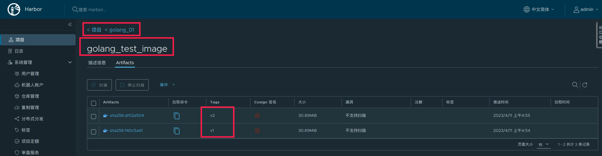

# 版本更新

## Rolling Update

前面已经讲过Kubernetes的Deployment可以使用Rolling Update进行更新，以下对Rolling Update进行一些补充。**Rolling Update会导致同一时间段内存在新旧实例对外服务，这是毋容置疑的，尽管比较短暂，但使用之前仍需要评估新旧实例的同时存在是否对业务有影响。**

Rolling Update由两个关键的参数控制滚动更新速率：

1. 最大峰值maxSurge：在滚动更新过程中Deployment的最大**额外**Pod数。replicas + maxSurge = 滚动更新过程中，Deployment内最大Pod数（包括unready）。
2. 最大不可用maxUnavailable：在滚动更新过程中Deployment的最大**减去**Pod数。replicas - maxUnavailable = 滚动更新过程中，Deployment内最小可提供服务Pod数（仅包含ready）

文字过于晦涩，以更新某个Deployment从v1到v2为例，其中replicas都为3，MaxSurge=1，maxUnavailable=1：


## Recreate

和Rolling Update不同的是，Recreate是一种比较粗暴的更新方式，从它的名字就能得知：重建。在构建新版本Pod之前，K8S会将旧版本Deployment的所有Pod删除，然后构建新版本Deployment，直到构建成功对外提供访问。因为太粗暴了，实际生产一般很少使用。

## 蓝绿或者红黑发布

### 概述

结合之前做的[笔记](https://github.com/9029HIME/Emphasis/blob/master/project_emphasis/src/main/mds/01-%E9%A1%B9%E7%9B%AE%E5%8F%91%E5%B8%83-%E8%93%9D%E7%BB%BF%E3%80%81%E7%BA%A2%E9%BB%91%E3%80%81%E7%81%B0%E5%BA%A6%E5%8F%91%E5%B8%83.md)回顾发布方式可以发现，Rolling Update比较平滑，但会新旧实例同时对外服务，Recreate只会有新实例服务，但比较粗暴。K8S有没有一种折中的发布方式，类似蓝绿发布、红黑发布那样采用空间冗余的策略，既保证旧服务在更新成功前正常提供服务，又保证新服务更新成功后全面接管流量，在这个过程中新旧服务不会同时处理请求？

K8S没有自带的蓝绿/红黑发布策略，但是可以通过kubectl patch service命令变相实现蓝绿/红黑发布。大致流程是：

1. Service的yaml文件，需要配置好spec.selector.version: v1。
2. Deployment v1的yaml文件，需要配置好metadata.labels.version: v1，值需要与1.的version一致，从而被Service路由流量。
3. 部署Service、Deployment v1，投入生产使用。
4. 需要更新服务为Deployment v2，新增Deployment v2的yaml文件，配置好metadata.labels.version: v2。
5. 部署Deployment v2，部署成功后进行验收测试。
6. 验收测试通过，通过kubectl patch service ${serviceName} -p '{"spec":{"selector":{"version":"v2"}}}'，修改1.的Service的spec.selector.version为v2。
7. 至此，1.的Service会将流量转发到Deployment v2，蓝绿/红黑发布完毕。

### 程序与镜像准备

为了方便演示，我准备了两个Golang程序：

v1：

```golang
package main

import (
   "io"
   "net/http"
)

func main() {
   http.HandleFunc("/", Handler)
   http.ListenAndServe(":10000", nil)
}

func Handler(rw http.ResponseWriter, request *http.Request) {
   io.WriteString(rw, "HERE IS VERSION 1")
}
```

v2：

```golang
package main

import (
	"io"
	"net/http"
)

func main() {
	http.HandleFunc("/", Handler)
	http.ListenAndServe(":10000", nil)
}

func Handler(rw http.ResponseWriter, request *http.Request) {
	io.WriteString(rw, "HERE IS VERSION 2")
}
```

两个程序的Dockerfile是一致的：

```dockerfile
FROM golang:1.20 AS builder

# copy ./Server.go 到 golang:1.20镜像内的/build目录下
COPY Server.go /build/
COPY go.mod /build/

# 将golang:1.20镜像内的/build目录作为工作目录，接下来的操作都是基于/build进行
WORKDIR /build

# 编译build目录下的main文件，输出名为main的可执行文件
RUN GOOS=linux go build -o main

FROM ubuntu:20.04

WORKDIR /

# 将golang:1.20镜像内的/build/main拷贝到gcr.io/distroless/base-debian10镜像的根目录下
COPY --from=builder /build/main /main

EXPOSE 10000

ENTRYPOINT ["/main"]
```

分别在不同目录下打包镜像：

```bash
kjg@kjg-PC:~/GolandProjects/Kubernetes_Note_Golang_Code/08_01_03_v1$ docker build -t golang_test_image:v1 .
Sending build context to Docker daemon  6.144kB
Step 1/10 : FROM golang:1.20 AS builder
 ---> e1567729a36d
Step 2/10 : COPY Server.go /build/
 ---> Using cache
 ---> d35f659501b4
Step 3/10 : COPY go.mod /build/
 ---> Using cache
 ---> c21eaf1452e7
Step 4/10 : WORKDIR /build
 ---> Using cache
 ---> 53f40fbaa495
Step 5/10 : RUN GOOS=linux go build -o main
 ---> Using cache
 ---> ed4a2faeb34a
Step 6/10 : FROM ubuntu:20.04
 ---> ba6acccedd29
Step 7/10 : WORKDIR /
 ---> Running in 53845a911a7f
Removing intermediate container 53845a911a7f
 ---> 2ec8cdc1ef19
Step 8/10 : COPY --from=builder /build/main /main
 ---> 459a71d3d6e5
Step 9/10 : EXPOSE 10000
 ---> Running in 1e09ada32fef
Removing intermediate container 1e09ada32fef
 ---> e319687a4243
Step 10/10 : ENTRYPOINT ["/main"]
 ---> Running in 3fe123f53d22
Removing intermediate container 3fe123f53d22
 ---> e7f4a2b597e7
Successfully built e7f4a2b597e7
Successfully tagged golang_test_image:v1
```

```bash
kjg@kjg-PC:~/GolandProjects/Kubernetes_Note_Golang_Code/08_01_03_v2$ docker build -t golang_test_image:v2 .
Sending build context to Docker daemon  4.608kB
Step 1/10 : FROM golang:1.20 AS builder
 ---> e1567729a36d
Step 2/10 : COPY Server.go /build/
 ---> 1889fa70543e
Step 3/10 : COPY go.mod /build/
 ---> fd49e46377e8
Step 4/10 : WORKDIR /build
 ---> Running in c8ee255cf93c
Removing intermediate container c8ee255cf93c
 ---> c5c1cd81d26f
Step 5/10 : RUN GOOS=linux go build -o main
 ---> Running in db24a840bfdb
Removing intermediate container db24a840bfdb
 ---> 983222db2b63
Step 6/10 : FROM ubuntu:20.04
 ---> ba6acccedd29
Step 7/10 : WORKDIR /
 ---> Using cache
 ---> 2ec8cdc1ef19
Step 8/10 : COPY --from=builder /build/main /main
 ---> 6e4477918163
Step 9/10 : EXPOSE 10000
 ---> Running in bc1400a70240
Removing intermediate container bc1400a70240
 ---> f4fcf76ff85c
Step 10/10 : ENTRYPOINT ["/main"]
 ---> Running in badf7e3f1313
Removing intermediate container badf7e3f1313
 ---> 8beffaff1d2a
Successfully built 8beffaff1d2a
Successfully tagged golang_test_image:v2
```

检查镜像，并上传到Harbor

```bash
kjg@kjg-PC:~$ docker images | grep golang_test
golang_test_image                                                          v2                  8beffaff1d2a        35 seconds ago      79.4MB
golang_test_image                                                          v1                  e7f4a2b597e7        2 minutes ago       79.4MB

kjg@kjg-PC:~$ docker tag golang_test_image:v1 harbor.genn.com/golang_01/golang_test_image:v1
kjg@kjg-PC:~$ docker push harbor.genn.com/golang_01/golang_test_image:v1
The push refers to repository [harbor.genn.com/golang_01/golang_test_image]
11380fa3213a: Pushed 
9f54eef41275: Pushed 
v1: digest: sha256:f40c5ad15ac2f3b7d40875468f6b19996009b8e8c610538b813a0c683b8eea1e size: 740

kjg@kjg-PC:~$ docker tag golang_test_image:v2 harbor.genn.com/golang_01/golang_test_image:v2
kjg@kjg-PC:~$ docker push harbor.genn.com/golang_01/golang_test_image:v2
The push refers to repository [harbor.genn.com/golang_01/golang_test_image]
74f5119f6b11: Pushed 
9f54eef41275: Layer already exists 
v2: digest: sha256:af02a504a5968315187d2d149ca42d412baecf7fa727b7834aaf91c5017440ff size: 740
```

检查Harbor，镜像已成功上传：



### Kubernetes准备

## 小插曲：Build Golang程序引发的多From知识


# Pod的存活与就绪

## 存活指针


## 就绪指针

# 重新梳理一下Deployment的对外访问

## Service

## NodePort

## LoadBalancer

## Ingress

# K8S提供的配置中心：ConfigMap

# K8S提供的密钥中心：Secret

# K8S的部署管家：Helm

